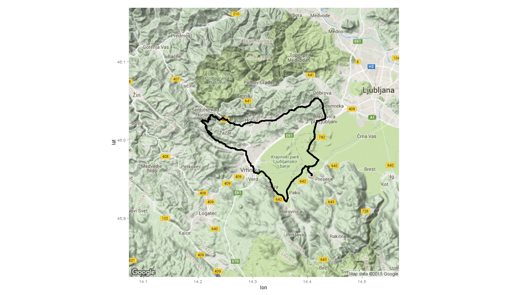
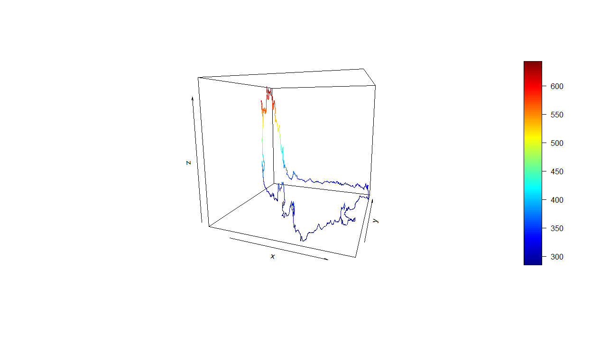
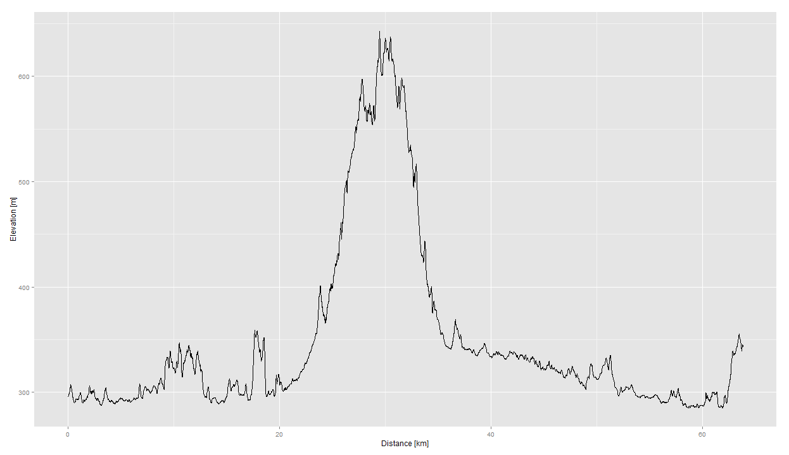
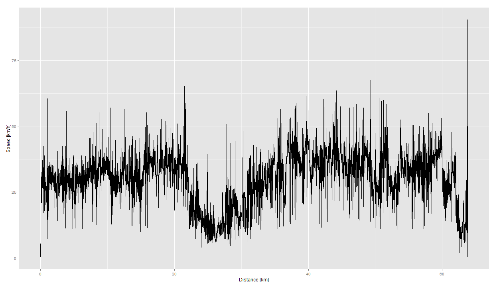
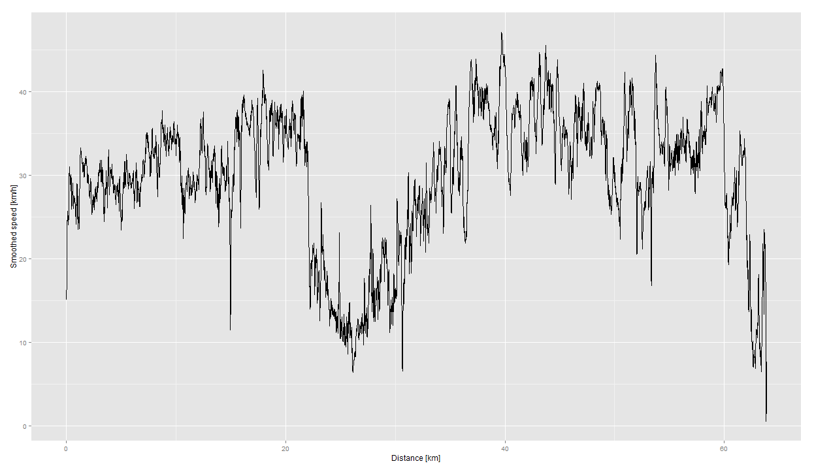
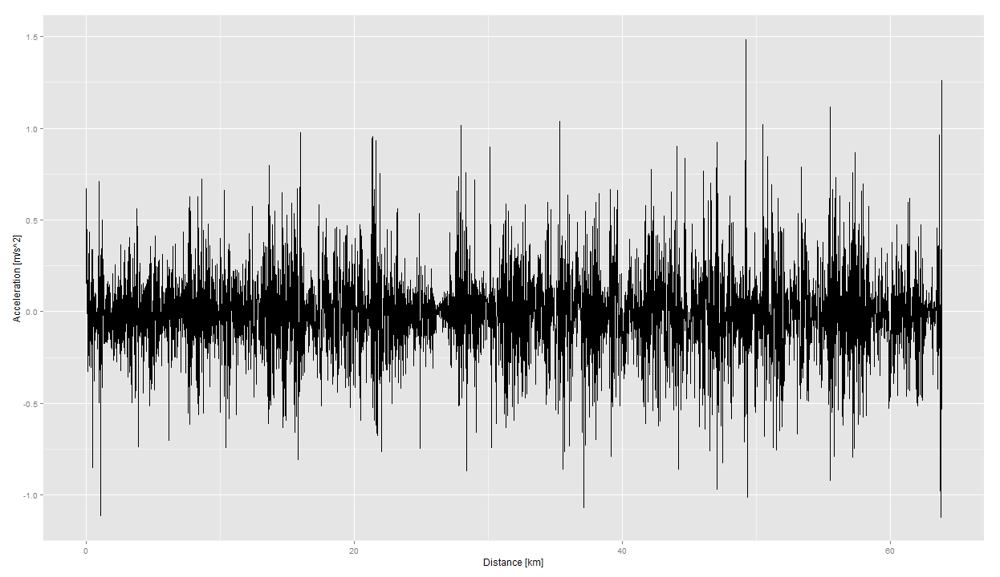

# Walkthrough for the analyzeGPS package

## Introduction

GPS data has become extensily used in our activities due to technological advances and development of affordable, pervasive, integrated and efficient GPS devices. Availability of the GPS data is offering possibilities to apply it in different ways than before. And the first step in this kind of experimenting is to be able to read the data and to prepare it for further use.  The package `analyzeGPS` offers functions for basic preparation and analysis of the GPS signal:

- `readGPS`: imports the GPS data in csv^[GPS data has to be converted from the default acquisition format first. One of the most common acquisition formats is gpx, which can easily be converted to csv, e.g. using the package `parseGPX`.] format into R data frame.
- `distanceGPS`: : calculation of distance in meters between two data points or vectors of data points.
- `speedGPS`: calculation of velocity between GPS data points. 
- `accGPS`: calculation of acceleration between GPS data points.
- `gradeGPS`: calculation of grade or inclination between GPS data points.

For example, let's test these functions on an example GPS dataset `myGPSData.csv`, acquired during cycling of a person. It is a data frame with 7771 rows and 5 variables:

- lon: longitude data
- lat: latitude data
- ele: elevation data
- time: GPS time stamp - GMT time zone
- tz_CEST: time stamp converted to CEST time zone

## Load GPS data

First, we load the `analyzeGPS` package, which contains the GPS data, find the exact location of the data file with `system.file` and than call the `readGPS` function with the obtained address:


```r
library(analyzeGPS)
data_file <- system.file("extdata", "myGPSData.csv", package="analyzeGPS")
gps <- readGPS(data_file)

str(gps, strict.width = "wrap")
```

```
## 'data.frame':	7771 obs. of  5 variables:
## $ lon : num 14.4 14.4 14.4 14.4 14.4 ...
## $ lat : num 46 46 46 46 46 ...
## $ ele : num 296 296 296 296 296 ...
## $ time : chr "2015-06-02T14:59:55Z" "2015-06-02T15:01:55Z"
##    "2015-06-02T15:01:56Z" "2015-06-02T15:01:57Z" ...
## $ tz_CEST: chr "2015-06-02 16:59:55" "2015-06-02 17:01:55" "2015-06-02
##    17:01:56" "2015-06-02 17:01:57" ...
```

## Plot data

For plotting the loaded data on a map, the package `ggmap` can be used (loading the `ggmap` package requires the `ggplot2` package). Package `ggmap` contains a function `get_googlemap`, which downloads a static map from the Google Static Maps API version 2. Among severeal parameters for modifying the downloaded map the `center` and `zoom` are the most important ones since they directly affect the appearance of the figure. 

The `center` determines the center of the map and can either be a longitude/latitude numeric vector or a string address (note that the latter uses geocode). In our case we described the center of the map with longitude/latitude numeric vector, calculated as the mean of the longitude and latitude data. 
The `zoom` determines the map zoom and is an integer from 3 (continent) to 21 (building) with default value 10 (city). In our case we used 11 for zoom value after a little experimenting with different values. The obtained map is ploted with the `ggmap` function and the GPS data or route is addedd to the same plot with the `geom_points` function from the `ggplot2` package.


```r
library(ggmap)
ggmap(get_googlemap(center = c(lon = mean(gps$lon), lat = mean(gps$lat)), zoom = 11, 
    size = c(720, 720))) + geom_point(data = gps, aes(x = lon, y = lat))
```

 

If elevation data is also available, we can represent the GPS route in 3D. For basic 3D plotting we can use the `lines3D` function from the `plot3D` package. 


```r
library(plot3D)
lines3D(gps$lon, gps$lat, gps$ele, phi = 10, theta = 20)
```

 

To create an interactive 3D plot the `plot3d` function from the `rgl` package can be used. The following command opens a new window with the 3D plot, which can be rotated using the click&drag. 


```r
library(rgl)
plot3d(gps$lon, gps$lat, gps$ele)
```

## Calculate distances

Distances between consecutive GPS data points and the total distance traveled are the initial calculations executed by using the function `distanceGPS`, which returns the distances in meters between GPS data points. The length of the returned vector of distances is one less than the length of the input vectors. To unify and properly include the returned vector  of distances into the `gps` data frame with GPS data, a zero is added as the first distance element. This addition is because the first element of the GPS data doesn't have a predecessor to calculate distance. The value zero of the added element is chosen because it enables cumulative summation in the following step (cumsum function doesn't exclude `NA` values). The total distance traveled (in meters) is obtained by applying cumulative summation to the returned vector of distances. 


```r
d <- distanceGPS(lat1 = gps$lat[1:(length(gps$lat) - 1)], lon1 = gps$lon[1:(length(gps$lon) - 
    1)], lat2 = gps$lat[2:length(gps$lat)], lon2 = gps$lon[2:length(gps$lon)])
gps$d <- c(0, d)
str(gps$d)
```

```
##  num [1:7771] 0 6.48 2.98 3.56 4.11 ...
```

```r
gps$dist <- cumsum(gps$d)
str(gps$dist)
```

```
##  num [1:7771] 0 6.48 9.46 13.02 17.13 ...
```

```r
library(ggplot2)
ggplot(data = gps, aes(x = dist/1000, y = ele)) + geom_line() + xlab("Distance [km]") + 
    ylab("Elevation [m]")
```

 


The function `distanceGPS` takes latitude and longitude information as input and returns the distance (in meters) between them as the reseult. The input can be given as a pair of points or as a pair of vectors. The function implements the [Haversine formula](https://en.wikipedia.org/wiki/Haversine_formula) 
for giving great-circle distances between two points on a sphere from their longitudes and latitudes: $$ d = 2R*arcsin(sqrt(sin^2((lat2-lat1)/2) + cos(lat1)cos(lat2)sin^2((lon2-lon1)/2))), $$ where $R$ is the Earth radius and $lat1$, $lon1$, $lat2$ and $lon2$ are latitude and longitude data of a pair of points or vectors. Of course, the latitude and longitude values have to be converted to radians first.


```r
distanceGPS <- function(lat1, lon1, lat2, lon2) {

  # Convert degrees to radians
  lat1 <- lat1 * pi/180
  lat2 <- lat2 * pi/180
  lon2 <- lon2 * pi/180
  lon1 <- lon1 * pi/180

  # Haversine formula;
  R = 6371000
  a <- sin(0.5 * (lat2 - lat1))
  b <- sin(0.5 * (lon2 - lon1))
  d <- 2 * R * asin(sqrt(a * a + cos(lat1) * cos(lat2) * b * b))

  return(d)

}
```


## Calculate speed

Speed or velocity calculation between GPS data points is the logical next step after determining distances. Speed is calculated by using the function `speedGPS`, which returns the speed in meters per second (m/s) between GPS data points. From there on values such as mean, maximum and minimum speed can easily be calculated. In this case the `time` and `d` columns of the `gps` data frame are used as the input time and distance vectors for speed calculation. However the first element of the distance vector is left out (`gps$d[-1]`) because it is a padded zero. The function `speedGPS` equals internally the length of input vectors by calculating the time differences between elements of the time vector, which shortens the length of the resulting time-difference vector by one element. The output speed vector has the same length and to unify its dimension with the `gps` data frame, it is padded with a `NA` value before the first element. 


```r
speed <- speedGPS(gps$time, gps$d[-1])
str(speed)
```

```
##  num [1:7770] 0.054 2.983 3.558 4.114 4.459 ...
```

```r
mean(speed, na.rm = TRUE)
```

```
## [1] 7.616787
```

```r
max(speed, na.rm = TRUE)
```

```
## [1] 25.1441
```

```r
min(speed, na.rm = TRUE)
```

```
## [1] 0.05398072
```

```r
gps$speed <- c(NA, speed)
str(gps, strict.width = "wrap")
```

```
## 'data.frame':	7771 obs. of  8 variables:
## $ lon : num 14.4 14.4 14.4 14.4 14.4 ...
## $ lat : num 46 46 46 46 46 ...
## $ ele : num 296 296 296 296 296 ...
## $ time : chr "2015-06-02T14:59:55Z" "2015-06-02T15:01:55Z"
##    "2015-06-02T15:01:56Z" "2015-06-02T15:01:57Z" ...
## $ tz_CEST: chr "2015-06-02 16:59:55" "2015-06-02 17:01:55" "2015-06-02
##    17:01:56" "2015-06-02 17:01:57" ...
## $ d : num 0 6.48 2.98 3.56 4.11 ...
## $ dist : num 0 6.48 9.46 13.02 17.13 ...
## $ speed : num NA 0.054 2.983 3.558 4.114 ...
```


Presentation of calculated speed vs distance


```r
ggplot(data = gps, aes(x = dist/1000, y = speed * 3.6)) + geom_line() + xlab("Distance [km]") + 
    ylab("Speed [km/h]")
```

 


From the speed vs distance figure we can observe that the calculated speed has many very sudden changes with high values, which are not expected for a (amateur) cyclist. This is mainly due to inaccuracy of the GPS sensor. However the main trend can still be noticed with speeds not exceeding 50 km/h. Therefore, these glitches can be neutralized by applying some smoothing, for example rolling mean with window width of 10 samples, since the length of the sudden changes is short and doesn't exceed 3 samples. The `rollmean` function from `zoo` package is used for this task. 


```r
library(zoo)
speed_smooth <- rollmean(gps$speed[-1], 10)
gps$speed_smooth <- c(NA, speed_smooth, tail(gps$speed, 9))

ggplot(data = gps, aes(x = dist/1000, y = speed_smooth * 3.6)) + geom_line() + 
    xlab("Distance [km]") + ylab("Smoothed speed [km/h]")
```

 


The input parameters for the `speedGPS` function are the time vector in POSIXct format and the numeric distance vector. The time vector has to have at least two values or time stamps to be able to determine the time difference in seconds corresponding to the distance in meters traveled in that time period. The distance vector can be the output of the `distanceGPS` function. The speed values are calculated as the quotient between the traveled distance (in m) and the corresponding time difference (in seconds). To obtain values in km/h, the values are multiplied by 3.6.  


```r
speedGPS <- function(timeVec, distanceVec) {
  timeVec <- as.POSIXct(timeVec, format = "%Y-%m-%dT%H:%M:%SZ")

  delta_time <- as.numeric(timeVec[2:length(timeVec)] -
                             timeVec[1:(length(timeVec)-1)])
  speed <- distanceVec / delta_time

  return(speed)

}
```


## Calculate acceleration

Acceleration can be calculated from the speed profile applying the function `accGPS`, which calculates acceleration in $m/s^2$ between GPS data points. 


```r
acc <- accGPS(gps$time, gps$speed_smooth)
str(acc)
```

```
##  num [1:7770] NA 0.669 0.337 0.292 0.168 ...
```

```r
mean(acc, na.rm = TRUE)
```

```
## [1] -0.00278203
```

```r
max(acc, na.rm = TRUE)
```

```
## [1] 1.485209
```

```r
min(acc, na.rm = TRUE)
```

```
## [1] -1.123548
```

```r
gps$acc <- c(NA, acc)
str(gps, strict.width = "wrap")
```

```
## 'data.frame':	7771 obs. of  10 variables:
## $ lon : num 14.4 14.4 14.4 14.4 14.4 ...
## $ lat : num 46 46 46 46 46 ...
## $ ele : num 296 296 296 296 296 ...
## $ time : chr "2015-06-02T14:59:55Z" "2015-06-02T15:01:55Z"
##    "2015-06-02T15:01:56Z" "2015-06-02T15:01:57Z" ...
## $ tz_CEST : chr "2015-06-02 16:59:55" "2015-06-02 17:01:55" "2015-06-02
##    17:01:56" "2015-06-02 17:01:57" ...
## $ d : num 0 6.48 2.98 3.56 4.11 ...
## $ dist : num 0 6.48 9.46 13.02 17.13 ...
## $ speed : num NA 0.054 2.983 3.558 4.114 ...
## $ speed_smooth: num NA 4.18 4.85 5.19 5.48 ...
## $ acc : num NA NA 0.669 0.337 0.292 ...
```


Presentation of calculated acceleration vs distance


```r
ggplot(data = gps, aes(x = dist/1000, y = acc)) + geom_line() + xlab("Distance [km]") + 
    ylab("Acceleration [m/s^2]")
```

 


As seen from the acceleration vs distance figure, the acceleration values are between - 1 and +1 $m/s^2$ for the entire GPS route, which can be expected for a cyclist. 

The input parameters for the `accGPS` function are the time vector in POSIXct format and the numeric speed vector. The time vector has to have at least two values or time stamps to be able to determine the time difference in seconds corresponding to the speed difference in m/s in that time period. The speed vector can be the output of the `speedGPS` function. The acceleration values are calculated as the quotient between the speed difference (in m/s) and the corresponding time difference (in seconds).   


```r
accGPS <- function(timeVec, speedVec) {
  timeVec <- as.POSIXct(timeVec, format = "%Y-%m-%dT%H:%M:%SZ")

  delta_time <- as.numeric(timeVec[2:length(timeVec)] -
                             timeVec[1:(length(timeVec)-1)])

  delta_speed <- speedVec[2:length(speedVec)] - speedVec[1:(length(speedVec)-1)]

  acc <- delta_speed / delta_time

  return(acc)

}
```


## Calculate route grade or inclination

Calculation of the route grade is performed applying the function `gradeGPS`, which calculates grade between a pair or vector of GPS points as the ratio between the rise and distance traveled. 


```r
grade <- gradeGPS(gps$ele, gps$d)
str(grade)
```

```
##  num [1:7770] 0 0 0.0281 0 0.0224 ...
```

```r
mean(grade, na.rm = TRUE)
```

```
## [1] 0.004726591
```

```r
max(grade, na.rm = TRUE)
```

```
## [1] 0.4661335
```

```r
min(grade, na.rm = TRUE)
```

```
## [1] -0.5139011
```

```r
gps$grade <- c(NA, grade)
str(gps, strict.width = "wrap")
```

```
## 'data.frame':	7771 obs. of  11 variables:
## $ lon : num 14.4 14.4 14.4 14.4 14.4 ...
## $ lat : num 46 46 46 46 46 ...
## $ ele : num 296 296 296 296 296 ...
## $ time : chr "2015-06-02T14:59:55Z" "2015-06-02T15:01:55Z"
##    "2015-06-02T15:01:56Z" "2015-06-02T15:01:57Z" ...
## $ tz_CEST : chr "2015-06-02 16:59:55" "2015-06-02 17:01:55" "2015-06-02
##    17:01:56" "2015-06-02 17:01:57" ...
## $ d : num 0 6.48 2.98 3.56 4.11 ...
## $ dist : num 0 6.48 9.46 13.02 17.13 ...
## $ speed : num NA 0.054 2.983 3.558 4.114 ...
## $ speed_smooth: num NA 4.18 4.85 5.19 5.48 ...
## $ acc : num NA NA 0.669 0.337 0.292 ...
## $ grade : num NA 0 0 0.0281 0 ...
```


The input parameters for the `gradeGPS` function are the numeric elevation vector and the numeric distance difference vector. The distance difference vector can be the output of the `distanceGPS` function, padded with a zero in the beginning. The grade values are calculated as the quotient between the elevation difference (in meters) and the corresponding distance difference (in meters). Consideration regarding input vector lengths and correctness of calculations is similar to the speed calculation described earlier. To correctly calculate the grade, the elevation differences have to be calculated and divided with corresponding distances. Vector of elevation differences is shorter than the input elevation vector by one element and the corresponding distance vector is obtained by leaving out the first element (`distanceVec[-1]`) of the input distance vector. The resulting `grade` vector also has one element less than both input vectors and to be able to include it into the `gps` data frame it is padded with a `NA` value in the front. 


```r
gradeGPS <- function(eleVec, distanceVec) {

  delta_ele <- eleVec[2:length(eleVec)] - eleVec[1:(length(eleVec)-1)]

  grade <- delta_ele / distanceVec[-1]

  return(grade)

}
```


End.
