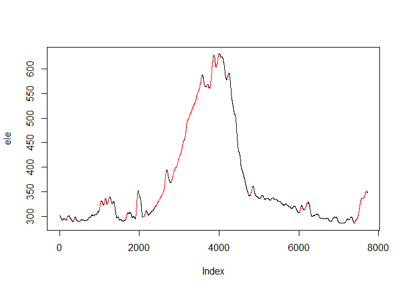
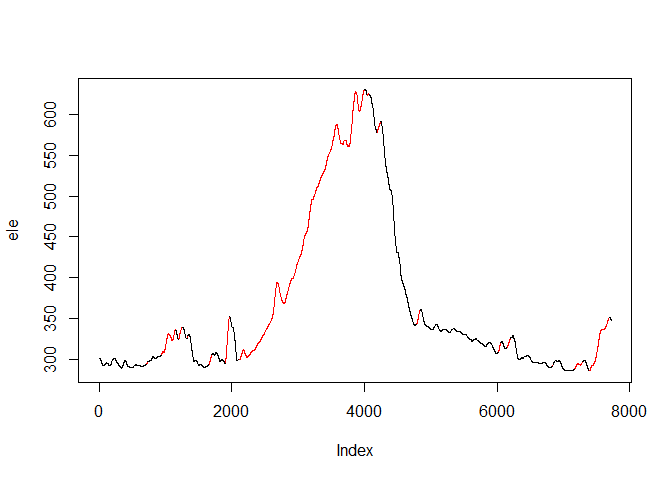
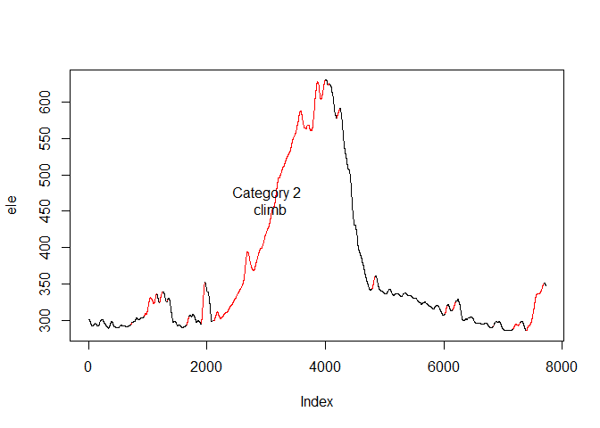
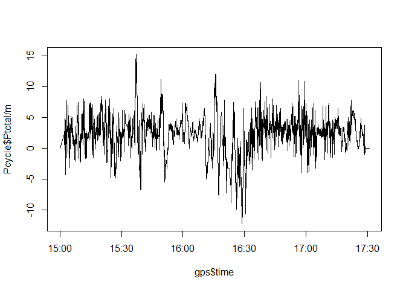

# Walkthrough for the cycleR package

-   Introduction
-   Segmenting time
-   Detection and categorization of climbs
-   Power calculation
    

## Introduction

This demonstration presents the `cycleR` package, which enables calculation of advanced advanced cycling parameters based on GPS data of the cycling route, for example power output, climb categorization, route-time segmentation. Calculations used in the package are based on [Strava glossary & calculations](https://strava.zendesk.com/forums/20246821-Strava-Glossary-Calculations) and are described in detail below. 

## Segmenting time 

The `segment_time` function determines the total time, moving time and resting time on a cycling route described with GPS data. Additionally, the function calculates the time spent ascending, descending and on the flat. Absolute and relative values of these parameters are combined in a data frame which is returned in a list along with the indexes of moving and resting samples of input GPS data. The input arguments of the function is the `gps` data frame containing GPS data. The GPS data frame has to be prepared before, for example using the package [`parseGPX`](https://github.com/ehrscape/R-project/tree/master/ParseGPX). The function is called with: 


```r
time_segmentation <- segment_time(gps, resting_ind)
```

To inspect in detail what the function does, we have to first load the sample data frame `gps` with GPS data of a cycling route located within the `cycleR` package


```r
load(system.file("extdata", "gps.Rda", package="cycleR"))
str(gps, strict.width = "wrap")
```

```
## 'data.frame':	7771 obs. of  5 variables:
## $ lon : num 14.4 14.4 14.4 14.4 14.4 ...
## $ lat : num 46 46 46 46 46 ...
## $ ele : num 296 296 296 296 296 ...
## $ time : chr "2015-06-02T14:59:55Z" "2015-06-02T15:01:55Z"
##    "2015-06-02T15:01:56Z" "2015-06-02T15:01:57Z" ...
## $ tz_CEST: chr "2015-06-02 16:59:55" "2015-06-02 17:01:55" "2015-06-02
##    17:01:56" "2015-06-02 17:01:57" ...
```

The function begins with converting the time vector of the GPS data to `POSIXct` format


```r
gps$time <- as.POSIXct(gps$time, format = "%Y-%m-%dT%H:%M:%SZ")
```

This is followed by calculating and prepairing six additional variables required for calculating the final result. The first one is `delta_time` which contains the time differences between the GPS samples. The time differences are calculated simply with the `diff` function and they have to be converted from POSIXct to numeric format 


```r
if(sum(names(gps) == "delta_time") == 0) {
    gps$delta_time <- c(NA, as.numeric(diff(gps$time)))
  }
```

The second variable is `d` containing the distances between GPS sample points. The distances in `d` are calculated by applying the `distanceGPS` function of the [`analyzeGPS` package](https://github.com/ehrscape/R-project/tree/master/AnalyzeGPS) on the latitude and longitude data of `gps`


```r
if (sum(names(gps) == "d") == 0) {
    gps$d <- c(NA, analyzeGPS::distanceGPS(lat1 = gps$lat[1:(length(gps$lat) - 
        1)], lon1 = gps$lon[1:(length(gps$lon) - 1)], lat2 = gps$lat[2:length(gps$lat)], 
        lon2 = gps$lon[2:length(gps$lon)]))
}
```

The third variable is `speed` containing the average velocities between GPS sample points. The velocity values are calculated by applying the `speedGPS` function of the `analyzeGPS` package on the `time` and previously calculated variable `d` of the `gps`


```r
if (sum(names(gps) == "speed") == 0) {
    gps$speed <- c(NA, analyzeGPS::speedGPS(gps$time, gps$d[-1]))
}
```

The fourth, fifth and sixth variables are `ele_smooth`, `d_smooth` and `grade_smooth` containing smoothed elevation, distances and hill grade values, respectively. Elevation and distances values are smoothed using rolling mean (function `rollapply` of the `zoo` package) with the smoothing window `win_smooth` approximately 60 seconds long. The `grade_smooth` variable is then calculated from the `ele` and `d_smooth` variables using the `gradeGPS` function of the `analyzeGPS` package. 


```r
if (sum(names(gps) == "grade_smooth") == 0) {
    # Smooth out the elevation and hill grade vectors usng rolling mean value
    # Length of the smoothing window is determined so that it's approximately 1
    # minute long
    win_smooth <- round(60/as.numeric(difftime(tail(gps$time, 1), gps$time[1], 
        units = "secs")/length(gps$time)), digits = -1)
    ele <- zoo::rollmean(gps$ele, win_smooth)
    d_smooth <- zoo::rollapply(gps$d, win_smooth, mean)
    grade <- analyzeGPS::gradeGPS(ele, d_smooth)
    
    # Insert the smoothened vectors into the main data frame
    gps$ele_smooth <- NA
    gps$ele_smooth[1:length(ele)] <- ele
    gps$d_smooth <- NA
    gps$d_smooth[1:length(d_smooth)] <- d_smooth
    gps$grade_smooth <- NA
    gps$grade_smooth[2:(length(grade) + 1)] <- grade
}
```

For consistency we add a `NA` value to each calculated additional variable and integrate it to the `gps` data frame. With the `if` sentence before each calculation, the input `gps` data frame is first checked if it already contains the variable to be calculated. If it is already there, it is not calculated again. After the initial preparation, the `gps` data frame looks something like 


```r
str(gps, strict.width = "wrap")
```

```
## 'data.frame':	7771 obs. of  11 variables:
## $ lon : num 14.4 14.4 14.4 14.4 14.4 ...
## $ lat : num 46 46 46 46 46 ...
## $ ele : num 296 296 296 296 296 ...
## $ time : POSIXct, format: "2015-06-02 14:59:55" "2015-06-02 15:01:55" ...
## $ tz_CEST : chr "2015-06-02 16:59:55" "2015-06-02 17:01:55" "2015-06-02
##    17:01:56" "2015-06-02 17:01:57" ...
## $ delta_time : num NA 120 1 1 1 1 1 1 1 1 ...
## $ d : num NA 6.48 2.98 3.56 4.11 ...
## $ speed : num NA 0.054 2.983 3.558 4.114 ...
## $ ele_smooth : num 301 301 301 301 301 ...
## $ d_smooth : num NA 7.25 7.27 7.38 7.46 ...
## $ grade_smooth: num NA 0.01352 0.0121 0.01084 0.00939 ...
```

Then `total_time` is calculated by summing up all values from the `delta_time` variable. All GPS samples with average speed less than 1 m/s (3.6 km/h) are determined as resting (standing still) and all those with average speed more than or equal 1 m/s are determined as moving/cycling. In both cases the sample indexes (`resting_ind`, `moving_ind`) and sum of corresponding `delta_time` values (`resting_time`, `moving_time`) are stored. Also the values of resting and moving time relative to the `total_time` are calculated (`t_rest_rel`, `t_mov_rel`). 


```r
total_time = sum(gps$delta_time, na.rm = TRUE)

resting_ind <- which(gps$speed < 1)
resting_time <- sum(gps$delta_time[resting_ind], na.rm = TRUE)
t_rest_rel <- resting_time / total_time

moving_ind <- which(gps$speed >= 1)
moving_time <- sum(gps$delta_time[-resting_ind], na.rm = TRUE)
t_mov_rel <- moving_time / total_time
```

This is followed by further segmentation of moving time by determining how much of that time was spent cycling ascending, descending and on flat. In the first step we exclude the resting periods from the input `gps` data frame. Then we calculate the total ascending time `time_asc` by summing up the time differences `delta_time` of all GPS samples that have a positive hill grade `grade_smooth`. The total descending time `time_desc` is calculated by summing up the time differences `delta_time` of all GPS samples that have a negative hill grade `grade_smooth`. The total time cycling on flat `time_flat` is calculated by summing up the time differences `delta_time` of all GPS samples that have the hill grade `grade_smooth` equal to zero. Additionally all the relative values (to `total_time`) of these times are determined (`t_asc_rel`, `t_desc_rel` and `t_flat_rel`). 


```r
# Segment only the moving part of the route
gps <- gps[-resting_ind,]

# Determine the total time spent ascending
time_asc <- sum(gps$delta_time[which(gps$grade_smooth > 0)], na.rm = TRUE)
t_asc_rel <- time_asc / total_time

# Determine the total time spent descending
time_desc <- sum(gps$delta_time[which(gps$grade_smooth < 0)], na.rm = TRUE)
t_desc_rel <- time_desc / total_time

# Determine the total time spent on flat
time_flat <- sum(gps$delta_time[which(gps$grade_smooth == 0)], na.rm = TRUE)
t_flat_rel <- time_flat / total_time
```

To conclude, the total time of GPS samples with undefined hill grade values (`NA`s) is also calculated. Samples with undefined hill grade values emerge beacuse of smoothing the elevation and distances. Finally, the values of time calculation are constructed into a data frame `time_div` which is then returned as function output in a list along with `resting_ind` and `moving_ind` vectors


```r
# Determine the time with undefined (NA) grade because of smoothing
time_NA <- sum(gps$delta_time[which(is.na(gps$grade_smooth))], na.rm = TRUE)
t_NA_rel <- time_NA / total_time

time_div <- data.frame(total_time = total_time, moving_time = moving_time,
                       t_mov_rel = t_mov_rel, resting_time = resting_time,
                       t_rest_rel = t_rest_rel, time_asc = time_asc,
                       t_asc_rel = t_asc_rel, time_desc = time_desc,
                       t_desc_rel = t_desc_rel, time_flat = time_flat,
                       t_flat_rel = t_flat_rel, time_NA = time_NA,
                       t_NA_rel = t_NA_rel)
time_div
```

```
##   total_time moving_time t_mov_rel resting_time t_rest_rel time_asc
## 1       9095        8770 0.9642661          325 0.03573392     4688
##   t_asc_rel time_desc t_desc_rel time_flat  t_flat_rel time_NA    t_NA_rel
## 1  0.515448      3986  0.4382628        25 0.002748763      71 0.007806487
```

```r
## return(list(time_div = time_div, resting_ind = resting_ind, moving_ind = moving_ind))
```


## Detection and categorization of climbs

The `categorize` function is used to detect and categorize all climbs of the cycling route. The input argument of the function is the `gps` data frame containing longitude, latitude, elevation and time data of the route. This function detects the starting and ending point, length, average grade and category of climbs. The function output is a list containing the input `gps` data frame with added categorization data, the `climbs` data frame with the details of the climbs and the `total_vam` variable indicating the total vertical ascent meters (VAM) of the route. The function is called with: 


```r
climb_cat <- categorize(gps)
```

Since sample data frame `gps` with GPS data of a cycling route located within the `cycleR` package was already loaded, we can proceed by inspecting the function's actions. Firstly, the time vector is converted to POSIXct format and smoothing of the distances `d`, elevation `ele`, hill grades `grade` and time differences `delta_time` are performed similarly as in the beginning of previously explained `segment_time` function


```r
gps$time <- as.POSIXct(gps$time, format = "%Y-%m-%dT%H:%M:%SZ")

# Calculate distances between GPS data points if it doesn't exist
if (sum(names(gps) == "d") == 0) {
    gps$d <- c(NA, analyzeGPS::distanceGPS(lat1 = gps$lat[1:(length(gps$lat) - 
        1)], lon1 = gps$lon[1:(length(gps$lon) - 1)], lat2 = gps$lat[2:length(gps$lat)], 
        lon2 = gps$lon[2:length(gps$lon)]))
}

# Smooth out the elevation and hill grade vectors using rolling mean value
# Length of the smoothing window is determined so that it's approximately 1
# minute long
win_smooth <- round(60/as.numeric(difftime(tail(gps$time, 1), gps$time[1], units = "secs")/length(gps$time)), 
    digits = -1)
d_smooth <- zoo::rollapply(gps$d, win_smooth, mean)
ele <- zoo::rollmean(gps$ele, win_smooth)
grade <- analyzeGPS::gradeGPS(ele, d_smooth)

# Insert the smoothened vectors into the main data frame
gps$d_smooth <- NA
gps$d_smooth[1:length(d_smooth)] <- d_smooth
gps$ele_smooth <- NA
gps$ele_smooth[1:length(ele)] <- ele
gps$grade_smooth <- NA
gps$grade_smooth[2:(length(grade) + 1)] <- grade

if (sum(names(gps) == "delta_time") == 0) {
    gps$delta_time <- c(NA, as.numeric(diff(gps$time)))
}
```

Additional preparation step in this case is calculation of elevation differences `delta_ele` executed on the smoothed elevation data 


```r
if (sum(names(gps) == "delta_ele") == 0) {
    gps$delta_ele <- c(NA, gps$ele_smooth[2:length(gps$ele_smooth)] - gps$ele_smooth[1:(length(gps$ele_smooth) - 
        1)])
}
```

Following the finished preparations, we can proceed with detection and categorization of climbs. This is based on the [Strava categorization](https://strava.zendesk.com/entries/20420292-How-are-Strava-climbs-categorized-For-Rides-) which claims that categorization is based on the product of percent grade and the length of the climb in meters. If this product is greater than 8000 then it is a categorized climb (in our case "Cat 4"). The limit for "Cat 3" climbs is 16000, for "Cat 2" climbs 32000, for "Cat 1" climbs 64000 and for "Cat HC" climbs (the hardest climbs) the limit is 80000. The referenced page also claims that the minimum percent grade of a clmb must be 3% or higher. However, the initial search criteria in our case was 2 % or higher to ensure detection and categorization of all climbs according to the grade - length product (this enables detection of climbs that are not as steep, but are longer in length). All samples with the grade - length product lower than 8000 are categorized as "no_category". 
With this information in mind, climb detection begins with detecting all lengths and values of runs of values in the vector `grade_smooth` that are greater than 2 % (0.02). This is executed using the `rle` function, which produces the `runs` list that includes vectors `lengths` and `values`. Elements of these two vectors contain information about length and value according to the condition used in `rle` function for each run. The indexes of runs of grade greater than 2 % are determined by extracting indexes of the positive (`TRUE`) runs in the vectors in the `runs` list and stored in `positives` vector


```r
runs <- rle(gps$grade_smooth >= 0.02)
str(runs)
```

```
## List of 2
##  $ lengths: int [1:135] 1 178 17 155 28 340 9 209 8 1 ...
##  $ values : logi [1:135] NA FALSE TRUE FALSE TRUE FALSE ...
##  - attr(*, "class")= chr "rle"
```

```r
positives <- which(runs$values)
str(positives)
```

```
##  int [1:43] 3 5 7 9 11 13 15 17 19 21 ...
```

The extracted indexes in `positives` are used to create inital `hill` data frame containing the climb details, such as starting and ending point, average grade, total length and vertical ascent meters. Each line in the `hill` data frame represents details of a separate climb


```r
hill <- data.frame(ind_start = rep(0, length(positives)), ind_end = rep(0, length(positives)), 
    len = rep(0, length(positives)), avg_grade = rep(0, length(positives)), 
    vam = rep(0, length(positives)))

for (i in 1:length(positives)) {
    hill$ind_start[i] <- sum(runs$lengths[1:(positives[i] - 1)]) + 1
    hill$ind_end[i] <- sum(runs$lengths[1:positives[i]])
    ind <- seq(hill$ind_start[i], hill$ind_end[i])
    hill$len[i] <- sum(gps$d[ind])
    hill$avg_grade[i] <- mean(gps$grade_smooth[ind])
    hill$vam[i] <- gps$ele_smooth[hill$ind_end[i]] - gps$ele_smooth[hill$ind_start[i]]
}

str(hill)
```

```
## 'data.frame':	43 obs. of  5 variables:
##  $ ind_start: num  180 352 720 938 947 ...
##  $ ind_end  : num  196 379 728 945 951 ...
##  $ len      : num  144.3 236.8 109.3 64.8 46.8 ...
##  $ avg_grade: num  0.0278 0.0321 0.0245 0.021 0.0216 ...
##  $ vam      : num  3.86 7.332 1.97 1.376 0.804 ...
```

```r
plot(ele, type = "l")
for (i in 1:dim(hill)[1]) {
    lines(x = seq(hill$ind_start[i] + 1, hill$ind_end[i] - 1), y = ele[seq(hill$ind_start[i] + 
        1, hill$ind_end[i] - 1)], col = "red")
}
```



Of course at this stage, the number of climbs (rows in `hill`) is higher than one would say after a simple visual inspection of the elevation graph above. Therefore, to get closer to the actual result further inspection and analysis of data in the `hill` data frame is required. Firstly, we aggregate all slopes that are close together and interrupted only by short (less than `win_smooth`) reductions of grade (below 2 %). This means that we are searching for starting points of climbs in `hill` that are closer together than `win_smooth`. The climbs that match this condition and start close together are combined into a single climb that starts at the starting point of the first climb and ends at the ending point of the second climb. The length and average grade of the combined climb are the sum of lengths and average grade of all data points between the starting and ending point of the combined climb. Vertical ascent meters of the combined climb are calculated as the difference between elevation of the ending and starting points of the newly combined climb. The second climb is now obsolete and can be excluded from the `hill` data frame. Line indexes of all obsolete climbs are stored separately in `del_lines` vector and used to delete them after the `for` loop is finished. The indexes of deleted lines are also displayed just above the visualization of result in the figure below the following code chunk 


```r
del_lines <- NA

groups <- which(diff(hill$ind_start) > win_smooth)
for (i in 1:length(groups)) {
    if (i == 1) {
        hill$ind_end[i] <- hill$ind_end[groups[i]]
        hill$len[i] <- sum(gps$d[hill$ind_start[i]:hill$ind_end[i]])
        hill$avg_grade[i] <- mean(gps$grade_smooth[hill$ind_start[i]:hill$ind_end[i]])
        hill$vam[i] <- gps$ele_smooth[hill$ind_end[i]] - gps$ele_smooth[hill$ind_start[i]]
        
        del_lines <- c(del_lines, (i + 1):groups[i])
    } else {
        hill$ind_end[groups[i - 1] + 1] <- hill$ind_end[groups[i]]
        hill$len[groups[i - 1] + 1] <- sum(gps$d[hill$ind_start[groups[i - 1] + 
            1]:hill$ind_end[groups[i - 1] + 1]])
        hill$avg_grade[groups[i - 1] + 1] <- mean(gps$grade_smooth[hill$ind_start[groups[i - 
            1] + 1]:hill$ind_end[groups[i - 1] + 1]])
        hill$vam[groups[i - 1] + 1] <- gps$ele_smooth[hill$ind_end[groups[i - 
            1] + 1]] - gps$ele_smooth[hill$ind_start[groups[i - 1] + 1]]
        
        if ((groups[i - 1] + 1) != groups[i]) {
            del_lines <- c(del_lines, (groups[i - 1] + 1 + 1):groups[i])
        }
        
    }
    if (i == length(groups)) {
        hill$ind_end[groups[i] + 1] <- tail(hill$ind_end, 1)
        hill$len[groups[i] + 1] <- sum(gps$d[hill$ind_start[groups[i] + 1]:hill$ind_end[groups[i] + 
            1]])
        hill$avg_grade[groups[i] + 1] <- mean(gps$grade_smooth[hill$ind_start[groups[i] + 
            1]:hill$ind_end[groups[i] + 1]])
        hill$vam[groups[i] + 1] <- gps$ele_smooth[hill$ind_end[groups[i] + 1]] - 
            gps$ele_smooth[hill$ind_start[groups[i] + 1]]
        
        if ((groups[i] + 1) != dim(hill)[1]) {
            del_lines <- c(del_lines, (groups[i] + 1 + 1):dim(hill)[1])
        }
        
    }
    
}

del_lines <- del_lines[-1]
del_lines
```

```
##  [1]  2  1  5  6 13 15 16 17 18 22 26 30 36 38 40 41 43
```

```r
hill <- hill[-del_lines, ]

str(hill)
```

```
## 'data.frame':	26 obs. of  5 variables:
##  $ ind_start: num  720 938 1112 1201 1327 ...
##  $ ind_end  : num  728 1035 1146 1246 1336 ...
##  $ len      : num  109.3 922.6 347.5 383.2 78.1 ...
##  $ avg_grade: num  0.0245 0.0273 0.0405 0.0374 0.0237 ...
##  $ vam      : num  1.97 25.08 12.65 13.9 1.94 ...
```

```r
plot(ele, type = "l")
for (i in 1:dim(hill)[1]) {
    lines(x = seq(hill$ind_start[i] + 1, hill$ind_end[i] - 1), y = ele[seq(hill$ind_start[i] + 
        1, hill$ind_end[i] - 1)], col = "red")
}
```


The climbs are further aggregated based on the difference between the starting point of a climb and the ending point of a previous climb. Two climbs are aggregated if this difference is less than half of `win_smooth`. This aggregation is performed within a `while` loop using backsearch. If for a certain climb there exists a predecessor for which the described condition is true than a combined climb is created by updating the details of the previous climb using similar corrections as described in the previous aggregation step. The current climb is deleted after its details are used to create the combined climb. In the bottom of the following code chunk, the number of deleted lines (aggregated climbs) is indicated with variable `deleted_lines` and the resulting elevation graph is visualized


```r
dim_start <- dim(hill)[1]
i <- 2
while(i <= dim(hill)[1]) {
  if((hill$ind_start[i] - hill$ind_end[i - 1]) < (win_smooth / 2)) {
    hill$ind_end[i - 1] <- hill$ind_end[i]
    hill$len[i - 1] <- sum(gps$d[hill$ind_start[i - 1]: hill$ind_end[i - 1]])
    hill$avg_grade[i - 1] <- mean(gps$grade_smooth[hill$ind_start[i - 1]: hill$ind_end[i - 1]])
    hill$vam[i - 1] <- gps$ele_smooth[hill$ind_end[i - 1]] - gps$ele_smooth[hill$ind_start[i - 1]]
    hill <- hill[-i,]
  } else {
    i <- i + 1
  }
}

deleted_lines <- dim_start - dim(hill)[1]
deleted_lines
```

```
## [1] 3
```

```r
str(hill)
```

```
## 'data.frame':	23 obs. of  5 variables:
##  $ ind_start: num  720 938 1112 1201 1327 ...
##  $ ind_end  : num  728 1035 1146 1246 1336 ...
##  $ len      : num  109.3 922.6 347.5 383.2 78.1 ...
##  $ avg_grade: num  0.0245 0.0273 0.0405 0.0374 0.0237 ...
##  $ vam      : num  1.97 25.08 12.65 13.9 1.94 ...
```

```r
plot(ele, type="l")
for(i in 1:dim(hill)[1]) {
  lines(x = seq(hill$ind_start[i] + 1, hill$ind_end[i] - 1), y = ele[seq(hill$ind_start[i] + 1, hill$ind_end[i] - 1)], col = "red")
}
```


These two steps ensure that we aggregate all climbs that are very close together interrupted by shorter intervals of data points with grade less than 2 %. However, we still have to consider longer climbs that have relatively short intervals of lower or even negative hill grade that don't have a great effect on the general climb difficulty or category (e.g. in the elevation graphs around indexes 2800 and 3800). In the final aggregation step we will combine pairs of climbs whose combined length is greater than the distance between them. Indexes of these pairs are determined in a `for` loop and stored in the vector `groups2`. All consecutive indexes in the `groups2` vector are aggregated together and the corresponding hills will be combined together in a single move. The `gr_difference` variable stores the indexes of the hills to combine. The number of elements in `gr_difference` corresponds with the number of consecutive index groups in `groups2`.  The hills are combined in the same way as described in the previous step. The indexes of deleted/aggregated climbs is displayed just above the final elevation graph in the end of the following code chunk


```r
groups2 <- NA
for(i in 1:(dim(hill)[1] - 1)){
  if((sum(gps$d[hill$ind_end[i]: hill$ind_start[i + 1]])) < sum(hill$len[i], hill$len[i + 1])) {
    groups2 <- c(groups2, i)
  }
}
groups2 <- groups2[-1]
groups2
```

```
##  [1]  2  3  8  9 10 11 12 13 14 21 22
```

```r
gr_difference <- which(diff(groups2) > 1)
gr_difference
```

```
## [1] 2 9
```

```r
del_lines <- NA

for(i in 1:length(gr_difference)) {
  if(i == 1){
    hill$ind_end[groups2[i]] <- hill$ind_end[groups2[gr_difference[i]]]
    hill$len[groups2[i]] <- sum(gps$d[hill$ind_start[groups2[i]]:
                                        hill$ind_end[groups2[i]]])
    hill$avg_grade[groups2[i]] <- mean(gps$grade_smooth[hill$ind_start[groups2[i]]:
                                                          hill$ind_end[groups2[i]]])
    hill$vam[groups2[i]] <- gps$ele_smooth[hill$ind_end[groups2[i]]] - 
      gps$ele_smooth[hill$ind_start[groups2[i]]]
    del_lines <- c(del_lines, (groups2[i]+1):groups2[gr_difference[i]])
  } else {
    hill$ind_end[groups2[gr_difference[i - 1] + 1]] <- 
      hill$ind_end[groups2[gr_difference[i]]]
    hill$len[groups2[gr_difference[i - 1] + 1]] <- 
      sum(gps$d[hill$ind_start[groups2[gr_difference[i - 1] + 1]]:
                  hill$ind_end[groups2[gr_difference[i - 1] + 1]]])
    hill$avg_grade[groups2[gr_difference[i - 1] + 1]] <- 
      mean(gps$grade_smooth[hill$ind_start[groups2[gr_difference[i - 1] + 1]]:
                              hill$ind_end[groups2[gr_difference[i - 1] + 1]]])
    hill$vam[groups2[gr_difference[i - 1] + 1]] <- 
      gps$ele_smooth[hill$ind_end[groups2[gr_difference[i - 1] + 1]]] -
      gps$ele_smooth[hill$ind_start[groups2[gr_difference[i - 1] + 1]]]
    
    if((groups2[gr_difference[i - 1] + 1]) != (groups2[gr_difference[i]])) {
      del_lines <- c(del_lines, (groups2[gr_difference[i - 1] + 1] + 1):
                       groups2[gr_difference[i]])
    } else {
      del_lines <- del_lines
    }
    
  }
  if(i == length(gr_difference)) {
    hill$ind_end[groups2[gr_difference[i] + 1]] <- 
      hill$ind_end[groups2[length(groups2)]]
    hill$len[groups2[gr_difference[i] + 1]] <- 
      sum(gps$d[hill$ind_start[groups2[gr_difference[i] + 1]]:
                  hill$ind_end[groups2[gr_difference[i] + 1]]])
    hill$avg_grade[groups2[gr_difference[i] + 1]] <- 
      mean(gps$grade_smooth[hill$ind_start[groups2[gr_difference[i] + 1]]:
                              hill$ind_end[groups2[gr_difference[i] + 1]]])
    hill$vam[groups2[gr_difference[i] + 1]] <- 
      gps$ele_smooth[hill$ind_end[groups2[gr_difference[i] + 1]]] -
      gps$ele_smooth[hill$ind_start[groups2[gr_difference[i] + 1]]]
    
    if((groups2[gr_difference[i] + 1]) != (groups2[length(groups2)])) {
      del_lines <- c(del_lines, (groups2[gr_difference[i] + 1] + 1):
                       (groups2[length(groups2)]))
    } else {
      del_lines <- del_lines
    }
  }
}

del_lines <- del_lines[-1]
del_lines
```

```
## [1]  3  9 10 11 12 13 14 22
```

```r
hill <- hill[-del_lines,]
str(hill)
```

```
## 'data.frame':	15 obs. of  5 variables:
##  $ ind_start: num  720 938 1201 1327 1657 ...
##  $ ind_end  : num  728 1146 1246 1336 1694 ...
##  $ len      : num  109.3 1994.8 383.2 78.1 272.2 ...
##  $ avg_grade: num  0.0245 0.0161 0.0374 0.0237 0.041 ...
##  $ vam      : num  1.97 30.95 13.9 1.94 11.28 ...
```

```r
plot(ele, type="l")
for(i in 1:dim(hill)[1]) {
  lines(x = seq(hill$ind_start[i] + 1, hill$ind_end[i] - 1), y = ele[seq(hill$ind_start[i] + 1, hill$ind_end[i] - 1)], col = "red")
}
```



Finally, categorization of the detected climbs is performed. An additional variable `category` is added to the `hill` data frame, which includes the grade - length product. Its values are then divided in intervals with limits described earlier. After this the `category` values are factorized with values `no_category`, `4`, `3`, `2`, `1` and `HC`. The factorized vector `hill$category` is than inserted into the input `gps` data frame based on the hill starting and ending indexes


```r
hill$category <- hill$len * 100 * hill$avg_grade
hill$category <- findInterval(hill$category, c(8000, 16000, 32000, 64000, 80000))
hill$category <- factor(hill$category, levels = c(0, 1, 2, 3, 4, 5), 
                        labels = c("no_category", "4", "3", "2", "1", "HC"))

# Insert hill data into the main gps data frame
gps$category <- 0
for(i in 1:dim(hill)[1]) {
  if(hill$category[i] != "no_category") {
    gps$category[hill$ind_start[i]:hill$ind_end[i]] <- as.character(hill$category[i])
  }
}
gps$category <- factor(gps$category, 
                       levels = c("0", "1", "2", "3", "4", "HC"), 
                       labels = c("no_category", "1", "2", "3", "4", "HC"))
```

The function `categorize` is concluded by calculating the total vertical ascent meters (VAM) of the cycling route which is returned as a final result in a list together with `gps` and `hill` data frames


```r
total_vam <- sum(gps$delta_ele[which(gps$grade_smooth > 0)], na.rm = TRUE)

str(list(gps = gps, climbs = hill, total_vam = total_vam))
```

```
## List of 3
##  $ gps      :'data.frame':	7764 obs. of  13 variables:
##   ..$ lon         : num [1:7764] 14.4 14.4 14.4 14.4 14.4 ...
##   ..$ lat         : num [1:7764] 46 46 46 46 46 ...
##   ..$ ele         : num [1:7764] 296 296 296 296 296 ...
##   ..$ time        : POSIXct[1:7764], format: "2015-06-02 14:59:55" ...
##   ..$ tz_CEST     : chr [1:7764] "2015-06-02 16:59:55" "2015-06-02 17:01:56" "2015-06-02 17:01:57" "2015-06-02 17:01:58" ...
##   ..$ delta_time  : num [1:7764] NA 1 1 1 1 1 1 1 1 1 ...
##   ..$ d           : num [1:7764] NA 2.98 3.56 4.11 4.46 ...
##   ..$ speed       : num [1:7764] NA 2.98 3.56 4.11 4.46 ...
##   ..$ ele_smooth  : num [1:7764] 301 301 301 301 301 ...
##   ..$ d_smooth    : num [1:7764] NA 7.27 7.38 7.46 7.52 ...
##   ..$ grade_smooth: num [1:7764] NA 0.0121 0.01084 0.00939 0.00824 ...
##   ..$ delta_ele   : num [1:7764] NA 0.186 0.08 0.07 0.062 ...
##   ..$ category    : Factor w/ 6 levels "no_category",..: 1 1 1 1 1 1 1 1 1 1 ...
##  $ climbs   :'data.frame':	15 obs. of  6 variables:
##   ..$ ind_start: num [1:15] 720 938 1201 1327 1657 ...
##   ..$ ind_end  : num [1:15] 728 1146 1246 1336 1694 ...
##   ..$ len      : num [1:15] 109.3 1994.8 383.2 78.1 272.2 ...
##   ..$ avg_grade: num [1:15] 0.0245 0.0161 0.0374 0.0237 0.041 ...
##   ..$ vam      : num [1:15] 1.97 30.95 13.9 1.94 11.28 ...
##   ..$ category : Factor w/ 6 levels "no_category",..: 1 1 1 1 1 1 4 1 1 1 ...
##  $ total_vam: num 803
```

In this case there is only one categorized ("Cat 2") climb with the following details and visualization


```r
hill[which(hill$category != "no_category"),]
```

```
##    ind_start ind_end      len  avg_grade     vam category
## 12      2122    3996 10727.41 0.03539187 329.058        2
```

```r
plot(ele, type="l")
for(i in 1:dim(hill)[1]) {
  lines(x = seq(hill$ind_start[i] + 1, hill$ind_end[i] - 1), y = ele[seq(hill$ind_start[i] + 1, hill$ind_end[i] - 1)], col = "red")
}

for(i in 1:dim(hill)[1]) {
  if(hill$category[i] != "no_category") {
    text(x = round(mean(c(hill$ind_start[i], hill$ind_end[i]))),
         y = mean(gps$ele_smooth[c(hill$ind_start[i], hill$ind_end[i])]),
         labels = paste("Category", hill$category[i], "\n climb"))
  }
}
```




## Power calculation

The `cycling_power` function is used to assess the total power produced by a cyclist on a bike ride given the GPS data and additional physical parameters, such as the combined mass of the cyclist and the bicycle, coefficients for rolling resistance and drag, air density, surface area of the cyclist facing the wind, wind speed. Specifically, the power required from a person to move on a bike between measured points of a GPS route is calculated, based on the formula $P = Proll + Pdrag + Pclimb + Pacc$, where `Proll` is the power required to overcome the rolling resistance, `Pdrag` is the power required to overcome the wind resistance, `Pclimb` is the power required to overcome the pull of gravity and `Pacc` is the power required to accelerate from one speed to another. All power values in this function are calculated directly in Wats (W) since basic metric units are used throughout this package as well as the package `analyzeGPS`. Calculations were defined according to [Strava Power Calculations](https://strava.zendesk.com/entries/20959332-Power-Calculations). The usage of the `cycling_power` function is 


```r
## Pcycling <- cycling_power(gps, m = 90, Crr = 0.004, Cd = 0.9, ro = 1.13, A = 0.5, 
##     windspeed = 0)
m <- 90
Crr <- 0.004
Cd <- 0.9
ro <- 1.13
A <- 0.5
windspeed <- 0
```

with the following arguments: 

  * `gps`: the GPS data of the cycling route (longitude, latitude, time, elevation, ...),
  * `m`: the combined mass of the rider and the bicycle (in kilograms),
  * `Crr`: the rolling resistance coefficient defined based on the type of bike (road, mtb, cross) used. The coefficient was determined according to data and calculations on [Analytic Cycling](http://www.analyticcycling.com/ForcesTires_Page.html),
  * `Cd`: the drag coefficient ([its value depends on the bike, equipment and rider position](http://www.cyclingpowerlab.com/CyclingAerodynamics.aspx); typical values can also be found in: Wilson, David Gordon, and Jim Papadopoulos. Bicycling science, p. 188. Mit Press, 2004.),
  * `ro`: air density (in kg/m^3). At 25 degrees Celsius and 300 m elevation air density is approximately 1.13 kg/m^3 using [this calculator](http://www.denysschen.com/catalogue/density.aspx),
  * `A`: the surface area of the rider facing the wind with [typical values](http://www.cyclingpowerlab.com/CyclingAerodynamics.aspx) between 0.4 and 0.7 (typical values can also be found in: Wilson, David Gordon, and Jim Papadopoulos. Bicycling science, p. 188. Mit Press, 2004.),
  * `windspeed`: average wind speed in m/s. Head wind is given as a negative number and tail wind is given as a positive number. This argument has value of 0 if there is no information about wind speed (default).

Default values of all input arguments apart from the `gps` data frame are set to 0 by function definition. In case any of them is missing, the calculation that requires it, isn't performed and returns `NA` values for the coresponding part of the output. 

Once the function is called it begins by prepairing all the data needed for the power calculations. The preparation of the data is almost the same as with previously described functions `segment_time` and `categorize` with the exception of defining the vector of smoothed speed and acceleration values and the value of gravitational pull (9.81 m/s^2). The smoothed speed `speed_smooth` is calculated directly from the smoothed distnace vector `d` by dividing those values with the average sampling time of the GPS data. The smoothed speed values are then used to calculate the smoothed acceleration values by dividing them with the time differences between samples (ba applying the `accGPS` function of the `analyzeGPS` package) 


```r
g <- 9.81

gps$time <- as.POSIXct(gps$time, format = "%Y-%m-%dT%H:%M:%SZ")

# Length of the smoothing window is determined so that it's approximately 1 minute long
win_smooth <- round(60 / as.numeric(difftime(tail(gps$time, 1), gps$time[1], units = "secs") / length(gps$time)), digits = -1)

# Smooth out the distances using rolling mean value
d <- c(NA, analyzeGPS::distanceGPS(lat1 = gps$lat[1:(length(gps$lat)-1)], lon1 = gps$lon[1:(length(gps$lon)-1)],
                                          lat2 = gps$lat[2:length(gps$lat)], lon2 = gps$lon[2:length(gps$lon)]))

d_smooth <- rep(NA, length(d))
d_smooth[1:(length(d_smooth) - win_smooth + 1)] <- zoo::rollapply(d, win_smooth, mean)

delta_time <- c(NA, as.numeric(difftime(gps$time[-1], gps$time[1:(length(gps$time) - 1)], units = "secs")))
samp_avg <- round(mean(delta_time, na.rm = T), digits = 0)

speed_smooth <- d_smooth / samp_avg

acc_smooth <- c(NA, analyzeGPS::accGPS(gps$time, speed_smooth))

ele_smooth <- rep(NA, length(gps$ele))
ele_smooth[1:(length(gps$ele) - win_smooth + 1)] <- zoo::rollmean(gps$ele, win_smooth)
grade_smooth <- c(NA, analyzeGPS::gradeGPS(ele_smooth, d_smooth))
```

The prepared data is then used with other input arguments of the function to calculate the power values. First, the rolling power is calculated by following the forumla $$Proll = Crr * N * speed = Crr * m * g * cos(atan(grade)) * speed$$, where $N$ is the normal force of the bike and the athlete against gravity and is calculated as $m * g * cos(atan(grade))$ and $speed$ is the average speed between two GPS data points (values $m$, $g$, $Crr$ and $grade$ were previously explained). Before the calculation of the rolling power it is checked if all the necessary parameters are defined with values different than default. If any of these values is missing, `Proll` is filled with `NA` values


```r
if((Crr != 0) & (m != 0)){
  Proll <- Crr * m * g * cos(atan(grade_smooth)) * speed_smooth
} else {
  Proll <- rep(NA, length(speed_smooth))
}
```

Next, the power to overcome drag is calculated by following the forumla $$Pdrag = 0.5 * ro * v^3 * Cd * A = 0.5 * ro * (speed - windspeed)^3 * Cd * A$$, where $v$ is the air speed of the bike and the athlete and is calculated as $speed - windspeed$ (values $ro$, $Cd$, and $A$ were previously explained). In the case of head wind the wind speed is negative, which increases air speed and drag force, and in the case of tail wind the wind speed is positive, which decreases air speed and drage force. Before the calculation of the power to overcome drag it is checked if all the necessary parameters are defined with values different than default. If any of these values is missing, `Pdrag` is filled with `NA` values


```r
if((Cd != 0) & (ro != 0) & (A != 0)){
  Pdrag <- 0.5 * ro * (speed_smooth - windspeed)^3 * Cd * A
} else {
  Pdrag <- rep(NA, length(speed_smooth))
}
```

Next, the power to overcome the pull of gravity while riding up an incline (climbing power) is calculated by following the forumla $$Pclimb = Fd * speed = m * g * sin(atan(grade)) * speed$$, where $Fd$ is the component of the gravity force of the bike and the athlete parallel to the ground and is calculated as $m * g * sin(atan(grade))$ (other values were previously explained). In the case of negative hill grade (downhill ride) the climbing power is also negative (gravity is supplying power), and in the case of positive hill grade (uphill ride) the climbing power is also positive (bike rider is supplying power). Before the calculation of the climbing power it is checked if all the necessary parameters are defined with values different than default. If any of these values is missing, `Pclimb` is filled with `NA` values


```r
if(m != 0){
  Pclimb <- m * g * sin(atan(grade_smooth)) * speed_smooth
} else {
  Pclimb <- rep(NA, length(speed_smooth))
}
```

Next, the power required to accelerate from one speed to another (accelerating power) is calculated by following the forumla $$Pacc =  m * acc * v$$, where $acc$ is the average acceleration (smoothed) between two data points (other values were previously explained). In the case of negative speed difference (decceleration, slowing down) the accelerating power is also negative (power from braking, wind resistance, the bike rider is not supplying power), and in the case of positive speed difference (acceleration, speeding up) the accelerating power is also positive (bike rider is supplying power). Before the calculation of the acceleration power it is checked if all the necessary parameters are defined with values different than default. If any of these values is missing, `Pacc` is filled with `NA` values


```r
if(m != 0){
  Pacc <- m * acc_smooth * speed_smooth
} else {
  Pacc <- rep(NA, length(speed_smooth))
}
```

Finally, the total cycling power `Ptotal` is calculated by summing up the previously calculated partial power values. In parallel all the power values are packed in a data frame, which is returned as the result of the function


```r
Pcycle <- data.frame(Proll = Proll, Pdrag = Pdrag, Pclimb = Pclimb, Pacc = Pacc)

Pcycle$Ptotal <- rowSums(Pcycle, na.rm = T)

str(Pcycle)
```

```
## 'data.frame':	7764 obs. of  5 variables:
##  $ Proll : num  NA 26.1 26.1 26.3 26.6 ...
##  $ Pdrag : num  NA 103 102 105 108 ...
##  $ Pclimb: num  NA 77.7 70.6 61.8 54.7 ...
##  $ Pacc  : num  NA NA -13.9 50 46.6 ...
##  $ Ptotal: num  0 207 185 243 236 ...
```

From here on we can visualize the calculated total power or any of its components 


```r
plot(gps$time, Pcycle$Ptotal, type = "l")
```


We can calculate the average power input of the cyclist


```r
mean(Pcycle$Ptotal, na.rm = TRUE)
```

```
## [1] 202.9225
```

Or we can calculate the average wattage per kilogram and visualize the power curve


```r
mean(Pcycle$Ptotal / m, na.rm = TRUE)
```

```
## [1] 2.254695
```

```r
plot(gps$time, Pcycle$Ptotal / m, type = "l")
```



