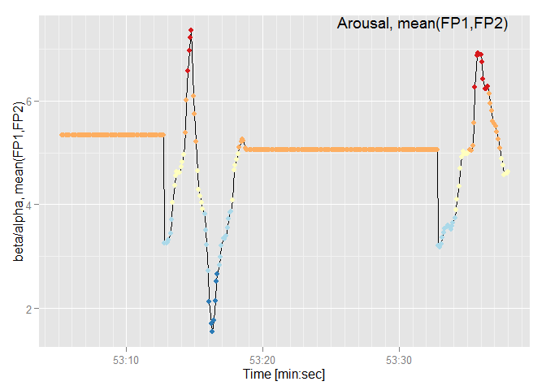

# Walkthrough for the emotionEEG package

-   Introduction
-   Data import
-   Emotional arousal calculation
    -   Arousal based on combination of channels FP1 and FP2
    -   Arousal separately for channel FP1 and FP2
-   Emotional valence calculation
-   Result

## Introduction

This demo presents the `emotion_analysis` function of the `emotionEEG` package, which uses the EEG data collected with the [InterAxon Muse device](http://www.choosemuse.com/) and assesses emotional valence and arousal based on asymmetry analysis. The EEG data prepared by the `read_eeg` function of the `museEEG` package contains EEG signal values in microvolts and alpha and beta absolute band powers and ratios in decibels. Emotional valence is calcluated based on the ratio of alpha band power between right and left EEG chanels FP2 and FP1. Emotional arousal is calculated based on the mean value of beta to alpha ratios of left and right EEG channels FP1 and FP2. The function `emotion_analysis` is defined as

``` r
emotion_analysis <- function(data)
```

where `data` is the input data frame containing EEG data (and posibbly other biodata, e.g. ECG, heart rate, GPS, etc.) with the following columns:

-   `time`: vector of unix timestamps in milisecond precision,
-   `type`: indication of wether the signal is EEG, or alpha or beta band,
-   `TP9`, `FP1`, `FP2`, `TP10`: EEG data from channels TP9, FP1, FP2, TP10,
-   `fp1_fp2`: ratio of alpha and beta band data of channels FP1 and FP2 (in decibels). The EEG type should be ignored,
-   `fp1_beta_alpha`: ratio between beta and alpha band power of channel FP1 (in decibels),
-   `fp2_beta_alpha`: ratio between beta and alpha band power of channel FP2 (in decibels),
-   additional columns with ECG and/or GPS data

The output of the function `emotion_analysis` is the input data frame `data` complemented with columns:

-   `timecest`: the time vector in `POSIXct` format (converted from the `time` column),
-   `fp1_fp2_beta_alpha_avg`: average values of beta-alpha ratios of channels FP1 and FP2,
-   `arousal`: factorized arousal classes averaged for channels FP1 and FP2,
-   `valence`: factorized valence classes for channels FP1 and FP2,
-   `arousalFP1`: factorized arousal classes for channel FP1,
-   `arousalFP2`: factorized arousal classes for channel FP2.

## Data import

The function expects the input to be a data frame, which is prepared by the `read_eeg` function of the `museEEG` package. To simplify, some example data is loaded from a file to the `emotion` data frame in this demonstration

``` r
load(system.file("extdata", "emotion.Rda", package="emotionEEG"))
str(emotion)
```

    ## 'data.frame':    7880 obs. of  9 variables:
    ##  $ time          : num  1.42e+09 1.42e+09 1.42e+09 1.42e+09 1.42e+09 ...
    ##  $ type          : Factor w/ 3 levels "alpha","beta",..: 1 2 3 3 3 3 3 3 3 3 ...
    ##  $ TP9           : num  0 0 822 841 859 ...
    ##  $ FP1           : num  0.162 0.771 983.698 957.379 901.449 ...
    ##  $ FP2           : num  0.117 0.575 723.791 692.537 638.252 ...
    ##  $ TP10          : num  0 0 855 901 928 ...
    ##  $ fp2_fp1       : num  -0.441 -1.957 NA NA NA ...
    ##  $ fp1_beta_alpha: num  NA 6.09 NA NA NA ...
    ##  $ fp2_beta_alpha: num  NA 4.58 NA NA NA ...

The time vector is converted to `POSIXct` format to create the time axis for plotting

``` r
emotion$timecest <- as.POSIXct(emotion$time, origin = "1970-01-01")
str(emotion)
```

    ## 'data.frame':    7880 obs. of  10 variables:
    ##  $ time          : num  1.42e+09 1.42e+09 1.42e+09 1.42e+09 1.42e+09 ...
    ##  $ type          : Factor w/ 3 levels "alpha","beta",..: 1 2 3 3 3 3 3 3 3 3 ...
    ##  $ TP9           : num  0 0 822 841 859 ...
    ##  $ FP1           : num  0.162 0.771 983.698 957.379 901.449 ...
    ##  $ FP2           : num  0.117 0.575 723.791 692.537 638.252 ...
    ##  $ TP10          : num  0 0 855 901 928 ...
    ##  $ fp2_fp1       : num  -0.441 -1.957 NA NA NA ...
    ##  $ fp1_beta_alpha: num  NA 6.09 NA NA NA ...
    ##  $ fp2_beta_alpha: num  NA 4.58 NA NA NA ...
    ##  $ timecest      : POSIXct, format: "2014-12-12 15:53:05" "2014-12-12 15:53:05" ...

Visualization of EEG data in channels FP1 and FP2

``` r
library(ggplot2)
library(scales)
library(gridExtra)

FP1_plot <- ggplot() +
  geom_line(aes(x = timecest, y = FP1),
                     data = emotion[which(emotion$type == "eeg"),]) +
  xlab("Time [min:sec]") +
  ylab("FP1 channel") +
  scale_x_datetime(breaks = date_breaks(width = "10 sec"),
                   minor_breaks = date_breaks(width = "1 sec"),
                   labels = date_format("%M:%S")) +
  annotate("text",  x = max(emotion$timecest), y = Inf,
           label = "FP1 channel", vjust = 1, hjust = 1)

FP2_plot <- ggplot() +
  geom_line(aes(x = timecest,y = FP2),
            data = emotion[which(emotion$type == "eeg"),]) +
  xlab("Time [min:sec]") +
  ylab("FP2 channel") +
  scale_x_datetime(breaks = date_breaks(width = "10 sec"),
                   minor_breaks = date_breaks(width = "1 sec"),
                   labels = date_format("%M:%S")) +
  annotate("text",  x = max(emotion$timecest), y = Inf,
           label = "FP2 channel", vjust = 1, hjust = 1)

grid.arrange(FP1_plot, FP2_plot, ncol = 1)
```


With the data available, emotional arousal and valence is calculated.

## Emotional arousal calculation

First, emotional arousal is calculated. Emotional arousal is calculated as the ratio between beta and alpha band power of the frontal lobe EEG channels[1] - in our case channels FP1 and FP2.

### Arousal based on combination of channels FP1 and FP2

The average value of the ratio between beta and alpha band power for channels FP1 and FP 2 is calculated and appended as a new variable `fp1_fp2_beta_alpha_avg` to the `emotion` data frame. Then a subset data frame `fp1_fp2_beta_alpha` of the `emotion` data frame is created for arousal calculation.

``` r
emotion$fp1_fp2_beta_alpha_avg <-
  (emotion$fp1_beta_alpha + emotion$fp2_beta_alpha) / 2
fp1_fp2_beta_alpha <- subset(emotion,
                             type == "beta",
                             select = c(time,fp1_fp2_beta_alpha_avg))
str(fp1_fp2_beta_alpha)
```

    ## 'data.frame':    328 obs. of  2 variables:
    ##  $ time                  : num  1.42e+09 1.42e+09 1.42e+09 1.42e+09 1.42e+09 ...
    ##  $ fp1_fp2_beta_alpha_avg: num  5.34 5.34 5.34 5.34 5.34 ...

The `fp1_fp2_beta_alpha` data frame is then used directly as the arousal indicator. The higher the values in `fp1_fp2_beta_alpha`, the higher the arousal level and vice versa. Therefore, the values in `fp1_fp2_beta_alpha` are divided (using the function `findCols` of the `classInt` package) into 5 equidistant intervals (using the function `classIntervals`, package `classInt`) and factorized according to the interval number of the value. These factors are stored in a separate variable `arousal` appended to the `emotion` data frame

``` r
library(classInt)
arousal <- classIntervals(fp1_fp2_beta_alpha$fp1_fp2_beta_alpha_avg,
                                    n = 5, style = "equal")
fp1_fp2_beta_alpha$arousal <- findCols(arousal)
fp1_fp2_beta_alpha$arousal <- as.factor(fp1_fp2_beta_alpha$arousal)
str(fp1_fp2_beta_alpha)
```

    ## 'data.frame':    328 obs. of  3 variables:
    ##  $ time                  : num  1.42e+09 1.42e+09 1.42e+09 1.42e+09 1.42e+09 ...
    ##  $ fp1_fp2_beta_alpha_avg: num  5.34 5.34 5.34 5.34 5.34 ...
    ##  $ arousal               : Factor w/ 5 levels "1","2","3","4",..: 4 4 4 4 4 4 4 4 4 4 ...

``` r
# Insert the arousal vector into the main dataframe (emotion).
emotion$arousal <- NA
emotion$arousal[which(emotion$type == "beta")] <- fp1_fp2_beta_alpha$arousal
emotion$arousal <- as.factor(emotion$arousal)
str(emotion, strict.width = "wrap")
```

    ## 'data.frame':    7880 obs. of  12 variables:
    ## $ time : num 1.42e+09 1.42e+09 1.42e+09 1.42e+09 1.42e+09 ...
    ## $ type : Factor w/ 3 levels "alpha","beta",..: 1 2 3 3 3 3 3 3 3 3 ...
    ## $ TP9 : num 0 0 822 841 859 ...
    ## $ FP1 : num 0.162 0.771 983.698 957.379 901.449 ...
    ## $ FP2 : num 0.117 0.575 723.791 692.537 638.252 ...
    ## $ TP10 : num 0 0 855 901 928 ...
    ## $ fp2_fp1 : num -0.441 -1.957 NA NA NA ...
    ## $ fp1_beta_alpha : num NA 6.09 NA NA NA ...
    ## $ fp2_beta_alpha : num NA 4.58 NA NA NA ...
    ## $ timecest : POSIXct, format: "2014-12-12 15:53:05" "2014-12-12 15:53:05"
    ##    ...
    ## $ fp1_fp2_beta_alpha_avg: num NA 5.34 NA NA NA ...
    ## $ arousal : Factor w/ 5 levels "1","2","3","4",..: NA 4 NA NA NA NA NA NA
    ##    NA NA ...

With the calculation fnished we can visualize the result. For example, the average value of the beta-alpha ratios for channels FP1 and FP2 `fp1_fp2_beta_alpha_avg` can be plotted as a line and annotated with the arousal values as a colour code. The `ggplot2` and `scales` libraries are used to construct the plot

``` r
# Create color scale for arousal ploting.
col_arousal = c("#2c7bb6","#abd9e9","#ffffbf","#fdae61", "#d7191c")

arousal_plot <- ggplot() +
  geom_line(aes(x = timecest,y = fp1_fp2_beta_alpha_avg),
            data = emotion[which(emotion$type == "beta"),]) +
  geom_point(aes(x = timecest,y = fp1_fp2_beta_alpha_avg, color = arousal),
             data = emotion[which(emotion$type == "beta"),],
             size = 2) +
  scale_color_manual(values = col_arousal) +
  theme(legend.position = "none") +
  xlab("Time [min:sec]") +
  ylab("beta/alpha, mean(FP1,FP2)") +
  scale_x_datetime(breaks = date_breaks(width = "10 sec"),
                   minor_breaks = date_breaks(width = "1 sec"),
                   labels = date_format("%M:%S")) +
  annotate("text", x = max(emotion$timecest), y = Inf,
           label = "Arousal, mean(FP1,FP2)", vjust = 1, hjust = 1)

arousal_plot
```



### Arousal separately for channel FP1 and FP2

Previous section presented determination of arousal based on average beta-to-alpha band power ratio of channels FP1 and FP2. However, arousal can also be determined for each channel separately using the same algorithm on the appropriate values for beta-to-alpha ratio. A subset of `emotion` data frame is used as the arousal indicator. Arousal is then determined by grouping the values of `fp1_beta_alpha` into 5 equidistant intervals with limits determined by the `classIntervals` function. Values in the highest class (5) indicate high arousal and values in the lowest class (1) indicate low arousal or calmness. The FP1-based arousal calculation and addition of the variable `arousalFP1` to the `emotion` data frame is achieved by applying

``` r
fp1_beta_alpha <- subset(emotion, type == "beta",
                         select = c(timecest, fp1_beta_alpha))

arousalFP1 <- classIntervals(fp1_beta_alpha$fp1_beta_alpha,
                             n = 5, style = "equal")
fp1_beta_alpha$arousal <- findCols(arousalFP1)
fp1_beta_alpha$arousal <- as.factor(fp1_beta_alpha$arousal)

emotion$arousalFP1 <- NA
emotion$arousalFP1[which(emotion$type == "beta")] <- fp1_beta_alpha$arousal
emotion$arousalFP1 <- as.factor(emotion$arousalFP1)
```

FP2-based arousal is determined in the same way

``` r
fp2_beta_alpha <- subset(emotion, type == "beta",
                         select = c(timecest, fp2_beta_alpha))

arousalFP2 <- classIntervals(fp2_beta_alpha$fp2_beta_alpha,
                             n = 5, style = "equal")
fp2_beta_alpha$arousal <- findCols(arousalFP2)
fp2_beta_alpha$arousal <- as.factor(fp2_beta_alpha$arousal)

emotion$arousalFP2 <- NA
emotion$arousalFP2[which(emotion$type == "beta")] <- fp2_beta_alpha$arousal
emotion$arousalFP2 <- as.factor(emotion$arousalFP2)
```

Visualization of results

``` r
arousal_plotFP1 <- ggplot() +
  geom_line(aes(x = timecest, y = fp1_beta_alpha),
            data = emotion[which(emotion$type == "beta"),]) +
  geom_point(aes(x = timecest, y = fp1_beta_alpha, color = arousalFP1),
             data = emotion[which(emotion$type == "beta"),], size = 2) +
  scale_color_manual(values = col_arousal) +
  theme(legend.position = "none") +
  xlab("Time [min:sec]") +
  ylab("FP1 (beta/alpha)") +
  scale_x_datetime(breaks = date_breaks(width = "10 sec"),
                   minor_breaks = date_breaks(width = "1 sec"),
                   labels = date_format("%M:%S")) +
  annotate("text",  x = max(emotion$timecest), y = Inf,
                    label = "Arousal, FP1", vjust = 1, hjust = 1)
arousal_plotFP1
```


``` r
arousal_plotFP2 <- ggplot() +
  geom_line(aes(x = timecest, y = fp2_beta_alpha),
            data = emotion[which(emotion$type == "beta"),]) +
  geom_point(aes(x = timecest, y = fp2_beta_alpha, color = arousalFP2),
             data = emotion[which(emotion$type == "beta"),], size = 2) +
  scale_color_manual(values = col_arousal) +
  theme(legend.position = "none") +
  xlab("Time [min:sec]") +
  ylab("FP2 (beta/alpha)") +
  scale_x_datetime(breaks = date_breaks(width = "10 sec"),
                   minor_breaks = date_breaks(width = "1 sec"),
                   labels = date_format("%M:%S")) +
  annotate("text",  x = max(emotion$timecest), y = Inf,
                    label = "Arousal, FP2", vjust = 1, hjust = 1)
arousal_plotFP2
```


Comparison with the results of determining arousal from channel FP1 and FP2 combination indicates that data in the channel FP2 are more relevant for calculating arousal in this case.

``` r
grid.arrange(arousal_plot, arousal_plotFP1, arousal_plotFP2, ncol = 1)
```


## Emotional valence calculation

Emotional valence is calculated as the ratio of alpha band power of channels FP2 and FP1. This ratio reflects the frontal EEG asymmetry which is an indicator of emotional valence[2]. A subset data frame `alpha_fp2_fp1` of the `emotion` data frame is created for valence calculation. The values of `fp2_fp1` variable in this subset are then used as the valence indicator and are grouped into 3 equidistant intervals created by the `classIntervals` function of the package `classInt`. The interval with the highest values indicates positive valence, the interval with the lowest values indicates negative valence and the interval with the values in the middle indicates neutral emotional valence. Each value of the `fp2_fp1` variable is annotated with a class from 1 (negative valence) to 3 (positive valence) in a separate `valence` variable. The `valence` variable are then factorized and appended to the `emotion` data frame

``` r
# Create subset of data for calculating valence.
alpha_fp2_fp1 <- subset(emotion, type == "alpha",
                        select = c(timecest,fp2_fp1))
str(alpha_fp2_fp1)
```

    ## 'data.frame':    328 obs. of  2 variables:
    ##  $ timecest: POSIXct, format: "2014-12-12 15:53:05" "2014-12-12 15:53:05" ...
    ##  $ fp2_fp1 : num  -0.441 -0.441 -0.441 -0.441 -0.441 ...

``` r
# Use the alpha band ratio between FP1 and FP2 as valence indicator.
valence <- classIntervals(alpha_fp2_fp1$fp2_fp1, n = 3, style = "equal")
alpha_fp2_fp1$valence <- findCols(valence)
alpha_fp2_fp1$valence <- as.factor(alpha_fp2_fp1$valence)
str(alpha_fp2_fp1)
```

    ## 'data.frame':    328 obs. of  3 variables:
    ##  $ timecest: POSIXct, format: "2014-12-12 15:53:05" "2014-12-12 15:53:05" ...
    ##  $ fp2_fp1 : num  -0.441 -0.441 -0.441 -0.441 -0.441 ...
    ##  $ valence : Factor w/ 3 levels "1","2","3": 2 2 2 2 2 2 2 2 2 2 ...

``` r
# Insert the valence vector into the main datarame (emotion).
emotion$valence <- NA
emotion$valence[which(emotion$type == "alpha")] <- alpha_fp2_fp1$valence
emotion$valence <- as.factor(emotion$valence)

str(emotion)
```

    ## 'data.frame':    7880 obs. of  15 variables:
    ##  $ time                  : num  1.42e+09 1.42e+09 1.42e+09 1.42e+09 1.42e+09 ...
    ##  $ type                  : Factor w/ 3 levels "alpha","beta",..: 1 2 3 3 3 3 3 3 3 3 ...
    ##  $ TP9                   : num  0 0 822 841 859 ...
    ##  $ FP1                   : num  0.162 0.771 983.698 957.379 901.449 ...
    ##  $ FP2                   : num  0.117 0.575 723.791 692.537 638.252 ...
    ##  $ TP10                  : num  0 0 855 901 928 ...
    ##  $ fp2_fp1               : num  -0.441 -1.957 NA NA NA ...
    ##  $ fp1_beta_alpha        : num  NA 6.09 NA NA NA ...
    ##  $ fp2_beta_alpha        : num  NA 4.58 NA NA NA ...
    ##  $ timecest              : POSIXct, format: "2014-12-12 15:53:05" "2014-12-12 15:53:05" ...
    ##  $ fp1_fp2_beta_alpha_avg: num  NA 5.34 NA NA NA ...
    ##  $ arousal               : Factor w/ 5 levels "1","2","3","4",..: NA 4 NA NA NA NA NA NA NA NA ...
    ##  $ arousalFP1            : Factor w/ 5 levels "1","2","3","4",..: NA 5 NA NA NA NA NA NA NA NA ...
    ##  $ arousalFP2            : Factor w/ 5 levels "1","2","3","4",..: NA 3 NA NA NA NA NA NA NA NA ...
    ##  $ valence               : Factor w/ 3 levels "1","2","3": 2 NA NA NA NA NA NA NA NA NA ...

To visualize the result, the `fp2_fp1` is plotted as a line and annotated with the `valence` values as a colour code. The `ggplot2` and `scales` libraries are used to construct the plot

``` r
# Create color scale for valence ploting.
col_valence = c("#2c7bb6", "#ffffbf", "#d7191c")

valence_plot <- ggplot() +
  geom_line(aes(x = timecest, y = fp2_fp1),
            data = emotion[which(emotion$type == "alpha"),]) +
  geom_point(aes(x = timecest, y = fp2_fp1, color = valence),
             data=emotion[which(emotion$type == "alpha"),], size = 2) +
  scale_color_manual(values = col_valence) +
  theme(legend.position = "none") +
  xlab("Time [min:sec]") +
  ylab("FP2/FP1 alpha") +
  scale_x_datetime(breaks = date_breaks(width = "10 sec"),
                   minor_breaks = date_breaks(width = "1 sec"),
                   labels = date_format("%M:%S")) +
  annotate("text",  x = max(emotion$timecest), y = Inf,
           label = "Valence FP2/FP1", vjust = 1, hjust = 1)

valence_plot
```


## Result

The function `emotion_analysis` outputs the input data frame `data` complemented with columns `timecest`, `fp1_fp2_beta_alpha_avg`, `arousal`, `valence`, `arousalFP1` and `arousalFP2`. Emotional valence and arousal can be visualized together with the input EEg data

``` r
grid.arrange(FP1_plot, FP2_plot, valence_plot, arousal_plot, ncol = 1)
```


[1] [Bos, D. O. (2006). EEG-based emotion recognition. The Influence of Visual and Auditory Stimuli, 1-17.](http://hmi.ewi.utwente.nl/verslagen/capita-selecta/CS-Oude_Bos-Danny.pdf)

[2] [Davidson, R. J. (2004). What does the prefrontal cortex “do” in affect: perspectives on frontal EEG asymmetry research. Biological psychology, 67(1), 219-234.](http://www.investigatinghealthyminds.org/ScientificPublications/2004/DavidsonWhatBiologicalPsychology.pdf)
