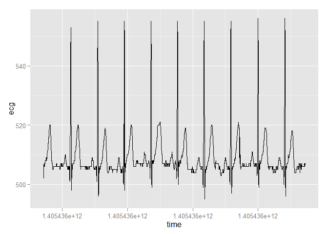
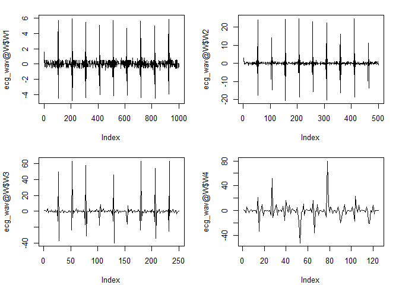
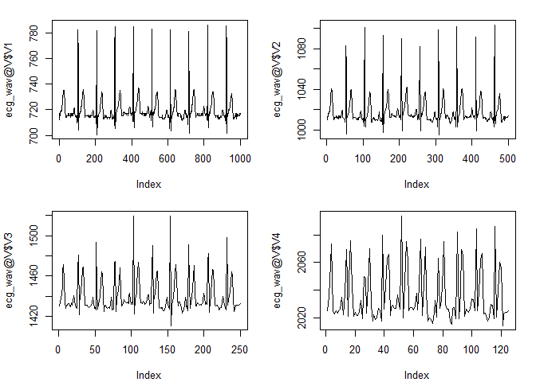
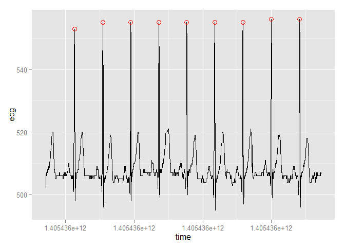
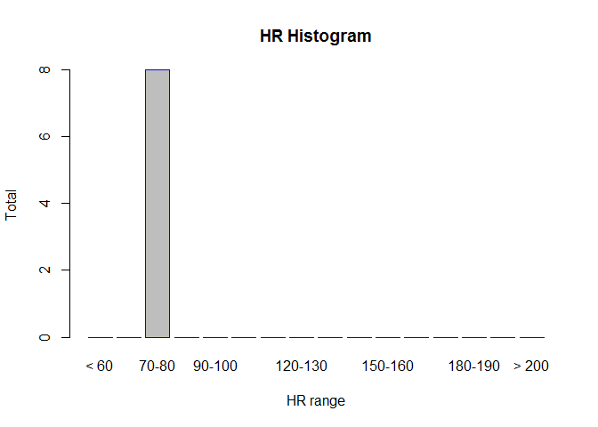
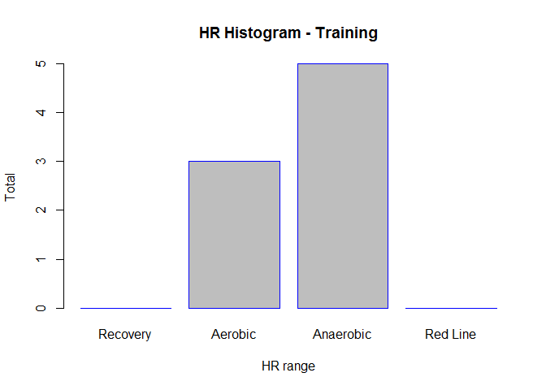

--   Heart beat detection
    -   Wavelet decomposition
    -   Peak detection
    -   Determining heart beats
    -   Calculate R-R intervals
    -   Heart beat tachogram
    -   Preparing and saving output
-   Heart rate distribution
    -   Heart rate calculation
    -   Non-training heart rate distribution
    -   Training heart rate distribution
-   Annotation of the ECG signal
    -   Non-training heart rate annotation
    -   Training heart rate annotation

Heart beat detection
--------------------

This is the first of three short tutorials on how to use the package `heartBeat` for heart beat detection from single-lead ECG signals. The functions of the package are focused on the detection itself and it is asumed that the input ECG data is already preprocessed (parsed, imported, denoised, etc.). The ECG data is expected to be already loaded into a data frame and ready to use (for importing data recorded with Zephyr BioHarness 3 monitor, please see the package `zephyrECG`).
However, for example purposes there is a data sample prepared within this package in the folder `./inst/extdata`. It is a data frame saved in .Rda format which can be imported with the `load` function. The data is loaded directly into a data frame called `ecg`

``` r
load(system.file("extdata", "ecg.Rda", package="heartBeat"))
str(ecg) 
```

    ## 'data.frame':    2000 obs. of  2 variables:
    ##  $ time: num  1.41e+12 1.41e+12 1.41e+12 1.41e+12 1.41e+12 ...
    ##  $ ecg : int  502 506 507 507 506 506 506 506 506 507 ...

``` r
library(ggplot2)
ggplot(data = ecg, aes(x = time, y = ecg)) + geom_line()
```



The data frame `ecg` has two columns:

-   `time`: UNIX timestamps with milisecond precision,
-   `ecg`: ECG amplitudes (integer values).

Once the data is loaded, we can start the analysis by detecting the heart beats with the function `heart_beat`. Based on this detection heart rate and its distribution can be determined by the `HRdistribution` function for the entire recording. Finally, all ECG data points can be color coded (tagged) according to the heart rate by applying the function `annotateHR`.
Of course you can also analyze your own ECG data. It can be loaded in any way using any R compatible tools (e.g. the `zephyrECG` package) as long as it is ordered in a two-column data frame with column names the same as described above. This tutorial presents the workflow of the `heart_beat` function.

Heart beats are detected by performing wavelet analysis to the ECG data (time series) within the function `heart_beat` called with the following input arguments:

-   data: Data frame with ECG data.
-   SampleFreq: The sampling frequency in Hz of ECG data. The default setting is 250 Hz.
-   thr: Fixed threshold value used to detect heart beats from wavelet coefficients. The default value is 9.

``` r
heart_beat <- function(data, SampleFreq = 250, thr = 9){...}
```

### Wavelet decomposition

Within the function `heart_beat` the detection is performed using [discrete wavelet transform (DWT)](https://en.wikipedia.org/wiki/Discrete_wavelet_transform) of ECG signal. The DWT of a signal \(x\) is calculated by passing it through a series of filters. The signal samples are simultaneously passed through a low pass filter and a high-pass filter. The outputs from the high-pass filter give the detail coefficients and the outputs from the low-pass filter give the approximation coefficients. However, since half the frequencies of the signal have now been removed, half the samples can be discarded according to Nyquist’s rule. The filter outputs are then subsampled by 2 which concludes one level of wavelet decomposition. This decomposition has halved the time resolution since only half of each filter output characterises the signal. However, each output has half the frequency band of the input so the frequency resolution has been doubled. This decomposition is repeated to further increase the frequency resolution and the approximation coefficients (output of low-pass filtering) decomposed with high and low pass filters and then down-sampled. In our case 4-th level decomposition is determined using the [Daubechie wavelet](https://en.wikipedia.org/wiki/Daubechies_wavelet) "d4" as the mother wavelet.
The wavelet transform is calculated using the `dwt` function from the `wavelets` package. To ensure that the mentioned function is used the `RHRV` and `waveslim` packages are detached first (if loaded). Before performing wavelet transform, `NA` values are removed from the data and the time column is replaced with the column of row indexes of (non-NA) data samples. The data with removed `NA` values and corresponding indexes is sorted into a new data frame `df` with columns `idx` and `ecg`.

``` r
SampleFreq <- 250
thr <- 9

# 4-level decomposition is used with the Daubechie d4 wavelet.
wavelet <- "d4"
level <- 4L

# If active detach packages RHRV and waveslim.

if (!is.na(match("TRUE", search() == "package:RHRV"))) {
    detach("package:RHRV", unload = TRUE)
}
if (!is.na(match("TRUE", search() == "package:waveslim"))) {
    detach("package:waveslim", unload = TRUE)
}

df <- data.frame(matrix(NA, nrow = sum(!is.na(ecg$ecg)), ncol = 2))
names(df) <- c("idx", "ecg")
df$idx <- which(!is.na(ecg$ecg))
df$ecg <- ecg$ecg[df$idx]

str(df)
```

    ## 'data.frame':    2000 obs. of  2 variables:
    ##  $ idx: int  1 2 3 4 5 6 7 8 9 10 ...
    ##  $ ecg: int  502 506 507 507 506 506 506 506 506 507 ...

``` r
X <- as.numeric(df$ecg)

library(wavelets)
ecg_wav <- dwt(X, filter = wavelet, n.levels = level, boundary = "periodic", 
    fast = TRUE)
str(ecg_wav)
```

    ## Formal class 'dwt' [package "wavelets"] with 11 slots
    ##   ..@ W         :List of 4
    ##   .. ..$ W1: num [1:1000, 1] 1.25 1.58 3.54e-01 -2.84e-14 -1.29e-01 ...
    ##   .. ..$ W2: num [1:500, 1] 1.0368 3.0858 -0.3538 0.0792 0.0458 ...
    ##   .. ..$ W3: num [1:250, 1] 1.1407 0.8128 1.0953 0.4334 0.0458 ...
    ##   .. ..$ W4: num [1:125, 1] 1.082 0.257 -3.861 6.176 0.677 ...
    ##   ..@ V         :List of 4
    ##   .. ..$ V1: num [1:1000, 1] 712 717 716 716 716 ...
    ##   .. ..$ V2: num [1:500, 1] 1010 1013 1013 1016 1016 ...
    ##   .. ..$ V3: num [1:250, 1] 1430 1434 1438 1441 1452 ...
    ##   .. ..$ V4: num [1:125, 1] 2025 2035 2059 2074 2025 ...
    ##   ..@ filter    :Formal class 'wt.filter' [package "wavelets"] with 7 slots
    ##   .. .. ..@ L        : int 4
    ##   .. .. ..@ level    : int 1
    ##   .. .. ..@ h        : num [1:4] -0.129 -0.224 0.837 -0.483
    ##   .. .. ..@ g        : num [1:4] 0.483 0.837 0.224 -0.129
    ##   .. .. ..@ wt.class : chr "Daubechies"
    ##   .. .. ..@ wt.name  : chr "d4"
    ##   .. .. ..@ transform: chr "dwt"
    ##   ..@ level     : int 4
    ##   ..@ n.boundary: num [1:4] 1 2 2 2
    ##   ..@ boundary  : chr "periodic"
    ##   ..@ series    : num [1:2000, 1] 502 506 507 507 506 506 506 506 506 507 ...
    ##   ..@ class.X   : chr "numeric"
    ##   ..@ attr.X    : list()
    ##   ..@ aligned   : logi FALSE
    ##   ..@ coe       : logi FALSE

The result of `dwt` function is a discrete wavelet transform object `ecg_wav` with the detail and approximation coefficients stored as lists along with selected options and mother wavelet properties. Detail coefficients `W2` were selected for heart beat detection with fixed threshold. Below are the plots of detail coefficients `W1` - `W4` and the plots of approximation coefficients `V1` - `V4` to illustrate why this choice was made.

``` r
oldpar <- par(mfrow = c(2,2), mar = c(4,4,1.5,1.5) + 0.1)
plot(ecg_wav@W$W1, type = "l")
plot(ecg_wav@W$W2, type = "l")
plot(ecg_wav@W$W3, type = "l")
plot(ecg_wav@W$W4, type = "l")
```



``` r
par(oldpar)
```

The detail coefficients of the first level contain more noise than those of the second level, which was the single reason of choosing level 2 coefficients. Detail coefficients of the third and fourth level contain too much detail and are missing vital information about heart beats, which is why they are less appropriate for heart beat detection than level 2 coefficients.

``` r
oldpar <- par(mfrow = c(2,2), mar = c(4,4,1.5,1.5) + 0.1)
plot(ecg_wav@V$V1, type = "l")
plot(ecg_wav@V$V2, type = "l")
plot(ecg_wav@V$V3, type = "l")
plot(ecg_wav@V$V4, type = "l")
```



``` r
par(oldpar)
```

The plots of approxiation coefficients show, how the signal is gradually lossing in detail from `V1` to `V4` and that it is getting less appropriate for heart beat analysis along the way.

### Peak detection

As mentioned, coefficients `W2` are used for heart beat detection. Heart beats are determined by detecting the [R points](https://en.wikipedia.org/wiki/Electrocardiography), maxima (or peaks) of the [QRS complexes](https://en.wikipedia.org/wiki/QRS_complex). Firstly, each data point is being checked if it is a local maximum (peak) and if it is greater than a preselected fixed threshold. Before going through the loop and checking these conditions, a vector of zeros `R` is pre-allocated for detected R peaks. The length of the pre-allocated vector is equal to the length of the ECG signal. All R peaks detected during the `for` loop are written to this vector as the index/location of detection. After detection is finished, all the (remained) zeros are deleted from the vector `R`. It's length is now equal to the number of detected R peaks/heart beats in the input ECG data

``` r
# Coefficients of the second level of decomposition are used for R peak detection.
x <- ecg_wav@W$W2

# Empty vector for detected R peaks
R <- matrix(0,1,length(x))

# While loop for sweeping the L2 coeffs for local maxima.
i <- 2
while (i < length(x)-1) {
  if ((x[i]-x[i-1]>=0) && (x[i+1]-x[i]<0) && x[i]>thr) {
    R[i] <- i
  }
  i <- i+1
}

# Clear all zero values from R vector.
R <- R[R!=0]
str(R)
```

    ##  num [1:9] 53 105 155 206 257 308 359 411 463

### Determining heart beats

In total, 9 heart beats were detected, which seems correct according to the first figure. However, the indexes seem to be incorrect and to small. This is because the detection was performed on the level 2 detail coefficients. To remind, the number of samples is halved in each level, which means that number of samples in level 2 coefficients was halved twice (or divided by four in other words). Therefore, to obtain the equivalent indexes of samples in the input ECG data, the result in `R` has to be multiplied by 4

``` r
Rtrue <- R*4
str(Rtrue)
```

    ##  num [1:9] 212 420 620 824 1028 ...

It is possible that the properly scaled results can be off the real R peak mark for a few samples. That is why they are checked out on the input signal in a `for` loop. Each detected R peak is used as a center of a time window with width of 21 samples (84 ms), where the true local maximum is looked for. This gurantees that the real R peaks are found and used for later calculations of inter beat intervals. The line right after the `for` loop ensures that there are no duplicate heart beats. This code chunk is concluded by writing to vector `Rtrue_idx` the indexes corresponding to the detected heart beats from the ECG data frame `df` (because there may be differences if `NA` values are present in the input data).

``` r
# Checking results on the original signal
for (k in 1:length(Rtrue)){
  if (Rtrue[k] > 10){
    Rtrue[k] <- Rtrue[k]-10+(which.max(X[(Rtrue[k]-10):(Rtrue[k]+10)]))-1
  } else {
    Rtrue[k] <- which.max(X[1:(Rtrue[k]+10)])
  }
}

Rtrue <- unique(Rtrue)
str(Rtrue)
```

    ##  num [1:9] 208 414 615 819 1024 ...

``` r
Rtrue_idx <- df$idx[Rtrue]
str(Rtrue_idx)
```

    ##  int [1:9] 208 414 615 819 1024 1227 1430 1639 1846

With this the heart beat detection is complete. The remaining code of the function calculates the inter beat intervals, exact times of heart beats for a potential HRV analysis and prepares the final output.

### Calculate R-R intervals

Inter beat intervals or R-R intervals are calculated from the indexes of the detected heart beats `Rtrue_idx`. The R-R intervals are calculated in number of samples (`RtoR`) as well as in seconds (`RtoR_sec`).

``` r
# Determine R-R intervals in samples and seconds and average heart rate.
RtoR <- Rtrue_idx[-1] - Rtrue_idx[1:length(Rtrue_idx) - 1]
str(RtoR)
```

    ##  int [1:8] 206 201 204 205 203 203 209 207

``` r
RtoR_sec <- (ecg$time[Rtrue_idx[-1]] - ecg$time[Rtrue_idx[1:length(Rtrue_idx) - 
    1]])/1000
str(RtoR_sec)
```

    ##  num [1:8] 0.824 0.814 0.814 0.811 0.813 0.819 0.828 0.824

``` r
# Average heart rate of the input ECG signal
avgHR = 60/mean(RtoR_sec)
avgHR = as.integer(avgHR)
avgHR
```

    ## [1] 73

``` r
# Plot the original signal together with results
require(ggplot2)
ggplot(data = ecg, aes(x = time, y = ecg)) + geom_line() + geom_point(data = ecg[Rtrue_idx, 
    ], aes(x = time, y = ecg), colour = "red", shape = 1, size = 3)
```



### Heart beat tachogram

The function also prepares input data for (potential) HRV analysis, which can be performed with the [`RHRV` package](http://rhrv.r-forge.r-project.org/) in R. HRV analysis functions in `RHRV` package require the heart beat data to be written in an ASCII file as a tachogram (a time series of exact moments of heart beats in seconds). The heart beat tachogram is obtained from the `time` column of the `ecg` data frame as the elapsed time in seconds from the first sample. The heart beat tachogram is saved as single column ASCII file `Rsec_data` to the current work directory

``` r
# Write the information about detected R peaks to Rsec_data ascii file
Rtrue_sec = (ecg$time[Rtrue_idx] - ecg$time[1])/1000;
Rtrue_sec <- round(Rtrue_sec, 3)
Rtrue_sec
```

    ## [1] 0.833 1.657 2.471 3.285 4.096 4.909 5.728 6.556 7.380

``` r
write(Rtrue_sec,"Rsec_data.txt", 1)
```

### Preparing and saving output

Vectors `Rtrue_idx`, `Rtrue_sec`, `RtoRext`, `RtoR_secext` with information about the detected heart beats is merged into a data frame `Rall` which is exported as a text file `Rall_data.txt` to the current work directory. Vectors `RtoRext` and `RtoR_secext` are equal to `RtoR` and `RtoR_sec`, respectively. They are just padded with a leading zero to equalize their lengths with the lengths of `Rtrue_idx` and `Rtrue_sec` for data frame construction

``` r
RtoRext <- c(0,RtoR)
RtoR_secext <- c(0,RtoR_sec)
Rall <- data.frame(Rtrue_idx,Rtrue_sec,RtoRext,RtoR_secext)
str(Rall)
```

    ## 'data.frame':    9 obs. of  4 variables:
    ##  $ Rtrue_idx  : int  208 414 615 819 1024 1227 1430 1639 1846
    ##  $ Rtrue_sec  : num  0.833 1.657 2.471 3.285 4.096 ...
    ##  $ RtoRext    : num  0 206 201 204 205 203 203 209 207
    ##  $ RtoR_secext: num  0 0.824 0.814 0.814 0.811 0.813 0.819 0.828 0.824

Finally, the function returns all the results together with the input data as a list

``` r
return(list(signal = df, coeff = x, R = R, Rall = Rall))
```

Heart rate distribution
-----------------------

The second of the tutorial demonstrates the use and workflow of the `HRdistribution` function of the package `heartBeat`

``` r
HRdistribution <- function(Rall, signal, HRrest, age, training = FALSE)
```

with input arguments:

-   `Rall`: data frame with information about (detected) heart beats with columns:
    -   `Rtrue_idx`: the indexes of R peaks in signal,
    -   `Rtrue_sec`: the time moments of Rtrue\_idx in seconds,
    -   `RtoRext`: R-R intervals in number of samples (with the starting zero),
    -   `RtoR_secext`: R-R intervals in seconds (with the starting zero),
-   `signal`: vector of ECG signal data points (the ECG signal from which the heart beats were determined),
-   `HRrest`: numeric value of the monitored person's resting heart rate,
-   `age`: numeric value of age of the monitored person's age,
-   `training`: a flag indicating, whether the monitored person was on trainning/exercise or not.

The function reads the signal and the output of `heart_beat` function and determines instant heart rates, their distribution and a basic histogram. The output of the function is a matrix named `beat_matrix` with 16 or 4 columns. Each column corresponds to a certain heart rate interval. The number of columns depends on the setting of the `training` flag: if `training` is `FALSE`, 16 columns are returned and if `training` is `TRUE`, 4 columns are returned. Each column contains indexes of all heart beats that belong to the certain interval. The number of rows in the `beat_matrix` is determined by the heart rate interval with the most heart beats. All other columns with less heart beats are appropriately filled with `NA` values.

Heart rate calculation
----------------------

The function begins with basic preparation of the input data. First, the sampling frequency is calculated from the sample index and time moment of one of the detected heart beats. The calculation is prepared to return the result in Hz and is rounded to the whole number (in this example it should be equal to 250 Hz). Also, the instant heart rate in beats per minute is calculated

``` r
load(system.file("extdata", "Rall.Rda", package = "heartBeat"))

# Calculate sampling rate
SampleFreq <- round(Rall$Rtrue_idx[2] / Rall$Rtrue_sec[2], -1)
SampleFreq
```

    ## [1] 250

``` r
# Calculate instant heart rate IHR. The padded zero at the begining is left out.
IHR <- 60 / Rall$RtoR_secext[-1]
IHR
```

    ## [1] 72.81553 73.71007 73.71007 73.98274 73.80074 73.26007 72.46377 72.81553

Non-training heart rate distribution
------------------------------------

Then the heart rate distribution is determined. Based on the setting of the `training` flag there are two options that produce distributions with different number and limits of heart rate intervals. When the `training` flag is set to `FALSE` the heart rate values are divided into intervals from below 60 to above 200 with the stepping of 10 beats. For each interval a vector is created into which the indexes of all instant heart beats are written. These vectors remain empty if there are no beats in the corresponding interval. In our example all the detected heart beats fall into the interval between 70 and 80 beats per minute (`ind_70_80`)

``` r
training <- TRUE

# Determine indexes of heart beats which are in limits of intervals - divide
# beats into interval groups
ind_sub_60 <- which(IHR < 60, arr.ind = TRUE)
ind_60_70 <- which(IHR >= 60 & IHR < 70, arr.ind = TRUE)
ind_70_80 <- which(IHR >= 70 & IHR < 80, arr.ind = TRUE)
ind_80_90 <- which(IHR >= 80 & IHR < 90, arr.ind = TRUE)
ind_90_100 <- which(IHR >= 90 & IHR < 100, arr.ind = TRUE)
ind_100_110 <- which(IHR >= 100 & IHR < 110, arr.ind = TRUE)
ind_110_120 <- which(IHR >= 110 & IHR < 120, arr.ind = TRUE)
ind_120_130 <- which(IHR >= 120 & IHR < 130, arr.ind = TRUE)
ind_130_140 <- which(IHR >= 130 & IHR < 140, arr.ind = TRUE)
ind_140_150 <- which(IHR >= 140 & IHR < 150, arr.ind = TRUE)
ind_150_160 <- which(IHR >= 150 & IHR < 160, arr.ind = TRUE)
ind_160_170 <- which(IHR >= 160 & IHR < 170, arr.ind = TRUE)
ind_170_180 <- which(IHR >= 170 & IHR < 180, arr.ind = TRUE)
ind_180_190 <- which(IHR >= 180 & IHR < 190, arr.ind = TRUE)
ind_190_200 <- which(IHR >= 190 & IHR < 200, arr.ind = TRUE)
ind_above_200 <- which(IHR >= 200, arr.ind = TRUE)

ind_70_80
```

    ## [1] 1 2 3 4 5 6 7 8

``` r
ind_60_70
```

    ## integer(0)

Heart beats in each vector are counted and ploted as a histogram

``` r
beats_count <- c(length(ind_sub_60), length(ind_60_70), length(ind_70_80),
                     length(ind_80_90), length(ind_90_100), length(ind_100_110),
                     length(ind_110_120), length(ind_120_130),
                     length(ind_130_140), length(ind_140_150),
                     length(ind_150_160), length(ind_160_170),
                     length(ind_170_180), length(ind_180_190),
                     length(ind_190_200), length(ind_above_200))
beats_count
```

    ##  [1] 0 0 8 0 0 0 0 0 0 0 0 0 0 0 0 0

``` r
barplot(beats_count, main = "HR Histogram", 
        xlab = "HR range", ylab = "Total", 
        names.arg = c("< 60","60-70","70-80","80-90","90-100", 
                    "100-110", "110-120", "120-130", 
                    "130-140", "140-150", "150-160",
                    "160-170", "170-180", "180-190",
                    "190-200", "> 200"), 
        border = "blue")
```



Finally, the function output is constructed: the data frame with all heart beats of the input ECG signal. Columns of this data frame corespond to heart rate intervals and in each column the indexes of all heart beats that belong to the certain interval are writen. However, due to the variability of heart function there are different numbers of heart beats in each interval. Consequently, the "interval" vectors (`ind_..._...`) have different lengths and are easier to combine into a list than into a data frame. This is why in first step the list of interval vectors of unequal lengths is created (`beat_list`).

``` r
beat_list <- list(ind_sub_60 = ind_sub_60, ind_60_70 = ind_60_70,
                      ind_70_80 = ind_70_80, ind_80_90 = ind_80_90,
                      ind_90_100 = ind_90_100, ind_100_110 = ind_100_110,
                      ind_110_120 = ind_110_120, ind_120_130 = ind_120_130,
                      ind_130_140 = ind_130_140, ind_140_150 = ind_140_150,
                      ind_150_160 = ind_150_160, ind_160_170 = ind_160_170,
                      ind_170_180 = ind_170_180, ind_180_190 = ind_180_190,
                      ind_190_200 = ind_190_200, ind_above_200 = ind_above_200)
str(beat_list)
```

    ## List of 16
    ##  $ ind_sub_60   : int(0) 
    ##  $ ind_60_70    : int(0) 
    ##  $ ind_70_80    : int [1:8] 1 2 3 4 5 6 7 8
    ##  $ ind_80_90    : int(0) 
    ##  $ ind_90_100   : int(0) 
    ##  $ ind_100_110  : int(0) 
    ##  $ ind_110_120  : int(0) 
    ##  $ ind_120_130  : int(0) 
    ##  $ ind_130_140  : int(0) 
    ##  $ ind_140_150  : int(0) 
    ##  $ ind_150_160  : int(0) 
    ##  $ ind_160_170  : int(0) 
    ##  $ ind_170_180  : int(0) 
    ##  $ ind_180_190  : int(0) 
    ##  $ ind_190_200  : int(0) 
    ##  $ ind_above_200: int(0)

A data frame can still not be created because the function `as.data.frame` errors out. Therefore, in the second step a list of vectors of equal lengths (`beat_data`) is created by using the function `lapply`. The `"["` argument means that the `lapply` is applying the indexing operator on the elements of the `beat_list` sorting them into a list where all elements have the length of the interval vector with the most heart beats (`max(beats_count)`). All elements of the `beat_list` with lesser number of heart beats than the `max(beats_count)` are complemented with `NA` values.

``` r
beat_data <- lapply(beat_list, "[", seq(max(beats_count)))
str(beat_data)
```

    ## List of 16
    ##  $ ind_sub_60   : int [1:8] NA NA NA NA NA NA NA NA
    ##  $ ind_60_70    : int [1:8] NA NA NA NA NA NA NA NA
    ##  $ ind_70_80    : int [1:8] 1 2 3 4 5 6 7 8
    ##  $ ind_80_90    : int [1:8] NA NA NA NA NA NA NA NA
    ##  $ ind_90_100   : int [1:8] NA NA NA NA NA NA NA NA
    ##  $ ind_100_110  : int [1:8] NA NA NA NA NA NA NA NA
    ##  $ ind_110_120  : int [1:8] NA NA NA NA NA NA NA NA
    ##  $ ind_120_130  : int [1:8] NA NA NA NA NA NA NA NA
    ##  $ ind_130_140  : int [1:8] NA NA NA NA NA NA NA NA
    ##  $ ind_140_150  : int [1:8] NA NA NA NA NA NA NA NA
    ##  $ ind_150_160  : int [1:8] NA NA NA NA NA NA NA NA
    ##  $ ind_160_170  : int [1:8] NA NA NA NA NA NA NA NA
    ##  $ ind_170_180  : int [1:8] NA NA NA NA NA NA NA NA
    ##  $ ind_180_190  : int [1:8] NA NA NA NA NA NA NA NA
    ##  $ ind_190_200  : int [1:8] NA NA NA NA NA NA NA NA
    ##  $ ind_above_200: int [1:8] NA NA NA NA NA NA NA NA

The data frame `beat_matrix`, which is returned as output, is created in the third step by applying `data.frame` function on the list of vectors of equal lengths `beat_data`.

``` r
beat_matrix <- data.frame(beat_data)
str(beat_matrix)
```

    ## 'data.frame':    8 obs. of  16 variables:
    ##  $ ind_sub_60   : int  NA NA NA NA NA NA NA NA
    ##  $ ind_60_70    : int  NA NA NA NA NA NA NA NA
    ##  $ ind_70_80    : int  1 2 3 4 5 6 7 8
    ##  $ ind_80_90    : int  NA NA NA NA NA NA NA NA
    ##  $ ind_90_100   : int  NA NA NA NA NA NA NA NA
    ##  $ ind_100_110  : int  NA NA NA NA NA NA NA NA
    ##  $ ind_110_120  : int  NA NA NA NA NA NA NA NA
    ##  $ ind_120_130  : int  NA NA NA NA NA NA NA NA
    ##  $ ind_130_140  : int  NA NA NA NA NA NA NA NA
    ##  $ ind_140_150  : int  NA NA NA NA NA NA NA NA
    ##  $ ind_150_160  : int  NA NA NA NA NA NA NA NA
    ##  $ ind_160_170  : int  NA NA NA NA NA NA NA NA
    ##  $ ind_170_180  : int  NA NA NA NA NA NA NA NA
    ##  $ ind_180_190  : int  NA NA NA NA NA NA NA NA
    ##  $ ind_190_200  : int  NA NA NA NA NA NA NA NA
    ##  $ ind_above_200: int  NA NA NA NA NA NA NA NA

``` r
## return(beat_matrix)
```

Training heart rate distribution
--------------------------------

When the `training` flag is set to `TRUE`, the algorithm uses a different division of heart rate intervals than the non-training regime. All other steps are equivalent. During trainig the values of heart beats are expected to be higher than the interval distribution of non-training conditions. Also, training is divided into known specific heart rate zones[1] calculated according to estimated maximum heart rate of the trainee. Therefore, the [maximum heart rate](https://en.wikipedia.org/wiki/Heart_rate#Maximum_heart_rate) estimation is the required first step and can be determined in various ways. In this example, the maximum heart rate is calculated by using the following age-predicted formula[2]

``` r
age <- 30
HRmax <- 205.8 - (0.685 * age)
HRmax
```

    ## [1] 185.25

which proved as "the most accurate general equation"[3]. This is why the age of the monitored person is one of the input arguments. The limits of heart rate training zones are then calculated by applying the Karvonen formula[4]: `Morning Resting Heart Rate + (Maximum heart rate - Morning Resting Heart Rate) * percentage`

``` r
HRrest <- 60

recovery_lim <- c(HRrest + ((HRmax-HRrest)*0.6), HRrest + ((HRmax-HRrest)*0.7))
aerobic_lim <- c(HRrest + ((HRmax-HRrest)*0.7), HRrest + ((HRmax-HRrest)*0.8))
anaerobic_lim <- c(HRrest + ((HRmax-HRrest)*0.8), HRrest + ((HRmax-HRrest)*0.9))
red_lim <- c(HRrest + ((HRmax-HRrest)*0.9),HRrest + ((HRmax-HRrest)*1))

list(recovery_lim = recovery_lim, aerobic_lim = aerobic_lim, 
     anaerobic_lim = anaerobic_lim, red_lim = red_lim)
```

    ## $recovery_lim
    ## [1] 135.150 147.675
    ## 
    ## $aerobic_lim
    ## [1] 147.675 160.200
    ## 
    ## $anaerobic_lim
    ## [1] 160.200 172.725
    ## 
    ## $red_lim
    ## [1] 172.725 185.250

Then the heart beats from `IHR` are distributed according to the calculated limits of training heart rate zones by applying the same technique as for the non-training regime

``` r
# IHR correction performed just to get the data into range of calculated limits
IHR <- IHR + 87

ind_recovery <- which(IHR >= recovery_lim[1] & IHR < recovery_lim[2], arr.ind = TRUE)
ind_aerobic <- which(IHR >= aerobic_lim[1] & IHR < aerobic_lim[2], arr.ind = TRUE)
ind_anaerobic <- which(IHR >= anaerobic_lim[1] & IHR < anaerobic_lim[2], arr.ind = TRUE)
ind_red <- which(IHR >= red_lim[1] & IHR < red_lim[2], arr.ind = TRUE)

list(ind_recovery = ind_recovery, ind_aerobic = ind_aerobic, 
     ind_anaerobic = ind_anaerobic, ind_red = ind_red)
```

    ## $ind_recovery
    ## integer(0)
    ## 
    ## $ind_aerobic
    ## [1] 1 7 8
    ## 
    ## $ind_anaerobic
    ## [1] 2 3 4 5 6
    ## 
    ## $ind_red
    ## integer(0)

Heart beats in each vector are counted and ploted as a histogram

``` r
beats_training <- c(length(ind_recovery), length(ind_aerobic),
                        length(ind_anaerobic), length(ind_red))
beats_training
```

    ## [1] 0 3 5 0

``` r
graphics::barplot(beats_training, main = "HR Histogram - Training",
                  xlab = "HR range", ylab = "Total",
                  names.arg = c("Recovery","Aerobic","Anaerobic","Red Line"),
                  border = "blue")
```



The function output is constructed Similarly as with the non-training regime. A list (`beat_list`) of interval vectors is created, where each interval vector contains the indexes of heart beats that correspond to the certain heart rate zone. The interval vectors in `beat_list` are first complemented to be of equal length (the `lapply` line) and then the list `beat_data` (with interval vectors of equal length) is converted to a data frame `beat_matrix`

``` r
beat_list <- list(ind_recovery = ind_recovery, ind_aerobic = ind_aerobic,
                  ind_anaerobic = ind_anaerobic, ind_red = ind_red)

beat_data <- lapply(beat_list, '[', seq(max(beats_count)))
beat_matrix <- data.frame(beat_data)
str(beat_matrix)
```

    ## 'data.frame':    8 obs. of  4 variables:
    ##  $ ind_recovery : int  NA NA NA NA NA NA NA NA
    ##  $ ind_aerobic  : int  1 7 8 NA NA NA NA NA
    ##  $ ind_anaerobic: int  2 3 4 5 6 NA NA NA
    ##  $ ind_red      : int  NA NA NA NA NA NA NA NA

``` r
## return(beat_matrix)
```

Annotation of the ECG signal
----------------------------

The tutorial concludes by presenting in more detail the use and workflow of the `annotateHR` function of the `heartBeat` package

``` r
annotateHR <- function(Rall, beat_matrix, data)
```

with input arguments:

-   `Rall`: data frame with information about (detected) heart beats with columns:
    -   `Rtrue_idx`: the indexes of R peaks in signal,
    -   `Rtrue_sec`: the time moments of Rtrue\_idx in seconds,
    -   `RtoRext`: R-R intervals in number of samples (with the starting zero),
    -   `RtoR_secext`: R-R intervals in seconds (with the starting zero),
-   `beat_matrix`: output of the `HRdistribution` function containing distribution of heart rate values,
-   `data`: data frame containing ECG, EEG and GPS measurements

This function adds factorized code to ECG data points according to heart rate determined previously with functions `heart_beat` and `HRdistribution`. The factorized code is added in a new column `heartRate` to the input data frame with ECG data points and the updated data frame is returned as output of the function `annotateHR`. First, the column names of `beat_matrix` input data frame are checked whether the ECG recording was made during training or not.

``` r
# input data frame - in this case named "data"
load(system.file("extdata", "data.Rda", package = "heartBeat"))
# data frame "Rall" with infromation about detected heart beats in "data"
load(system.file("extdata", "Rall.Rda", package = "heartBeat"))
# data frame "beat_matrix" with heart rate information 
load(system.file("extdata", "beat_matrix.Rda", package = "heartBeat"))

names(beat_matrix)[1]
```

    ## [1] "ind_sub_60"

The distributions for the non-training and training regime are different and consequently the annotation of the ECG data will be different. Therefore, operation of the function is directed by a simple `if` structure

``` r
if (names(beat_matrix)[1] != "ind_recovery") {
  # Non-training heart rate annotation
} else {
  # Training heart rate annotation
}
```

Non-training heart rate annotation
----------------------------------

Firstly, the `heartRate` column of NA values is created for the input data frame `data`

``` r
data$heartRate <- NA
```

This is followed by adding text annotations to ECG data points according to the current heart rate. Text annotations are very similar as used for the names of intervals used in the `HRdistribution` function: `sub 60`, `60-70`, `70-80`, ..., `190-200`, `above 200`. The annotation is performed using the `do.call` function which constructs and executes a function call from a name or a function and a list of arguments to be passed to it. The function executed with `do.call` is the simple concatenate function `c`, used on a sequence of data points. The sequence of data points is obtained by using the `mapply` function which applies the `seq` function on a group of data points between two consecutive heart beats that correspond to the proper heart rate.

``` r
data$heartRate[
  do.call("c",
          mapply(seq,
                 Rall$Rtrue_idx[beat_matrix$ind_sub_60]
                 [!is.na(Rall$Rtrue_idx[beat_matrix$ind_sub_60])],
                 Rall$Rtrue_idx[beat_matrix$ind_sub_60 + 1]
                 [!is.na(Rall$Rtrue_idx[beat_matrix$ind_sub_60])] - 1,
                 SIMPLIFY = FALSE)
          )] <- "sub 60" 
data$heartRate[
  do.call("c",
          mapply(seq,
                 Rall$Rtrue_idx[beat_matrix$ind_60_70]
                 [!is.na(Rall$Rtrue_idx[beat_matrix$ind_60_70])],
                 Rall$Rtrue_idx[beat_matrix$ind_60_70 + 1]
                 [!is.na(Rall$Rtrue_idx[beat_matrix$ind_60_70])] - 1,
                 SIMPLIFY = FALSE)
          )] <- "60-70"
data$heartRate[
  do.call("c",
          mapply( seq,
                  Rall$Rtrue_idx[beat_matrix$ind_70_80]
                  [!is.na(Rall$Rtrue_idx[beat_matrix$ind_70_80])],
                  Rall$Rtrue_idx[beat_matrix$ind_70_80 + 1]
                  [!is.na(Rall$Rtrue_idx[beat_matrix$ind_70_80])] - 1,
                  SIMPLIFY = FALSE)
          )] <- "70-80" 
data$heartRate[
  do.call("c",
          mapply(seq,
                 Rall$Rtrue_idx[beat_matrix$ind_80_90]
                 [!is.na(Rall$Rtrue_idx[beat_matrix$ind_80_90])],
                 Rall$Rtrue_idx[beat_matrix$ind_80_90 + 1]
                 [!is.na(Rall$Rtrue_idx[beat_matrix$ind_80_90])] - 1,
                 SIMPLIFY = FALSE)
          )] <- "80-90" 
data$heartRate[
  do.call("c",
          mapply(seq,
                 Rall$Rtrue_idx[beat_matrix$ind_90_100]
                 [!is.na(Rall$Rtrue_idx[beat_matrix$ind_90_100])],
                 Rall$Rtrue_idx[beat_matrix$ind_90_100 + 1]
                 [!is.na(Rall$Rtrue_idx[beat_matrix$ind_90_100])] - 1,
                 SIMPLIFY = FALSE)
          )] <- "90-100" 
data$heartRate[
  do.call("c",
          mapply( seq,
                  Rall$Rtrue_idx[beat_matrix$ind_100_110]
                  [!is.na(Rall$Rtrue_idx[beat_matrix$ind_100_110])],
                  Rall$Rtrue_idx[beat_matrix$ind_100_110 + 1]
                  [!is.na(Rall$Rtrue_idx[beat_matrix$ind_100_110])] - 1,
                  SIMPLIFY = FALSE)
          )] <- "100-110" 
data$heartRate[
  do.call("c",
          mapply(seq,
                 Rall$Rtrue_idx[beat_matrix$ind_110_120]
                 [!is.na(Rall$Rtrue_idx[beat_matrix$ind_110_120])],
                 Rall$Rtrue_idx[beat_matrix$ind_110_120 + 1]
                 [!is.na(Rall$Rtrue_idx[beat_matrix$ind_110_120])] - 1,
                 SIMPLIFY = FALSE)
          )] <- "110-120" 
data$heartRate[
  do.call("c",
          mapply(seq,
                 Rall$Rtrue_idx[beat_matrix$ind_120_130]
                 [!is.na(Rall$Rtrue_idx[beat_matrix$ind_120_130])],
                 Rall$Rtrue_idx[beat_matrix$ind_120_130 + 1]
                 [!is.na(Rall$Rtrue_idx[beat_matrix$ind_120_130])] - 1,
                 SIMPLIFY = FALSE)
          )] <- "120-130" 
data$heartRate[
  do.call("c",
          mapply( seq,
                  Rall$Rtrue_idx[beat_matrix$ind_130_140]
                  [!is.na(Rall$Rtrue_idx[beat_matrix$ind_130_140])],
                  Rall$Rtrue_idx[beat_matrix$ind_130_140 + 1]
                  [!is.na(Rall$Rtrue_idx[beat_matrix$ind_130_140])] - 1,
                  SIMPLIFY = FALSE)
          )] <- "130-140" 
data$heartRate[
  do.call("c",
          mapply( seq,
                  Rall$Rtrue_idx[beat_matrix$ind_140_150]
                  [!is.na(Rall$Rtrue_idx[beat_matrix$ind_140_150])],
                  Rall$Rtrue_idx[beat_matrix$ind_140_150 + 1]
                  [!is.na(Rall$Rtrue_idx[beat_matrix$ind_140_150])] - 1,
                  SIMPLIFY = FALSE))] <- "140-150" 
data$heartRate[
  do.call("c",
          mapply(seq,
                 Rall$Rtrue_idx[beat_matrix$ind_150_160]
                 [!is.na(Rall$Rtrue_idx[beat_matrix$ind_150_160])],
                 Rall$Rtrue_idx[beat_matrix$ind_150_160 + 1]
                 [!is.na(Rall$Rtrue_idx[beat_matrix$ind_150_160])] - 1,
                 SIMPLIFY = FALSE)
          )] <- "150-160" 
data$heartRate[
  do.call("c",
          mapply(seq,
                 Rall$Rtrue_idx[beat_matrix$ind_160_170]
                 [!is.na(Rall$Rtrue_idx[beat_matrix$ind_160_170])],
                 Rall$Rtrue_idx[beat_matrix$ind_160_170 + 1]
                 [!is.na(Rall$Rtrue_idx[beat_matrix$ind_160_170])] - 1,
                 SIMPLIFY = FALSE)
          )] <- "160-170"
data$heartRate[
  do.call("c",
          mapply(seq,
                 Rall$Rtrue_idx[beat_matrix$ind_170_180]
                 [!is.na(Rall$Rtrue_idx[beat_matrix$ind_170_180])],
                 Rall$Rtrue_idx[beat_matrix$ind_170_180 + 1]
                 [!is.na(Rall$Rtrue_idx[beat_matrix$ind_170_180])] - 1,
                 SIMPLIFY = FALSE))] <- "170-180"
data$heartRate[
  do.call("c",
          mapply(seq,
                 Rall$Rtrue_idx[beat_matrix$ind_180_190]
                 [!is.na(Rall$Rtrue_idx[beat_matrix$ind_180_190])],
                 Rall$Rtrue_idx[beat_matrix$ind_180_190 + 1]
                 [!is.na(Rall$Rtrue_idx[beat_matrix$ind_180_190])] - 1,
                 SIMPLIFY = FALSE)
          )] <- "180-190"
data$heartRate[
  do.call("c",
          mapply(seq,
                 Rall$Rtrue_idx[beat_matrix$ind_190_200]
                 [!is.na(Rall$Rtrue_idx[beat_matrix$ind_190_200])],
                 Rall$Rtrue_idx[beat_matrix$ind_190_200 + 1]
                 [!is.na(Rall$Rtrue_idx[beat_matrix$ind_190_200])] - 1,
                 SIMPLIFY = FALSE)
          )] <- "190-200"
data$heartRate[
  do.call("c",
          mapply(seq,
                 Rall$Rtrue_idx[beat_matrix$ind_above_200]
                 [!is.na(Rall$Rtrue_idx[beat_matrix$ind_above_200])],
                 Rall$Rtrue_idx[beat_matrix$ind_above_200 + 1]
                 [!is.na(Rall$Rtrue_idx[beat_matrix$ind_above_200])] - 1,
                 SIMPLIFY = FALSE)
          )] <- "above 200"
```

Then the `heartRate` column is factorized. The `NA` values need to excluded since the begining of the ECG data (till the second heart beat) isn't annotated, because heart rate can be calculated only from the second heart beat on.

``` r
data$heartRate <- factor(data$heartRate, exclude = NA)
```

The factor levels need to be reordered (from alpha-numerical ordering to the desired order from sub-60 to above-200)

``` r
data$heartRate <- factor(data$heartRate,
                             levels = c("sub 60","60-70","70-80","80-90",
                                        "90-100","100-110","110-120","120-130",
                                        "130-140","140-150","150-160","160-170",
                                        "170-180","180-190","above 200"))
```

Also, the instant heart rate column `ihr` is created to store the IHR information, which is calculated the same as in the function `HRdistribution`. The IHR data is inserted using a `for` loop

``` r
data$ihr <- NA
IHR <- round(60/Rall$RtoR_secext[-1])

for (idx in 1:length(IHR)) {
  if (idx < length(IHR)){
    data$ihr[Rall$Rtrue_idx[idx]:(Rall$Rtrue_idx[idx+1]-1)] <- IHR[idx]
  } else {
    data$ihr[Rall$Rtrue_idx[idx]:length(data$ecg)] <- IHR[idx]
  }
}
```

Training heart rate annotation
------------------------------

The procedure for annotation of training regime is the same as for the non-training regime, except that the interval limits and values and annotations are different.

``` r
data$heartRate <- NA
data$heartRate[
  do.call("c",
          mapply(seq,
                 Rall$Rtrue_idx[beat_matrix$ind_recovery]
                 [!is.na(Rall$Rtrue_idx[beat_matrix$ind_recovery])],
                 Rall$Rtrue_idx[beat_matrix$ind_recovery + 1]
                 [!is.na(Rall$Rtrue_idx[beat_matrix$ind_recovery])] - 1,
                 SIMPLIFY = FALSE)
          )] <- "recovery" 
data$heartRate[
  do.call("c",
          mapply(seq,
                 Rall$Rtrue_idx[beat_matrix$ind_aerobic]
                 [!is.na(Rall$Rtrue_idx[beat_matrix$ind_aerobic])],
                 Rall$Rtrue_idx[beat_matrix$ind_aerobic + 1]
                 [!is.na(Rall$Rtrue_idx[beat_matrix$ind_aerobic])] - 1,
                 SIMPLIFY = FALSE)
          )] <- "aerobic" 
data$heartRate[
  do.call("c",
          mapply(seq,
                 Rall$Rtrue_idx[beat_matrix$ind_anaerobic]
                 [!is.na(Rall$Rtrue_idx[beat_matrix$ind_anaerobic])],
                 Rall$Rtrue_idx[beat_matrix$ind_anaerobic + 1]
                 [!is.na(Rall$Rtrue_idx[beat_matrix$ind_anaerobic])] - 1,
                 SIMPLIFY = FALSE)
          )] <- "anaerobic" 
data$heartRate[
  do.call("c",
          mapply(seq,
                 Rall$Rtrue_idx[beat_matrix$ind_red]
                 [!is.na(Rall$Rtrue_idx[beat_matrix$ind_red])],
                 Rall$Rtrue_idx[beat_matrix$ind_red + 1]
                 [!is.na(Rall$Rtrue_idx[beat_matrix$ind_red])] - 1,
                 SIMPLIFY = FALSE)
          )] <- "red" 

# Create factors
data$heartRate <- factor(data$heartRate, exclude = NA)
# Reorder factor levels
data$heartRate <- factor(data$heartRate,
                         levels = c("recovery","aerobic","anaerobic","red"))

data$ihr <- NA
IHR <- round(60/Rall$RtoR_secext[-1])

for (idx in 1:length(IHR)) {
  if (idx < length(IHR)){
    data$ihr[Rall$Rtrue_idx[idx]:(Rall$Rtrue_idx[idx+1]-1)] <- IHR[idx]
  } else {
    data$ihr[Rall$Rtrue_idx[idx]:length(data$ecg)] <- IHR[idx]
  }
}
```

[1] [Heart Rate Training Zones](http://www.brianmac.co.uk/hrm1.htm)

[2] Inbar, O. Oten, A., Scheinowitz, M., Rotstein, A., Dlin, R. and Casaburi, R. Normal cardiopulmonary responses during incremental exercise in 20 - 70-yr-old men. Med Sci Sport Exerc 1994;26(5):538-546.

[3] Robergs R and Landwehr R (2002). "The Surprising History of the 'HRmax=220-age' Equation" (PDF). Journal of Exercise Physiology 5 (2): 1–10.

[4] [Polar: How to calculate target heart rate zone?](http://www.polar.com/us-en/support/How_to_calculate_target_heart_rate_zone_)
