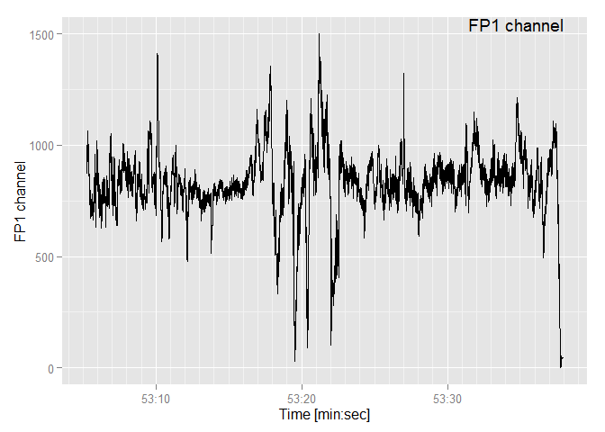
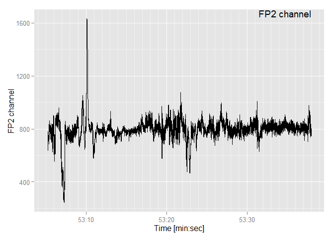

# Walkthrough for the museEEG package

-   Introduction
-   Reading and parsing EEG data
    -   Read EEG data
    -   Data subsetting
    -   Ratios of alpha and beta power bands
    -   Correction of EEG timing

## Introduction

The package `museEEG` is designed to parse and read the EEG data collected with the [InterAxon Muse device](http://www.choosemuse.com/). The device stores the acquired data directly in .muse format and the manufacturer offers a tool [MusePlayer](http://developer.choosemuse.com/research-tools/museplayer) that converts the .muse data to .csv format. The package is comprised of `read_eeg` function.

## Reading and parsing EEG data

The `read_eeg` function reads a file in csv format acquired by MUSE hardware and sorts the EEG data in it into a data frame. The function is defined as

``` r
read_eeg <- function(NAME="filename")
```

The input argument is the string path to the selected EEG file in csv format (`NAME`). The original input file with Muse data includes many different (derived) parameters besides EEG data signal data. With the `read_eeg` function, a selection of available data is shaped into the output data frame. This selection includes:

-   `time`: vector of unix timestamps in milisecond precision
-   `type`: indication of wether the signal is EEG, or alpha or beta band
-   `TP9`, `FP1`, `FP2`, `TP10`: EEG data from channels TP9, FP1, FP2, TP10
-   `fp1_fp2`: ratio of alpha and beta band data of channels FP1 and FP2 (in decibels). The EEG type should be ignored.
-   `fp1_beta_alpha`: ratio between beta and alpha band power of channel FP1 (in decibels).
-   `fp2_beta_alpha`: ratio between beta and alpha band power of channel FP2 (in decibels).

### Read EEG data

Below, the steps of `read_eeg` are presented in detail on a short (approx. 30 seconds long) Muse recording that is included in the package.

``` r
NAME <- system.file("extdata", "eeg_sample.csv", package="museEEG")
NAME
```

    ## [1] "C:/R/Rlibs/museEEG/extdata/eeg_sample.csv"

In the first step, the csv file with the EEG data is imported into the `muse` data frame with the EEG data and all the additional parameters (e.g. absolute and relative values of EEG frequency bands (alpha - theta), fft coeficients, etc.). For this the `read.csv` function is used with the `header` and `stringsAsFactors` arguments set to `FALSE`, because the csv files of Muse data don't have the title line and to prevent unwanted factorizing of data written as strings.

``` r
muse_file <- NAME
muse <- read.csv(muse_file, header=FALSE, stringsAsFactors=FALSE)
str(muse, strict.width = "wrap", list.len = 20)
```

    ## 'data.frame':    18563 obs. of  131 variables:
    ## $ V1 : num 1.42e+09 1.42e+09 1.42e+09 1.42e+09 1.42e+09 ...
    ## $ V2 : chr " /muse/elements/raw_fft0" " /muse/elements/raw_fft1" "
    ##    /muse/elements/raw_fft2" " /muse/elements/raw_fft3" ...
    ## $ V3 : chr " 21.67107" " 24.765371" " 18.682999" " 24.506533" ...
    ## $ V4 : chr " 26.700253" " 30.266417" " 23.56232" " 29.906038" ...
    ## $ V5 : chr " 26.221638" " 26.237923" " 23.723951" " 28.795336" ...
    ## $ V6 : chr " 27.805504" " 18.997297" " 22.061762" " 25.644644" ...
    ## $ V7 : chr " 26.361446" " 12.983604" " 13.575578" " 20.130281" ...
    ## $ V8 : chr " 21.551762" " 9.268732" " 10.573607" " 10.867702" ...
    ## $ V9 : num 13.53 10.36 9.51 9.77 NA ...
    ## $ V10 : num 12.34 6.76 5.35 13.57 NA ...
    ## $ V11 : chr " 9.843936" " 9.776208" " 8.0879135" " 13.011974" ...
    ## $ V12 : chr " 9.701899" " 14.362541" " 3.414631" " 12.570309" ...
    ## $ V13 : chr " 5.870545" " 11.151609" " 2.2663603" " 10.412337" ...
    ## $ V14 : chr " 9.319328" " 4.5954328" " 5.048014" " 6.14574" ...
    ## $ V15 : chr " 8.119961" " 6.43512" " 3.2765212" " 8.376848" ...
    ## $ V16 : chr " 3.6904578" " 8.592881" " -0.50741875" " 7.476821" ...
    ## $ V17 : chr " 8.060724" " 5.9749303" " 0.8887181" " 4.608893" ...
    ## $ V18 : chr " 8.360534" " 2.793673" " -0.7831017" " 7.273836" ...
    ## $ V19 : chr " 1.7820944" " 0.90627354" " -6.167336" " 4.9218893" ...
    ## $ V20 : chr " 7.2082696" " 1.3640586" " 1.8926748" " 6.0123925" ...
    ## [list output truncated]

### Data subsetting

Each feature or parameter in `muse` is described by the second column `V2`. Because the parameters have different lengths, the number of columns of the data frame is determined by the parameter with most elements and all other are complemented with `NA` values. The EEG channels data is extracted by using the `subset` function which returns subset of the `muse` data frame for which the type in `V2` is matching EEG, alpha and beta absolute values

``` r
muse_sub <- subset(muse, (muse$V2 == " /muse/elements/alpha_absolute") |
                     (muse$V2 == " /muse/elements/beta_absolute") | 
                     (muse$V2 == " /muse/eeg"))
str(muse_sub, strict.width = "wrap", list.len = 20)
```

    ## 'data.frame':    7880 obs. of  131 variables:
    ## $ V1 : num 1.42e+09 1.42e+09 1.42e+09 1.42e+09 1.42e+09 ...
    ## $ V2 : chr " /muse/elements/alpha_absolute" "
    ##    /muse/elements/beta_absolute" " /muse/eeg" " /muse/eeg" ...
    ## $ V3 : chr " 0.0" " 0.0" " 822.4902" " 840.58496" ...
    ## $ V4 : chr " 0.1615823" " 0.7709681" " 983.69824" " 957.37854" ...
    ## $ V5 : chr " 0.1174871" " 0.5752194" " 723.7913" " 692.53674" ...
    ## $ V6 : chr " 0.0" " 0.0" " 855.3898" " 901.4492" ...
    ## $ V7 : chr "" "" "" "" ...
    ## $ V8 : chr "" "" "" "" ...
    ## $ V9 : num NA NA NA NA NA NA NA NA NA NA ...
    ## $ V10 : num NA NA NA NA NA NA NA NA NA NA ...
    ## $ V11 : chr "" "" "" "" ...
    ## $ V12 : chr "" "" "" "" ...
    ## $ V13 : chr "" "" "" "" ...
    ## $ V14 : chr "" "" "" "" ...
    ## $ V15 : chr "" "" "" "" ...
    ## $ V16 : chr "" "" "" "" ...
    ## $ V17 : chr "" "" "" "" ...
    ## $ V18 : chr "" "" "" "" ...
    ## $ V19 : chr "" "" "" "" ...
    ## $ V20 : chr "" "" "" "" ...
    ## [list output truncated]

The output of `subset` has the same number of variables and less rows than the `muse` input data frame. However, the subseted variables in `muse_sub` each have only 4 values for each sample time and the remaining variables are empty or containing only `NA` values. Therefore, only the first 6 columns of `muse_sub` are perserved, while all the rest are discarded. The remaining 6 columns in `muse_sub` represent the time stamp, type, channel TP9, channel FP1, channel FP2 and channel TP10, respectively. The variables are appropriately named and converted from strings to numeric vaules (they represent microvolts and Bels).

``` r
muse_sub <- muse_sub[,c(1:6)]
names(muse_sub) <- c("time", "type", "TP9", "FP1", "FP2", "TP10")
muse_sub[,1] <- as.numeric(muse_sub[,1])
muse_sub[,3] <- as.numeric(muse_sub[,3])
muse_sub[,4] <- as.numeric(muse_sub[,4])
muse_sub[,5] <- as.numeric(muse_sub[,5])
muse_sub[,6] <- as.numeric(muse_sub[,6])

str(muse_sub, strict.width = "wrap")
```

    ## 'data.frame':    7880 obs. of  6 variables:
    ## $ time: num 1.42e+09 1.42e+09 1.42e+09 1.42e+09 1.42e+09 ...
    ## $ type: chr " /muse/elements/alpha_absolute" "
    ##    /muse/elements/beta_absolute" " /muse/eeg" " /muse/eeg" ...
    ## $ TP9 : num 0 0 822 841 859 ...
    ## $ FP1 : num 0.162 0.771 983.698 957.379 901.449 ...
    ## $ FP2 : num 0.117 0.575 723.791 692.537 638.252 ...
    ## $ TP10: num 0 0 855 901 928 ...

Also the names in `type` variable are reasonably shortened and converted to factors for usability and simpler addressing

``` r
muse_sub[which(muse_sub[,2] == " /muse/elements/alpha_absolute"),2] <- "alpha"
muse_sub[which(muse_sub[,2] == " /muse/elements/beta_absolute"),2] <- "beta"
muse_sub[which(muse_sub[,2] == " /muse/eeg"),2] <- "eeg"
muse_sub[,2] <- as.factor(muse_sub[,2]) 

str(muse_sub, strict.width = "wrap")
```

    ## 'data.frame':    7880 obs. of  6 variables:
    ## $ time: num 1.42e+09 1.42e+09 1.42e+09 1.42e+09 1.42e+09 ...
    ## $ type: Factor w/ 3 levels "alpha","beta",..: 1 2 3 3 3 3 3 3 3 3 ...
    ## $ TP9 : num 0 0 822 841 859 ...
    ## $ FP1 : num 0.162 0.771 983.698 957.379 901.449 ...
    ## $ FP2 : num 0.117 0.575 723.791 692.537 638.252 ...
    ## $ TP10: num 0 0 855 901 928 ...

### Ratios of alpha and beta power bands

Next, the `fp1_fp2`, `fp1_beta_alpha` and `fp2_beta_alpha` derived variables are calculated. The `fp1_fp2` is the ratio of alpha-alpha and beta-beta of channels FP1 and FP2. In other words, it is the ratio between the left and right alpha bands (result type is `alpha`) and the left and right beta bands (result type is `beta`).
The `fp1_beta_alpha` is the ratio between beta and alpha band power of channel FP1 and the `fp2_beta_alpha` is the ratio between beta and alpha band power of channel FP2. For these two variables it is important to consider the correct type of data. The type of the calculated ratios is `beta`. Since the values of alpha ans beta power bands are given in Bels, the deciBel (dB) values of the described ratios are obtained as the differences multiplied by 10.

``` r
muse_sub$fp2_fp1 <- NA
muse_sub$fp2_fp1[which(muse_sub[,2] == "alpha")] <-
  10 * (muse_sub[which(muse_sub[,2] == "alpha"),5] -
          muse_sub[which(muse_sub[,2] == "alpha"),4])
muse_sub$fp2_fp1[which(muse_sub[,2] == "beta")] <-
  10 * (muse_sub[which(muse_sub[,2] == "beta"),5] -
          muse_sub[which(muse_sub[,2] == "beta"),4])

muse_sub$fp1_beta_alpha <- NA
muse_sub$fp1_beta_alpha[which(muse_sub[,2] == "beta")] <-
  10 * (muse_sub[which(muse_sub[,2] == "beta"),4] -
          muse_sub[which(muse_sub[,2] == "alpha"),4])
muse_sub$fp2_beta_alpha <- NA
muse_sub$fp2_beta_alpha[which(muse_sub[,2] == "beta")] <-
  10 * (muse_sub[which(muse_sub[,2] == "beta"),5] -
          muse_sub[which(muse_sub[,2] == "alpha"),5])

str(muse_sub, strict.width = "wrap")
```

    ## 'data.frame':    7880 obs. of  9 variables:
    ## $ time : num 1.42e+09 1.42e+09 1.42e+09 1.42e+09 1.42e+09 ...
    ## $ type : Factor w/ 3 levels "alpha","beta",..: 1 2 3 3 3 3 3 3 3 3 ...
    ## $ TP9 : num 0 0 822 841 859 ...
    ## $ FP1 : num 0.162 0.771 983.698 957.379 901.449 ...
    ## $ FP2 : num 0.117 0.575 723.791 692.537 638.252 ...
    ## $ TP10 : num 0 0 855 901 928 ...
    ## $ fp2_fp1 : num -0.441 -1.957 NA NA NA ...
    ## $ fp1_beta_alpha: num NA 6.09 NA NA NA ...
    ## $ fp2_beta_alpha: num NA 4.58 NA NA NA ...

### Correction of EEG timing

The function concludes with a correction of EEG timing. This is due to the fact that the BlueTooth transmission of the data packets causes that several EEG samples share the same time stamps. After this correction the time vector of the `muse_sub` data frame is a proper time series. The sampling frequency `f_sampling` is calculated by dividing the number of all EEG data points with the time difference between the last and first EEG data sample. A time stamp series with milisecond precision is created for EEG data between the first and last time stamp of EEG data with stepping defined as `1 / f_sampling`

``` r
f_sampling <- length(which(muse_sub$type == "eeg")) /
  (muse_sub$time[length(muse_sub$time)] - muse_sub$time[1])
f_sampling
```

    ## [1] 220.6206

``` r
test <- round(seq(muse_sub$time[1]*1000,
                  muse_sub$time[length(muse_sub$time)] * 1000,
                  by=1000/f_sampling))/1000 
str(test) 
```

    ##  num [1:7225] 1.42e+09 1.42e+09 1.42e+09 1.42e+09 1.42e+09 ...

``` r
muse_sub$time[which(muse_sub$type == "eeg")] <- test 
```

    ## Warning in muse_sub$time[which(muse_sub$type == "eeg")] <- test: number of
    ## items to replace is not a multiple of replacement length

``` r
str(muse_sub)
```

    ## 'data.frame':    7880 obs. of  9 variables:
    ##  $ time          : num  1.42e+09 1.42e+09 1.42e+09 1.42e+09 1.42e+09 ...
    ##  $ type          : Factor w/ 3 levels "alpha","beta",..: 1 2 3 3 3 3 3 3 3 3 ...
    ##  $ TP9           : num  0 0 822 841 859 ...
    ##  $ FP1           : num  0.162 0.771 983.698 957.379 901.449 ...
    ##  $ FP2           : num  0.117 0.575 723.791 692.537 638.252 ...
    ##  $ TP10          : num  0 0 855 901 928 ...
    ##  $ fp2_fp1       : num  -0.441 -1.957 NA NA NA ...
    ##  $ fp1_beta_alpha: num  NA 6.09 NA NA NA ...
    ##  $ fp2_beta_alpha: num  NA 4.58 NA NA NA ...

Visualization of sample EEG data

``` r
library(ggplot2)
library(scales)
muse_sub$timecest <- as.POSIXct(muse_sub$time, origin = "1970-01-01")

ggplot(data=muse_sub[which(muse_sub$type == "eeg"),]) +
  geom_line(aes(x=timecest,y=FP1)) +
  xlab("Time [min:sec]") +
  ylab("FP1 channel") +
  scale_x_datetime(breaks=date_breaks(width = "10 sec"),
                            minor_breaks=date_breaks(width = "1 sec"),
                            labels=date_format("%M:%S")) +
  annotate("text",  x=max(muse_sub$timecest), y = Inf,
                    label = "FP1 channel", vjust=1, hjust=1)
```



``` r
ggplot(data=muse_sub[which(muse_sub$type == "eeg"),]) +
  geom_line(aes(x=timecest,y=FP2)) +
  xlab("Time [min:sec]") +
  ylab("FP2 channel") +
  scale_x_datetime(breaks=date_breaks(width = "10 sec"),
                            minor_breaks=date_breaks(width = "1 sec"),
                            labels=date_format("%M:%S")) +
  annotate("text",  x=max(muse_sub$timecest), y = Inf,
                    label = "FP2 channel", vjust=1, hjust=1)
```



The data frame `muse_sub` is returned as output of the `read_eeg` function.

``` r
return(muse_sub)
```
