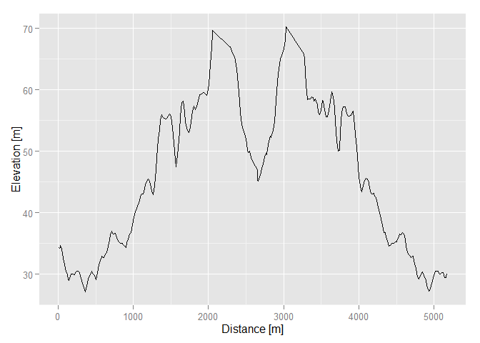
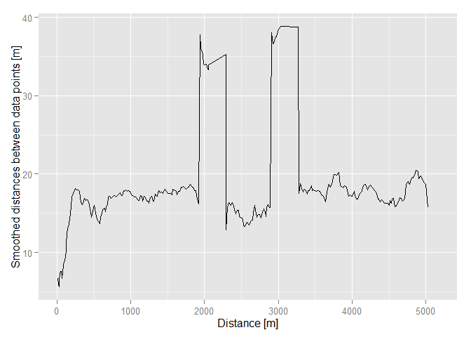
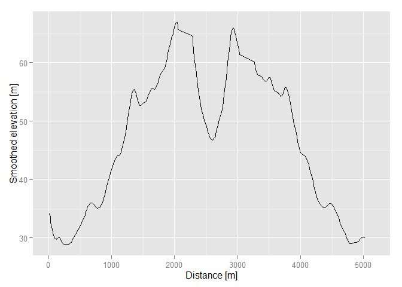
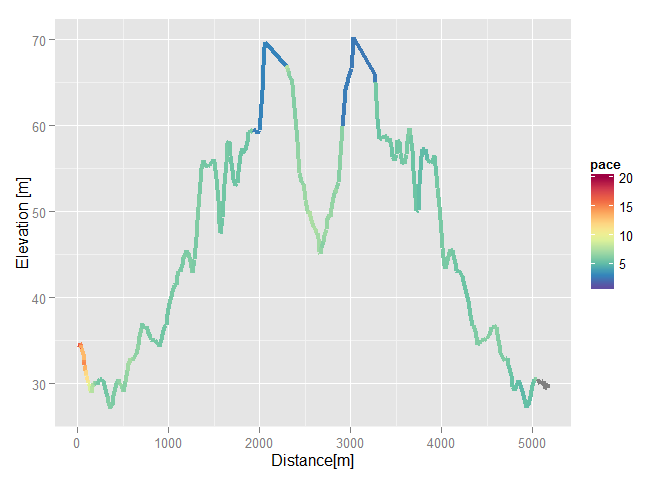
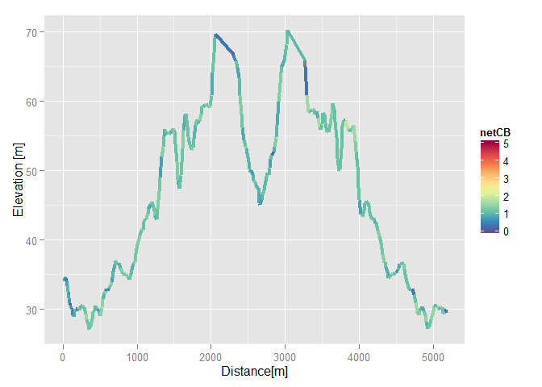
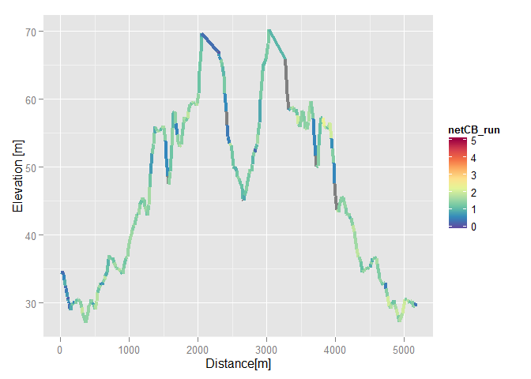
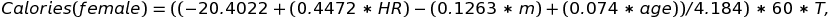
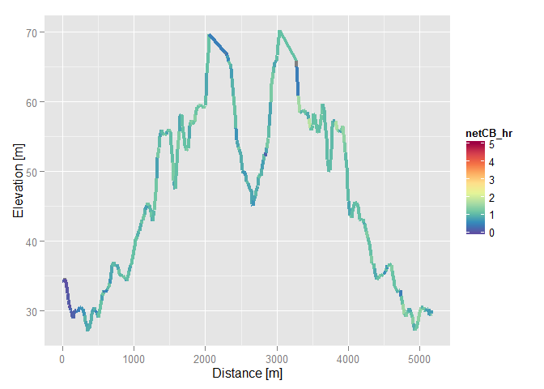

# Walkthrough for the runneR package 

-   Introduction
-   Analyze the run
-   Activity based calorie burn calculation
-   Running calorie burn calculation
-   Heart rate based calorie burn calculation

## Introduction

The **runneR** package is presented, which enables calculation of advanced running parameters based on GPS data of the running route, for example route-time segmentation, vertical ascent meters, calorie burn, pace. Calculations used in the package are based on [Strava glossary & calculations](https://strava.zendesk.com/forums/20246821-Strava-Glossary-Calculations) and are described in detail below. The package is comprised of the following functions:  

  - `analyze_run` which analyzes the running activity based on basic GPS data,
    * `time_div` time segmentation information for the running route, 
    * `resting_ind` resting time indexes in the `gpsHR` data frame
    * `moving_ind` moving time indexes in the `gpsHR` data frame
    * `total_vam` value of vertical ascent meters (VAM)
    * `pace` pacing information for the running route
    * `gps` input data frame containing additional calculated parameters
  - `cb_activity` which calculates the calories burned during the run based on activity intensity (running speed),
  - `cb_running` which calculates the calories burned during the run additionally using the elevation data,
  - `cb_hr` which calculates the calories burned during the run based on heart rate during the activity. 
  
The input data frame contains basic GPS data of time, latitude and longitude values and optionally additional GPS data such as elevation as well as non-GPS data such as heart rate time series. 

## Analyze the run

The function `analyze_run` performs the most calculations in this package. Based on the input GPS data which must contain at least latitude and longitude, it determines the duration of the run, which is further divided to moving and resting time. Additionally, average pace of the entire run and also of the moving time is calculated along with the best and worst pace of the run. If elevation data is also available, total vertivcal ascent meters are calculated and the moving time is further divided into time spent on climbs, downhill and on flat. 
The function is called with:


```r
## run_info <- analyze_run(gps, smoothing = FALSE)
```

The mandatory input argument is the data frame with GPS data (`gps`) of the run. The argument `smoothing` is set to `FALSE` by default and is used to indicate whether the results should be calculated on smoothed data or not. For step-by-step investigation of the function, some sample data (attached to the package) will be loaded 


```r
load(system.file("extdata", "gpsHR.Rda", package="runneR"))
```

```
## 'data.frame':	298 obs. of  6 variables:
## $ lon : num 13.7 13.7 13.7 13.7 13.7 ...
## $ lat : num 45.5 45.5 45.5 45.5 45.5 ...
## $ ele : num 34.6 34.3 34.2 34.3 34.5 ...
## $ time : chr "2015-06-05T05:40:59Z" "2015-06-05T05:41:07Z"
##    "2015-06-05T05:41:14Z" "2015-06-05T05:41:20Z" ...
## $ tz_CEST: POSIXct, format: "2015-06-05 07:40:59" "2015-06-05 07:41:07"
##    ...
## $ hr : num 67 68 73 71 66 63 64 64 65 66 ...
```

The loaded data contains GPS data (time, logitude, latitude and elevation) of a single run. Since the sample data is used for examples of all functions, it also includes heart rate (HR) data of the runner. 

After the `gpsHR` data frame is served as input, the function begins with converting the time vector of the GPS data to `POSIXct` format


```r
gpsHR$time <- as.POSIXct(gpsHR$time, format = "%Y-%m-%dT%H:%M:%OSZ")
```

This is followed by calculating the length of the smoothing window in samples corresponding to approximately one minute in time. This `win_smooth` parameter is used for rolling mean smoothing if the `smoothing` argument is set. Also, the disatances (`d`) and time differences (`delta_time`) between GPS data points (longitude - latitude pairs) are calculated as well as the average sampling rate `samp_avg` of the running data.


```r
# Length of the smoothing window is determined so that it's approximately 1
# minute long
win_smooth <- round(60/as.numeric(difftime(tail(gpsHR$time, 1), gpsHR$time[1], 
    units = "secs")/length(gpsHR$time)), digits = -1)

gpsHR$d <- c(NA, analyzeGPS::distanceGPS(lat1 = gpsHR$lat[1:(length(gpsHR$lat) - 
    1)], lon1 = gpsHR$lon[1:(length(gpsHR$lon) - 1)], lat2 = gpsHR$lat[2:length(gpsHR$lat)], 
    lon2 = gpsHR$lon[2:length(gpsHR$lon)]))
gpsHR$delta_time <- c(NA, as.numeric(difftime(gpsHR$time[-1], gpsHR$time[1:(length(gpsHR$time) - 
    1)], units = "secs")))
samp_avg <- round(mean(gpsHR$delta_time, na.rm = T), digits = 0)
```


If the smoothing argument is set to `FALSE`, the distances `d` and elevation `ele` are left unaltered. The speed data (`speed`) is calculated from distances `d` and time differences `delta_time` by using the `speedGPS` function from the **analyzeGPS** package. The grade (inclination) `grade` is calculated from elevation `ele` and distances `d` by using the `gradeGPS` function from the **analyzeGPS** package. The elevation differences `delta_ele` are calculated from `ele` and used to calculate the total vertical ascent meters (VAM) - `total_vam` based on positive values of `grade`. If the elevation data is not present the `total_vam_smooth` is assigned the `NA` value.


```r
gpsHR$d <- gpsHR$d
gpsHR$cum_dist <- c(NA, cumsum(na.omit(gpsHR$d)))

ggplot() + geom_line(data = gpsHR, aes(x = cum_dist, y = d)) + xlab("Distance [m]") + 
    ylab("Distances between data points [m]")
```

```
## Warning: Removed 1 rows containing missing values (geom_path).
```


```r
gpsHR$ele <- gpsHR$ele
ggplot() + geom_line(data = gpsHR, aes(x = cum_dist, y = ele)) + xlab("Distance [m]") + 
    ylab("Elevation [m]")
```



```r
gpsHR$speed <- c(NA, analyzeGPS::speedGPS(gpsHR$time, gpsHR$d[-1]))
gpsHR$grade <- c(NA, analyzeGPS::gradeGPS(gpsHR$ele, gpsHR$d))
gpsHR$delta_ele <- c(NA, gpsHR$ele[2:length(gpsHR$ele)] - gpsHR$ele[1:(length(gpsHR$ele) - 
    1)])
total_vam <- sum(gpsHR$delta_ele[which(gpsHR$grade > 0)], na.rm = TRUE)
```

```
## [1] 117.971
```

The above figures present the distances between GPS data points and elevation data according to the cumulative distance (`cum_dist`). However, if time dependence is of interest, the `cum_dist` variable in the `ggplot` code can be replaced with `time` variable.

If the smoothing argument of the function is set to `TRUE`, the distances and elevation data are smoothed using the rolling mean. The speed data `speed_smooth` is smoothed by dividing the smoothed distances with the average sampling rate `samp_avg`. The smoothed grade (inclination) `grade_smooth` is calculated from smoothed elevation `ele_smooth` and distances `d_smooth` by using the `gradeGPS` function from the **analyzeGPS** package. The elevation differences `delta_ele_smooth` are calculated from `ele_smooth`. All elevation differences, where the grade `grade_smooth` is positive, are summed-up to present VAM - `total_vam_smooth`. If the elevation data is not present, the grade and elevation differences are not calculated and `total_vam_smooth` is assigned the `NA` value.  

```r
gpsHR$d_smooth <- NA
gpsHR$d_smooth[1:(length(gpsHR$d) - win_smooth + 1)] <- zoo::rollapply(gpsHR$d, 
    win_smooth, mean)
ggplot() + geom_line(data = gpsHR, aes(x = cum_dist, y = d_smooth)) + xlab("Distance [m]") + 
    ylab("Smoothed distances between data points [m]")
```

```
## Warning: Removed 10 rows containing missing values (geom_path).
```



```r
gpsHR$ele_smooth <- rep(NA, length(gpsHR$ele))
gpsHR$ele_smooth[1:(length(gpsHR$ele) - win_smooth + 1)] <- zoo::rollapply(gpsHR$ele, 
    win_smooth, mean)
ggplot() + geom_line(data = gpsHR, aes(x = cum_dist, y = ele_smooth)) + xlab("Distance [m]") + 
    ylab("Smoothed elevation [m]")
```

```
## Warning: Removed 9 rows containing missing values (geom_path).
```



```r
gpsHR$speed_smooth <- gpsHR$d_smooth/samp_avg
gpsHR$grade_smooth <- c(NA, analyzeGPS::gradeGPS(gpsHR$ele_smooth, gpsHR$d_smooth))
gpsHR$delta_ele_smooth <- c(NA, gpsHR$ele_smooth[2:length(gpsHR$ele_smooth)] - 
    gpsHR$ele_smooth[1:(length(gpsHR$ele_smooth) - 1)])
total_vam_smooth <- sum(gpsHR$delta_ele[which(gpsHR$grade_smooth > 0)], na.rm = TRUE)
```

```
## [1] 51.31
```
The above figures present the smoothed distances between GPS data points and smoothed elevation data according to the cumulative distance (`cum_dist`). However, if time dependence is of interest, the `cum_dist` variable in the `ggplot` code can be replaced with `time` variable. 

Distances, time and elevation differences, average speed and grade between gps data points and total VAM are calculated at this point. Next, the function cotinues with segmenting the running route according to time. The total time of the recorded activity `active_time` is calculated by summing up the elements of `delta_time`. This is further divided to resting and moving time, `resting_time` and `moving_time`. Additionally, the indexes of resting (`resting_ind`) and moving (`moving_ind`) segments are extracted along with their proportions (`t_rest_rel`, `t_mov_rel`) in relation to total active time. All the absolute values are given in seconds.

```r
active_time = sum(gpsHR$delta_time, na.rm = TRUE)
```

```
## [1] 1688
```

```r
resting_ind <- which(gpsHR$speed_smooth < 1)
resting_time <- sum(gpsHR$delta_time[resting_ind], na.rm = TRUE)
```

```
## [1] 13
```

```r
t_rest_rel <- resting_time / active_time
```

```
## [1] 0.007701422
```

```r
moving_ind <- which(gpsHR$speed_smooth >= 1)
moving_time <- sum(gpsHR$delta_time[-resting_ind], na.rm = TRUE)
```

```
## [1] 1675
```

```r
t_mov_rel <- moving_time / active_time
```

```
## [1] 0.9922986
```

The moving part of the running route is segmented further according to grade values. Time spent ascending, descending and on flat is summed up and their proportions relative to total active time are calculated. These values are all asigned `NA` if there is no elevation data. All the time values and their relative proportions are packed in the `time_div` data frame. 


```r
if(sum(names(gpsHR) == "grade_smooth") > 0) {
  gps2 <- gpsHR[-resting_ind,]

  # Determine the total time spent ascending
  time_asc <- sum(gps2$delta_time[which(gps2$grade_smooth > 0)], na.rm = TRUE)
  time_asc
  t_asc_rel <- time_asc / moving_time

  # Determine the total time spent descending
  time_desc <- sum(gps2$delta_time[which(gps2$grade_smooth < 0)], na.rm = TRUE)
  time_desc
  t_desc_rel <- time_desc / moving_time

  # Determine the total time spent on flat
  time_flat <- sum(gps2$delta_time[which(gps2$grade_smooth == 0)], na.rm = TRUE)
  time_flat
  t_flat_rel <- time_flat / moving_time

  # Determine the time with undefined (NA) grade because of smoothing
  time_NA <- sum(gps2$delta_time[which(is.na(gps2$grade_smooth))], na.rm = TRUE)
  time_NA
  t_NA_rel <- time_NA / moving_time
} else {
  gps2 <- gps[-resting_ind,]

  time_asc <- NA
  t_asc_rel <- NA

  time_desc <- NA
  t_desc_rel <- NA

  time_flat <- NA
  t_flat_rel <- NA

  # Determine the time with undefined (NA) grade because of smoothing
  time_NA <- sum(gps2$delta_time[which(is.na(gps2$speed_smooth))], na.rm = TRUE)
  t_NA_rel <- time_NA / moving_time
}

time_div <- data.frame(active_time = active_time, moving_time = moving_time,
                         t_mov_rel = t_mov_rel, resting_time = resting_time,
                         t_rest_rel = t_rest_rel, time_asc = time_asc,
                         t_asc_rel = t_asc_rel, time_desc = time_desc,
                         t_desc_rel = t_desc_rel, time_flat = time_flat,
                         t_flat_rel = t_flat_rel, time_NA = time_NA,
                         t_NA_rel = t_NA_rel)
time_div
```

```
##   active_time moving_time t_mov_rel resting_time  t_rest_rel time_asc
## 1        1688        1675 0.9922986           13 0.007701422      729
##   t_asc_rel time_desc t_desc_rel time_flat t_flat_rel time_NA   t_NA_rel
## 1 0.4352239       910  0.5432836         0          0      36 0.02149254
```

After time segmentation the running pace is calculated from the speed data. The pace is the basic information of how many time units are needed to cover a selected unit of distance. This means that by inversing the speed we get the pace. However, we are not particularly interested in how many seconds we need to travel one meter. Therefore, we need to convert the units to a more standard unit. The most standard pace unit in running is minutes per kilometer (min/km). This requires multiplying the inversed speed in m/s by (100/6). By applying this formula, instantaneous pace `pace`, average pace `avg_pace`, average moving pace `avg_mov_pace`, best achieved pace `best_pace` and worst achieved pace `worst_pace` are calculated.


```r
gpsHR$pace <- (100/6) / gpsHR$speed_smooth
avg_pace <- 100/6/(sum(gpsHR$d_smooth, na.rm = TRUE) /
                     sum(gpsHR$delta_time[!is.na(gpsHR$d_smooth)], na.rm = TRUE))
avg_mov_pace <- 100/6/(sum(gps2$d_smooth, na.rm = TRUE) /
                     sum(gps2$delta_time[!is.na(gps2$d_smooth)], na.rm = TRUE))
best_pace <- min(gpsHR$pace, na.rm = TRUE)
worst_pace <- max(gpsHR$pace, na.rm = TRUE)
pace <- data.frame(avg_pace = avg_pace, avg_mov_pace = avg_mov_pace,
                   best_pace = best_pace, worst_pace = worst_pace)
pace
```

```
##   avg_pace avg_mov_pace best_pace worst_pace
## 1  5.41902     5.388504   2.57629   17.88631
```

```r
ggplot() + 
  geom_line(data = gpsHR, aes(x = cum_dist, y = pace)) + 
  xlab("Distance [m]") + 
  ylab("Pace [min/km]")
```

```
## Warning: Removed 10 rows containing missing values (geom_path).
```


The above figure presents running pace according to the cumulative distance (`cum_dist`). However, if time dependence is of interest, the `cum_dist` variable in the `ggplot` code can be replaced with `time` variable. 

The function concludes by returning a list of results: 

* `time_div` data frame containing time segmentation information for the running route, 
* `resting_ind` vector of resting time indexes in the `gpsHR` data frame
* `moving_ind` vector of moving time indexes in the `gpsHR` data frame
* `total_vam` value of vertical ascent meters (VAM)
* `pace` data frame containing pacing information for the running route
* `gps` input data frame containing additional calculated parameters


```r
return(list(time_div = time_div, resting_ind = resting_ind,
            moving_ind = moving_ind, total_vam = total_vam,
            pace = pace, gps = gps))
```


```r
myPalette <- colorRampPalette(rev(brewer.pal(10, "Spectral")))
sc <- scale_colour_gradientn(colours = myPalette(100), limits = c(1, 20))
ggplot() + geom_line(data = gpsHR, aes(x = cum_dist, y = ele, color = pace), size = 1.5) + sc + 
    xlab("Distance [m]") + ylab("Elevation [m]")
```



The above figure presents elevation data according to the cumulative distance (`cum_dist`) and coloured according to the pace value in that particular place. However, if time dependence is of interest, the `cum_dist` variable in the `ggplot` code can be replaced with `time` variable.

## Activity based calorie burn calculation

The function `cb_activity` estimates the amount of calories that you burn while running based on the MET (Metabolic Equivalent) data for the running activities from ["The Compendium of Physical Activities Tracking Guide" by B. E. Ainsworth](https://sites.google.com/site/compendiumofphysicalactivities/Activity-Categories/running). This table associates MET value associated with individual activities. A MET value represents the ratio of energy (i.e. calories) required to perform a particular activity relative to your BMR (Basal Metabolic Rate over 24 hours), where BMR is the amount of energy required to simply sit or lie quietly (while not digesting any food). The MET values for running are determined directly from the running speed and they are entered into a formula that estimates the calorie burn by multiplying the MET value for the running activity by the duration time of the activity and by the calculated BMR. Estimation of BMR is based on the widely used and accepted Harris-Benedict equations [*Harris J.A. and Benedict F.G. A Biometric Study of Human Basal Metabolism. Proc Natl Acad Sci U S A. 1918 December; 4(12): 370-373.*]. The equation for calorie calculation is 


where *T* is the duration of the exercise in hours (BMR and MET factors were already explained). This equation provides gross calorie burn estimate. To convert this value to net calorie burn estimate, we need to substract the resting metabolic rate calorie burn (RMRCB) which is calculated by 


The function is called with 

```r
## activity_cal_burn <- cb_activity(gender = "male", age = 41, m = 80, h = 180, gpsHR)

gender <- "male"
age <- 41
m <- 80
h <- 180
```

using the following mandatory input agruments: 

* `gender` String, either "male" or "female",
* `age` Age of the person in years,
* `m` mass in kg,
* `h` height in cm,
* `gps` the GPS data of the running route (longitude, latitude, time, elevation, ...). The longitude and latitude variables must be named "lon" and "lat", respectfully.

The function begins by calculating the needed parameters for calculating the calorie burn. The first one is basal metabolic rate over 24 hours (BMR), which depends on the value of the `gender`


```r
if(gender == "male") {
  BMR <- 13.75 * m + 5 * h - 6.76 * age + 66.47
} else {
  BMR <- 9.56 * m + 1.85 * h - 4.68 * age + 655.1
}
BMR
```

```
## [1] 1789.31
```

Additionally, the time vector is converted to POSIXct format, the time diferences and the distances between GPS data points are calculated, the duration of the run in hours is calculated and the average pace in min/km is calculated.   


```r
gpsHR$time <- as.POSIXct(gpsHR$time, format = "%Y-%m-%dT%H:%M:%OSZ")
gpsHR$delta_time <- c(NA, as.numeric(difftime(gpsHR$time[-1], gpsHR$time[1:(length(gpsHR$time) - 
    1)], units = "secs")))
duration <- sum(gpsHR$delta_time, na.rm = T)/3600
gpsHR$d <- c(NA, analyzeGPS::distanceGPS(lat1 = gpsHR$lat[1:(length(gpsHR$lat) - 
    1)], lon1 = gpsHR$lon[1:(length(gpsHR$lon) - 1)], lat2 = gpsHR$lat[2:length(gpsHR$lat)], 
    lon2 = gpsHR$lon[2:length(gpsHR$lon)]))

avg_pace <- 100/6/(sum(gpsHR$d, na.rm = TRUE)/(duration * 3600))
```

With this finished, the MET value can be determined by selecting one of the values according to the value of average pace `avg_pace`


```r
# MET (Metabolic Equivalent) data for physical activities
if(avg_pace > 9) {
  MET <- 6
}
if(avg_pace > 7.5 & avg_pace <= 9.0) {
  MET <- 8.3
}
if(avg_pace > 7.0 & avg_pace <= 7.5) {
  MET <- 9
}
if(avg_pace > 6.2 & avg_pace <= 7.0) {
  MET <- 9.8
}
if(avg_pace > 5.6 & avg_pace <= 6.2) {
  MET <- 10.5
}
if(avg_pace > 5.3 & avg_pace <= 5.6) {
  MET <- 11
}
if(avg_pace > 4.7 & avg_pace <= 5.3) {
  MET <- 11.8
}
if(avg_pace > 4.3 & avg_pace <= 4.7) {
  MET <- 12.3
}
if(avg_pace > 4.0 & avg_pace <= 4.3) {
  MET <- 12.8
}
if(avg_pace > 3.7 & avg_pace <= 4.0) {
  MET <- 14.5
}
if(avg_pace > 3.4 & avg_pace <= 3.7) {
  MET <- 16
}
if(avg_pace > 3.1 & avg_pace <= 3.4) {
  MET <- 19
}
if(avg_pace > 2.8 & avg_pace <= 3.1) {
  MET <- 19.8
}
if(avg_pace <= 2.8) {
  MET <- 23
}

MET
```

```
## [1] 11
```

After selecting the proper MET value, all the quantities are inserted to the described equation to calculate the gross calorie burn estimate (`grossCB`) which is then converted to the net estimate by substracting the RMRCB value from the gross estimation. 

```r
grossCB <- BMR * MET * duration / 24

RMRCB <- ((1.1 * BMR) / 24) * duration

netCB <- grossCB - RMRCB
netCB
```

```
## [1] 346.0824
```

The above procedure of determining the MET value and calculating the net calorie burn estimate is also vectorized to determine sample-by-sample value of the `netCB` for the input data frame. 


```r
gpsHR$netCB <- NA
for(i in 1:dim(gpsHR)[1]) {
  # average pace in min/km
  pace <- 100/6/(gpsHR$d[i] / gpsHR$delta_time[i])

  # MET (Metabolic Equivalent) data for physical activities
  if(is.na(pace)){
    gpsHR$netCB[i] <- NA
    next
  }
  if(pace > 9) {
    MET <- 6
  }
  if(pace > 7.5 & pace <= 9.0) {
    MET <- 8.3
  }
  if(pace > 7.0 & pace <= 7.5) {
    MET <- 9
  }
  if(pace > 6.2 & pace <= 7.0) {
    MET <- 9.8
  }
  if(pace > 5.6 & pace <= 6.2) {
    MET <- 10.5
  }
  if(pace > 5.3 & pace <= 5.6) {
    MET <- 11
  }
  if(pace > 4.7 & pace <= 5.3) {
    MET <- 11.8
  }
  if(pace > 4.3 & pace <= 4.7) {
    MET <- 12.3
  }
  if(pace > 4.0 & pace <= 4.3) {
    MET <- 12.8
  }
  if(pace > 3.7 & pace <= 4.0) {
    MET <- 14.5
  }
  if(pace > 3.4 & pace <= 3.7) {
    MET <- 16
  }
  if(pace > 3.1 & pace <= 3.4) {
    MET <- 19
  }
  if(pace > 2.8 & pace <= 3.1) {
    MET <- 19.8
  }
  if(pace <= 2.8) {
    MET <- 23
  }

  grossCB_vec <- BMR * MET * (gpsHR$delta_time[i] / 3600) / 24

  RMRCB_vec <- ((1.1 * BMR) / 24) * (gpsHR$delta_time[i] / 3600)

  gpsHR$netCB[i] <- grossCB_vec - RMRCB_vec
}
```

The function returns a list containing the net estimate of calories burned `netCB` and the modified input data frame gpsHR (among the added columns also the `netCB` column)

```r
## return(list(netCB = netCB, gpsHR = gpsHR))
netCB
```

```
## [1] 346.0824
```

```r
str(gpsHR)
```

```
## 'data.frame':	298 obs. of  18 variables:
##  $ lon             : num  13.7 13.7 13.7 13.7 13.7 ...
##  $ lat             : num  45.5 45.5 45.5 45.5 45.5 ...
##  $ ele             : num  34.6 34.3 34.2 34.3 34.5 ...
##  $ time            : POSIXct, format: "2015-06-05 05:40:59" "2015-06-05 05:41:07" ...
##  $ tz_CEST         : POSIXct, format: "2015-06-05 07:40:59" "2015-06-05 07:41:07" ...
##  $ hr              : num  67 68 73 71 66 63 64 64 65 66 ...
##  $ d               : num  NA 12.46 7.86 3.62 2.94 ...
##  $ delta_time      : num  NA 8 7 6 9 11 6 4 8 10 ...
##  $ speed           : num  NA 1.557 1.123 0.604 0.327 ...
##  $ grade           : num  NA -0.0198 -0.0131 0.0152 0.0632 ...
##  $ delta_ele       : num  NA -0.247 -0.103 0.055 0.186 ...
##  $ d_smooth        : num  NA 6.7 5.84 5.59 6.11 ...
##  $ ele_smooth      : num  34.3 34.1 33.9 33.7 33.4 ...
##  $ speed_smooth    : num  NA 1.116 0.974 0.932 1.018 ...
##  $ grade_smooth    : num  NA -0.0287 -0.033 -0.0387 -0.0455 ...
##  $ delta_ele_smooth: num  NA -0.192 -0.193 -0.216 -0.278 ...
##  $ pace            : num  NA 14.9 17.1 17.9 16.4 ...
##  $ netCB           : num  NA 0.812 0.71 0.609 0.913 ...
```

```r
myPalette <- colorRampPalette(rev(brewer.pal(10, "Spectral")))
sc <- scale_colour_gradientn(colours = myPalette(100), limits = c(0, 5))
ggplot() + geom_line(data = gpsHR, aes(x = cum_dist, y = ele, color = netCB), size = 1.5) + 
    sc + xlab("Distance [m]") + ylab("Elevation [m]")
```



The above figure presents elevation data according to the cumulative distance (`cum_dist`) and coloured according to the activity-based net calorie burn value in that particular place. However, if time dependence is of interest, the `cum_dist` variable in the `ggplot` code can be replaced with `time` variable. 

## Running calorie burn calculation

The function `cb_running` estimates the calories that you burn while running any given distance. The function takes into consideration the grade of the running surface (i.e. the incline or decline), whether the running is done on a treadmill or not, and the fitness level. The incline or decline of the running surface is taken into consideration because more calories are burned as the incline of the running surface increases, and less calories are burned as the decline of the surface increases (until -10% grade, beyond which any further decline will cause an increase in calorie burn, similar to the effect of increasing the incline). Whether or not the running is performed on a treadmill is taken into consideration because treadmill runners do not need to overcome air resistance and therefore consume slightly less energy than those running on solid ground. Fitness level (measured through VO2max estimation) is taken into consideration because there is a known negative correlation between VO2max and energy cost of running (i.e. with increased fitness, or VO2max, you will burn less calories to run a given distance). 

VO2 (or oxygen consumption) is a measure of the volume of oxygen that is used by your body to convert the energy from the food into the energy molecules. VO2max (or maximal oxygen consumption) is simply the maximum possible VO2 that a given person can achieve. VO2 and VO2max are important in the context of exercise, because they are a measure of body's ability to generate the energy source that allows your muscles to continue working while you are exercising. Therefore, by definition, a VO2max measurement is ultimately a measure of your cardiorespiratory fitness level. A person who is fit, in the cardiorespiratory sense of the word "fit," would have a higher VO2max than someone who is less fit. However, it is important to understand that if you have a larger VO2max than someone else, it does not necessarily mean that you could beat them in, for example, a marathon race. What it means is that your body is more able to absorb and use oxygen to generate energy for your muscles, and this will certainly give you an edge, but what you are actually capable of doing with that energy depends on many other factors (the mechanical efficiency with which you run at a given speed, for example).

This function is based on equations derived by from experimental data gathered by [*Margaria R., Cerretelli P., Aghemo P., Sassi G. Energy cost of running. J Appl Physiol. 1963 Mar;18:367-70.*]. The experimental data gathered by Margaria et al. measured calorie burn of subjects running on a treadmill at various speeds (from 9 to 22 km/hr) and running surface grades (from 20% decline to 15% incline). It was found that the net calories burned per kilogram of body weight per kilometer run is independent of speed, and depends only on the incline or decline of the running surface and the cardiorespiratory fitness level (measured through VO2max) of the runner. There is, therefore, no need to take running speed into consideration when estimating calories burned while running. You simply need to know the total distance run, the weight of the runner, and the incline or decline of the running surface. If the cardiorespiratory fitness level of the runner is known it will allow you to further refine your estimation of calorie burn because there is a known negative correlation between VO2max and energy cost of running. This function estimates cardiorespiratory fitness level through VO2max estimation, based on the runner's resting heart rate [*Uth N., SA¸rensen H., Overgaard K., Pedersen P.K. Estimation of VO2max from the ratio between HRmax and HRrest-the Heart Rate Ratio Method. Eur J Appl Physiol. 2004 Jan;91(1):111-5.*] 


where *MHR* is the maximum heart rate and *RHR* is the resting heart rate of the runner, both in beats/min. For the Uth et al. estimation of VO2max an age based estimation of maximum heart rate is made [*Tanaka, H., Monhan, K.D., Seals, D.G., Age-predicted maximal heart rate revisited. Am Coll Cardiol 2001; 37:153-156.*] 


The function is called with 

```r
## running_cal_burn <- cb_running(age = 41, m = 80, h = 180, RHR = 60, treadmill = FALSE, gpsHR)

age <- 41
m <- 80
h <- 180
RHR <- 60
treadmill <- FALSE
```

using the following mandatory input agruments: 

* `age` Age of the person in years,
* `m` mass in kg,
* `h` height in cm,
* `RHR` resting heart rate in beats/min
* `treadmill` indicator of whether the running was performed on a treadmill or not (TRUE or FALSE)
* `gpsHR` the GPS data of the running route containing time, longitude, latitude and elevation. The longitude, latitude and elevation variables must be named "lon", "lat" and "ele", respectfully.

Again, the first step of the function is preparation of necessary parameters. Body mass and height are used to calculate body mass index (`BMI`), age is used to determine the maximum heart rate `MHR`, which is then used together with the resting heart rate `RHR` to assess the VO2max value. 


```r
BMI <- m / ((h / 100)^2)
```

```
## [1] 24.69136
```

```r
MHR <- 208 - (0.685 * age)
```

```
## [1] 179.915
```

```r
VO2max <- 15.3 * MHR / RHR
```

```
## [1] 45.87833
```

Depending on the value of `treadmill` argument the treadmill factor `TF` is defined, which is used to account for the presence or absence of air resistance. Runner on a treadmill does not experience air resistance while running and therefore burns fewer calories than a runner that is running on solid ground. For a person running at a typical casual runner's pace of 2.5 meters per second (9 km/hr) it can be shown that the energy cost of air resistance while running on solid ground is roughly 0.84 calories per kilometer (this is equivalent to approximately an extra 1.2% calorie burn relative to a runner on a treadmill) [*Pugh LG. The influence of wind resistance in running and walking and the mechanical efficiency of work against horizontal or vertical forces. J Physiol. 1971 Mar;213(2):255-76.*]. The value of 0.84 calories per kilometer assumes a typical running speed of 2.5 m/s and no wind (i.e. the extra calorie burn is caused by the runner having to "push" through still air while at running 2.5 m/s). Therefore, the `TF` is 0.84 calories if the runner is not on a treadmill and 0 calories if the runner is using a treadmill. 


```r
if(treadmill) {
  TF <- 0
} else {
  TF <- 0.84
}
```

The VO2max value is used for determination of Cardiorespiratory Fitness Factor (CFF), which accounts for fitness level of the runner since athletes can perform better not so much because of their greater skill as for their greater capacity for oxygen consumption. Essentially, a runner with a high VO2max will burn approximately 5% to 7% fewer calories while running than a runner with a low VO2max. The cardiorespiratory fitness factor `CFF` is defined according to the `VO2max` value as shown below:

```r
if(VO2max >= 56) {
  CFF <- 1
}
if(VO2max >= 54 & VO2max < 56) {
  CFF <- 1.01
}
if(VO2max >= 52 & VO2max < 54) {
  CFF <- 1.02
}
if(VO2max >= 50 & VO2max < 52) {
  CFF <- 1.03
}
if(VO2max >= 48 & VO2max < 50) {
  CFF <- 1.04
}
if(VO2max >= 46 & VO2max < 48) {
  CFF <- 1.05
}
if(VO2max >= 44 & VO2max < 46) {
  CFF <- 1.06
}
if(VO2max < 44) {
  CFF <- 1.07
}
CFF
```

```
## [1] 1.06
```

As mentioned, the function `cb_running` takes into account also the inclination of the route. Therefore, we have to calclulate inclination or grade between the GPS samples. First, the `time` variable is converted to POSIXct format. Time differences `delta_time` between data points are used to determine total duration of the run in hours. The distances `d` between GPS data points are calculated using the the `distanceGPS` function from the **analyzeGPS** package and inclination `grade` is calculated from elevation and distances data by using the `gradeGPS` function from the **analyzeGPS** package. Also, the total distance in kilometers and average grade in percent of the running route are calculated. 


```r
gpsHR$time <- as.POSIXct(gpsHR$time, format = "%Y-%m-%dT%H:%M:%OSZ")
gpsHR$delta_time <- c(NA, as.numeric(difftime(gpsHR$time[-1], gpsHR$time[1:(length(gpsHR$time) - 
    1)], units = "secs")))
duration <- sum(gpsHR$delta_time, na.rm = T)/3600
```

```
## [1] 0.4688889
```

```r
gpsHR$d <- c(NA, analyzeGPS::distanceGPS(lat1 = gpsHR$lat[1:(length(gpsHR$lat) - 
    1)], lon1 = gpsHR$lon[1:(length(gpsHR$lon) - 1)], lat2 = gpsHR$lat[2:length(gpsHR$lat)], 
    lon2 = gpsHR$lon[2:length(gpsHR$lon)]))
distance <- sum(gpsHR$d, na.rm = T)/1000
```

```
## [1] 5.170663
```

```r
gpsHR$grade <- c(NA, analyzeGPS::gradeGPS(gpsHR$ele, gpsHR$d))
avg_grade <- mean(gpsHR$grade, na.rm = TRUE) * 100
```

```
## [1] -0.01654923
```

Finally, all the necessary parameters are ready to use the calorie burn equation, which can be written in general form as: 


where *A* and *B* are constants depending on the `grade` value. The calculated value presents the net calorie burn estimate `netCB`


```r
if(avg_grade > 10) {
  netCB_run <- (((0.07 * avg_grade) + 0.75) * m + TF) * distance * CFF
}
if(avg_grade > 0 & avg_grade <= 10) {
  netCB_run <- (((0.05 * avg_grade) + 0.95) * m + TF) * distance * CFF
}
if(avg_grade > -10 & avg_grade <= 0) {
  netCB_run <- (((0.04 * avg_grade) + 0.95) * m + TF) * distance * CFF
}
if(avg_grade > -15 & avg_grade <= -10) {
  netCB_run <- (((-0.02 * avg_grade) + 0.35) * m + TF) * distance * CFF
}
if(avg_grade <= -15) {
  netCB_run <- (((-0.01 * avg_grade) + 0.5) * m + TF) * distance * CFF
}

netCB_run
```

```
## [1] 420.8624
```

The above procedure of calculating the net calorie burn estimate is also vectorized to determine sample-by-sample value of the `netCB_run` for the input data frame.


```r
gpsHR$netCB_run <- NA
for(i in 1:dim(gpsHR)[1]) {
  if(is.na(gpsHR$grade[i])){
    gpsHR$netCB_run[i] <- NA
    next
  }
  if((100 * gpsHR$grade[i]) > 10) {
    gpsHR$netCB_run[i] <- (((0.07 * gpsHR$grade[i]) + 0.75) * m + TF) * (gpsHR$d[i] / 1000) * CFF
  }
  if((100 * gpsHR$grade[i]) > 0 & (100 * gpsHR$grade[i]) <= 10) {
    gpsHR$netCB_run[i] <- (((0.05 * gpsHR$grade[i]) + 0.95) * m + TF) * (gpsHR$d[i] / 1000) * CFF
  }
  if((100 * gpsHR$grade[i]) > -10 & (100 * gpsHR$grade[i]) <= 0) {
    gpsHR$netCB_run[i] <- (((0.04 * gpsHR$grade[i]) + 0.95) * m + TF) * (gpsHR$d[i] / 1000) * CFF
  }
  if((100 * gpsHR$grade[i]) > -15 & (100 * gpsHR$grade[i]) <= -10) {
    gpsHR$netCB_run[i] <- (((-0.02 * gpsHR$grade[i]) + 0.35) * m + TF) * (gpsHR$d[i] / 1000) * CFF
  }
  if((100 * gpsHR$grade[i]) <= -15) {
    gpsHR$netCB_run[i] <- (((-0.01 * gpsHR$grade[i]) + 0.5) * m + TF) * gpsHR$d[i] * CFF
  }
}
```

The function returns a list containing the net estimate of calories burned `netCB_run` and the modified input data frame `gpsHR` (among the added columns also the `netCB_run` column)


```r
## return(list(netCB = netCB_run, gpsHR = gpsHR))
netCB_run
```

```
## [1] 420.8624
```

```r
str(gpsHR)
```

```
## 'data.frame':	298 obs. of  19 variables:
##  $ lon             : num  13.7 13.7 13.7 13.7 13.7 ...
##  $ lat             : num  45.5 45.5 45.5 45.5 45.5 ...
##  $ ele             : num  34.6 34.3 34.2 34.3 34.5 ...
##  $ time            : POSIXct, format: "2015-06-05 05:40:59" "2015-06-05 05:41:07" ...
##  $ tz_CEST         : POSIXct, format: "2015-06-05 07:40:59" "2015-06-05 07:41:07" ...
##  $ hr              : num  67 68 73 71 66 63 64 64 65 66 ...
##  $ d               : num  NA 12.46 7.86 3.62 2.94 ...
##  $ delta_time      : num  NA 8 7 6 9 11 6 4 8 10 ...
##  $ speed           : num  NA 1.557 1.123 0.604 0.327 ...
##  $ grade           : num  NA -0.0198 -0.0131 0.0152 0.0632 ...
##  $ delta_ele       : num  NA -0.247 -0.103 0.055 0.186 ...
##  $ d_smooth        : num  NA 6.7 5.84 5.59 6.11 ...
##  $ ele_smooth      : num  34.3 34.1 33.9 33.7 33.4 ...
##  $ speed_smooth    : num  NA 1.116 0.974 0.932 1.018 ...
##  $ grade_smooth    : num  NA -0.0287 -0.033 -0.0387 -0.0455 ...
##  $ delta_ele_smooth: num  NA -0.192 -0.193 -0.216 -0.278 ...
##  $ pace            : num  NA 14.9 17.1 17.9 16.4 ...
##  $ netCB           : num  NA 0.812 0.71 0.609 0.913 ...
##  $ netCB_run       : num  NA 1.014 0.64 0.295 0.24 ...
```

```r
myPalette <- colorRampPalette(rev(brewer.pal(10, "Spectral")))
sc <- scale_colour_gradientn(colours = myPalette(100), limits = c(0, 5))
ggplot() + geom_line(data = gpsHR, aes(x = time, y = cum_dist, color = netCB_run), size = 1.5) + 
    sc + xlab("Distance [m]") + ylab("Elevation [m]")
```



The above figure presents elevation data according to the cumulative distance (`cum_dist`) and coloured according to the running speed-based net calorie burn value in that particular place. However, if time dependence is of interest, the `cum_dist` variable in the `ggplot` code can be replaced with `time` variable.

## Heart rate based calorie burn calculation

The function `cb_hr` provides an estimate of the rate at which you are burning calories during aerobic (i.e. cardiorespiratory) exercise, based on your average heart rate while performing the exercise. During exercise your muscles must burn calories to fuel their contractions. The conversion of calories from their stored nutrient state to the form that can be burned by your muscle cells is achieved, during aerobic exercise, through the process of cellular respiration, which requires oxygen, and the delivery of oxygen through your bloodstream to your active muscle cells is directly related to your heart rate. It is this relationship that allows you to predict your energy expenditure (i.e. calorie burn) from your heart rate. Essentially, with increased exercise intensity your muscles must burn more calories, and so your heart must beat faster to provide the oxygen necessary to convert those calories to the form of energy that can be burned by your muscles.

This function calculates burned calories by using the following equations [*Keytel L.R., Goedecke J.H., Noakes T.D., Hiiloskorpi H., Laukkanen R., van der Merwe L., Lambert E.V. Prediction of energy expenditure from heart rate monitoring during submaximal exercise. J Sports Sci. 2005 Mar;23(3):289-97*] 




where *HR* represents heart rate, *m* is body mass, and *T* is duration in hours. 

It should be noted that the presented equations are optimized to estimate calorie burn for exercise intesity level ranging between 41% of VO2max (or roughly 64% of maximum heart rate [*Swain D.P., Abernathy K.S., Smith C.S., Lee S.J., Bunn S.A. Target heart rates for the development of cardiorespiratory fitness. Med Sci Sports Exerc. January 1994. 26(1): 112-116.*]) and VO2max. 

The function is called with 

```r
## hr_cal_burn <- cb_hr(gender = "male", age = 41, m = 80, h = 180, RHR = 60, gpsHR$hr, gpsHR)

gender <- "male"
age <- 41
m <- 80
h <- 180
RHR <- 60
HR <- gpsHR$hr
```

using the following mandatory input agruments: 

* `gender` String, either "male" or "female",
* `age` Age of the person in years,
* `m` mass in kg,
* `h` height in cm,
* `RHR` resting heart rate in beats/min
* `gpsHR$hr` heart rate time series data for the run
* `gpsHR` the GPS data of the running route (longitude, latitude, time, elevation, ...). The longitude and latitude variables must be named "lon" and "lat", respectfully.

The first step of the function is preparation of necessary parameters. Age is used to determine the maximum heart rate `MHR`, which is then used together with the resting heart rate `RHR` to assess the VO2max value. Also, the average heart rate `avg_hr` is calculated for the input heart rate series. Additionally, the time vector is converted to POSIXct format and time differences between data points are determined together with total duration of the run

```r
MHR <- 208 - (0.685 * age)
VO2max <- 15.3 * MHR/RHR
gpsHR$time <- as.POSIXct(gpsHR$time, format = "%Y-%m-%dT%H:%M:%OSZ")
duration <- sum(gpsHR$delta_time, na.rm = T)/3600
```

Then, the calories burn is estimated according to `gender`. The formula provides gross calorie burn estimate. To convert this value to net calorie burn estimate, we need to substract the resting metabolic rate calorie burn (RMRCB), described in the section about calculating calorie burn by activity

```r
if (gender == "male") {
    BMR <- 13.75 * m + 5 * h - 6.76 * age + 66.47
    grossCB <- ((-95.7735 + (0.634 * avg_hr) + (0.404 * VO2max) + (0.394 * m) + 
        (0.271 * age))/4.184) * 60 * duration
    RMRCB <- ((1.1 * BMR)/24) * duration
    netCB_hr <- grossCB - RMRCB
} else {
    BMR <- 9.56 * m + 1.85 * h - 4.68 * age + 655.1
    grossCB <- ((-59.3954 + (0.45 * avg_hr) + (0.38 * VO2max) + (0.103 * m) + 
        (0.274 * age))/4.184) * 60 * duration
    RMRCB <- ((1.1 * BMR)/24) * duration
    netCB_hr <- grossCB - RMRCB
}

netCB_hr
```

```
## [1] 315.354
```

The above procedure of calculating the net calorie burn estimate is also vectorized to determine sample-by-sample value of the `netCB_hr` for the input data frame.

```r
gpsHR$netCB_hr <- NA

if (gender == "male") {
    BMR <- 13.75 * m + 5 * h - 6.76 * age + 66.47
    for (i in 1:dim(gpsHR)[1]) {
        if (is.na(HR[i])) {
            gpsHR$netCB_hr[i] <- NA
            next
        }
        grossCB <- ((-95.7735 + (0.634 * HR[i]) + (0.404 * VO2max) + (0.394 * 
            m) + (0.271 * age))/4.184) * 60 * (gpsHR$delta_time[i]/3600)
        RMRCB <- ((1.1 * BMR)/24) * (gpsHR$delta_time[i]/3600)
        gpsHR$netCB_hr[i] <- grossCB - RMRCB
    }
} else {
    BMR <- 9.56 * m + 1.85 * h - 4.68 * age + 655.1
    for (i in 1:dim(gpsHR)[1]) {
        if (is.na(HR[i])) {
            gpsHR$netCB_hr[i] <- NA
            next
        }
        grossCB <- ((-59.3954 + (0.45 * HR[i]) + (0.38 * VO2max) + (0.103 * 
            m) + (0.274 * age))/4.184) * 60 * (gpsHR$delta_time[i]/3600)
        RMRCB <- ((1.1 * BMR)/24) * (gpsHR$delta_time[i]/3600)
        gpsHR$netCB_hr <- grossCB - RMRCB
    }
}
```

The function returns a list containing the net estimate of calories burned `netCB_hr` and the modified input data frame `gpsHR` (among the added columns also the `netCB_hr` column)

```r
## return(list(netCB = netCB_hr, gpsHR = gpsHR))
netCB_hr
```

```
## [1] 315.354
```

```r
str(gpsHR)
```

```
## 'data.frame':	298 obs. of  20 variables:
##  $ lon             : num  13.7 13.7 13.7 13.7 13.7 ...
##  $ lat             : num  45.5 45.5 45.5 45.5 45.5 ...
##  $ ele             : num  34.6 34.3 34.2 34.3 34.5 ...
##  $ time            : POSIXct, format: "2015-06-05 05:40:59" "2015-06-05 05:41:07" ...
##  $ tz_CEST         : POSIXct, format: "2015-06-05 07:40:59" "2015-06-05 07:41:07" ...
##  $ hr              : num  67 68 73 71 66 63 64 64 65 66 ...
##  $ d               : num  NA 12.46 7.86 3.62 2.94 ...
##  $ delta_time      : num  NA 8 7 6 9 11 6 4 8 10 ...
##  $ speed           : num  NA 1.557 1.123 0.604 0.327 ...
##  $ grade           : num  NA -0.0198 -0.0131 0.0152 0.0632 ...
##  $ delta_ele       : num  NA -0.247 -0.103 0.055 0.186 ...
##  $ d_smooth        : num  NA 6.7 5.84 5.59 6.11 ...
##  $ ele_smooth      : num  34.3 34.1 33.9 33.7 33.4 ...
##  $ speed_smooth    : num  NA 1.116 0.974 0.932 1.018 ...
##  $ grade_smooth    : num  NA -0.0287 -0.033 -0.0387 -0.0455 ...
##  $ delta_ele_smooth: num  NA -0.192 -0.193 -0.216 -0.278 ...
##  $ pace            : num  NA 14.9 17.1 17.9 16.4 ...
##  $ netCB           : num  NA 0.812 0.71 0.609 0.913 ...
##  $ netCB_run       : num  NA 1.014 0.64 0.295 0.24 ...
##  $ netCB_hr        : num  NA 0.0888 0.1661 0.112 0.0544 ...
```

```r
myPalette <- colorRampPalette(rev(brewer.pal(10, "Spectral")))
sc <- scale_colour_gradientn(colours = myPalette(100), limits = c(0, 5))
ggplot() + geom_line(data = gpsHR, aes(x = cum_dist, y = ele, color = netCB_hr), size = 1.5) + 
    sc + xlab("Distance [m]") + ylab("Elevation [m]")
```



The above figure presents elevation data according to the cumulative distance (`cum_dist`) and coloured according to the heart rate-based net calorie burn value in that particular place. However, if time dependence is of interest, the `cum_dist` variable in the `ggplot` code can be replaced with `time` variable.

The three presented calorie calculations provide only calorie burn estimations. However, the heart rate based calorie burn calculation is considered to be the most accurate of the three presented methods. 
