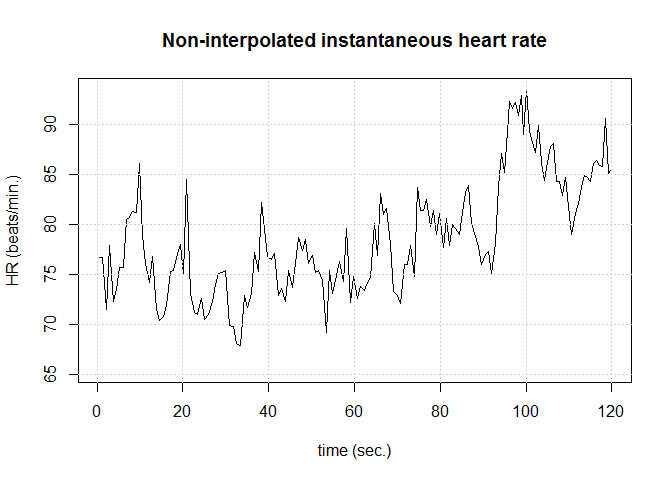
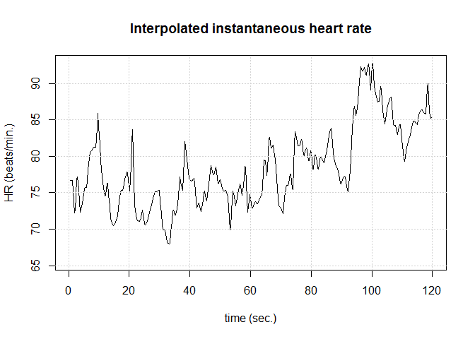
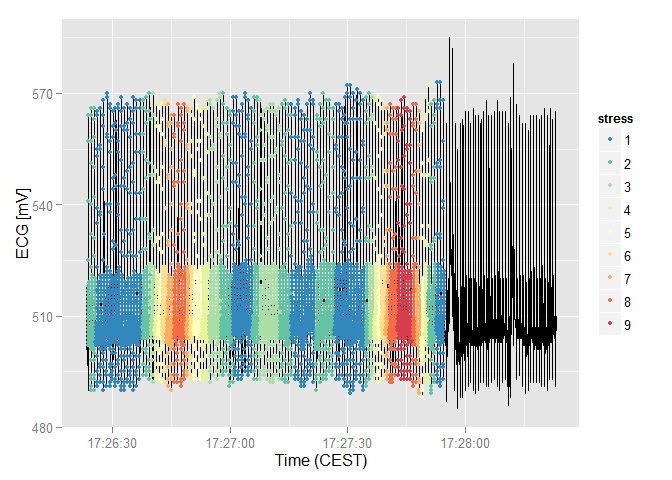

-   Introduction
-   Heart rate variability analysis
    -   Initialization and HR series preparation
    -   Calculating spectrogram of HR series
-   Calculate stress
    -   Data synchronization
    -   Calculating and adding stress data

Introduction
------------

This is a short demo of the functionalities of the `stressHR` package, which assesses mental stress based on heart rate. Heart beats and heart rate are previously detected from single-lead ECG signal by using the `heartBeat` package.
The `stressHR` package is comprised of `hrv_analyze` and `merge_hrv` functions. The `hrv_analyze` function executes the [heart rate variability (HRV)](https://en.wikipedia.org/wiki/Heart_rate_variability) on heart beat positions written in an ASCII file (`Rsec_data.txt`). The resulting data structure with HRV data is then forwarded to `merge_hrv` function, which merges the HRV data with the initial ECG data frame.

Heart rate variability analysis
-------------------------------

The `hrv_analyze` function is used to perform the HRV analysis

``` r
hrv_analyze <- function(NAME = "Rsec_data.txt")
```

where the string name of the ASCII file with heart beat positions in seconds in the ECG signal is the only input argument. The function uses the [`RHRV` package](http://rhrv.r-forge.r-project.org/) to calculate the parameters of the HRV analysis. Therefore, the output of the function is a RHRV structure, which is basically a list of results presented at the end of this section.

### Initialization and HR series preparation

The function begins with initializing the `hrv_data` structure and enabling the verbose operation mode for additional information in the console

``` r
library(RHRV)
```

    ## Loading required package: tcltk
    ## Loading required package: tkrplot
    ## Loading required package: waveslim
    ## 
    ## waveslim: Wavelet Method for 1/2/3D Signals (version = 1.7.5)
    ## 
    ## Loading required package: nonlinearTseries
    ## Loading required package: Matrix
    ## Loading required package: rgl
    ## Loading required package: tseries
    ## Loading required package: TSA
    ## Loading required package: leaps
    ## Loading required package: locfit
    ## locfit 1.5-9.1    2013-03-22
    ## Loading required package: mgcv
    ## Loading required package: nlme
    ## This is mgcv 1.8-7. For overview type 'help("mgcv-package")'.
    ## 
    ## Attaching package: 'TSA'
    ## 
    ## The following objects are masked from 'package:stats':
    ## 
    ##     acf, arima
    ## 
    ## The following object is masked from 'package:utils':
    ## 
    ##     tar
    ## 
    ## Loading required package: Rcpp
    ## 
    ## Attaching package: 'nonlinearTseries'
    ## 
    ## The following object is masked from 'package:grDevices':
    ## 
    ##     contourLines

``` r
hrv_data <- CreateHRVData()
hrv_data <- SetVerbose(hrv_data, TRUE)
str(hrv_data)
```

    ## List of 5
    ##  $ Ext              : chr "hrv"
    ##  $ FreqAnalysis     : list()
    ##  $ TimeAnalysis     : list()
    ##  $ NonLinearAnalysis: list()
    ##  $ Verbose          : logi TRUE

In the next step the ASCII file with heart beat positions is loaded into `hrv_data`. Then the `BuildNIHR` function constructs both the R-to-R and instantaneous heart rate (HR) series. The instantaneous heart rate (HR) is refered to as the Non Interpolated Heart Rate (niHR) series.

``` r
NAME <- system.file("extdata", "Rsec_data.txt", package="stressHR")
hrv_data <- LoadBeatAscii(hrv_data, NAME, RecordPath = ".")
```

    ## ** Loading beats positions for record: C:/R/Rlibs/stressHR/extdata/Rsec_data.txt **
    ##    Path: . 
    ##    Scale: 1 
    ##    Date: 01/01/1900
    ##    Time: 00:00:00
    ##    Number of beats: 157

``` r
hrv_data <- BuildNIHR(hrv_data)
```

    ## ** Calculating non-interpolated heart rate **
    ##    Number of beats: 157

``` r
str(hrv_data)
```

    ## List of 7
    ##  $ Ext              : chr "hrv"
    ##  $ FreqAnalysis     : list()
    ##  $ TimeAnalysis     : list()
    ##  $ NonLinearAnalysis: list()
    ##  $ Verbose          : logi TRUE
    ##  $ datetime         : POSIXlt[1:1], format: "1900-01-01"
    ##  $ Beat             :'data.frame':   157 obs. of  3 variables:
    ##   ..$ Time: num [1:157] 0.509 1.291 2.13 2.9 3.73 ...
    ##   ..$ niHR: num [1:157] 76.7 76.7 71.5 77.9 72.3 ...
    ##   ..$ RR  : num [1:157] 782 782 839 770 830 816 792 792 745 743 ...

A filtering operation must be carried out in order to eliminate outliers or spurious points present in the niHR time series with unacceptable physiological values. Outliers present in the series originate both from detecting an artifact as a heartbeat (RR interval too short) or not detecting a heartbeat (RR interval too large). In this case the outliers removal is both automatic and manual. The `FilterNIHR` function is used to automatically filter out all heart beats resulting in IHR more than 300 bpm. The `EditNIHR` function is used to manually filter out all other outliers. The result of filtering is displayed by the `PlotNIHR` function

``` r
# Filter the NIHR data to remove outliers
hrv_data <- FilterNIHR(hrv_data, maxbpm = 300)
```

    ## ** Filtering non-interpolated Heart Rate **
    ##    Number of original beats: 157 
    ##    Number of accepted beats: 157

``` r
# Manually remove outlier beats if any
hrv_data <- EditNIHR(hrv_data)
```

    ## ** Manually editing non-interpolated instantaneous heart rate **

    ##    Manual edition ended... quitting

``` r
# Plot filtered NIHR
PlotNIHR(hrv_data)
```

    ## ** Plotting non-interpolated instantaneous heart rate **
    ##    Number of points: 157



In order to be able to perform spectral analysis in the frequency domain, a uniformly sampled HR series is required. It may be constructed from the niHR series by using the `InterpolateNIHR` function, which uses linear (default) or spline interpolation. The frequency of interpolation may be specified. 4 Hz (the default value) is enough for most applications and also used in this case

``` r
# Create equally spaced ECG time series for spectral analysis
hrv_data = RHRV::InterpolateNIHR (hrv_data, freqhr = 4)
```

    ## ** Interpolating instantaneous heart rate **
    ##    Frequency: 4Hz
    ##    Number of beats: 157 
    ##    Number of points: 478

If we plot and compare the non-interpolated and interpolated HR series we can observe that there are no differences in this case because there were no beats filtered out

``` r
PlotNIHR(hrv_data)
```

    ## ** Plotting non-interpolated instantaneous heart rate **
    ##    Number of points: 157


``` r
PlotHR(hrv_data)
```

    ## ** Plotting interpolated instantaneous heart rate **
    ##    Number of points: 478



### Calculating spectrogram of HR series

After the HR series is prepared [HRV analysis](https://en.wikipedia.org/wiki/Heart_rate_variability#HRV_analysis) can be performed. Among different possible methods, the time-domain and frequency-domain methods are most widely used. In our case we want to obtain information about the frequency spectrum of the HR series. Therefore, frequency-domain HRV analysis is performed by applying `CreateFreqAnalysis` and `CalculatePowerBand` functions. The `CreateFreqAnalysis` function is used to create a data analysis structure in the `hrv_data` structure. Several different analysis structures can be created, which are identified by unique numbers.

``` r
# Frequency domain analysis
hrv_data = RHRV::CreateFreqAnalysis(hrv_data)
```

    ## ** Creating frequency analysis
    ##    Data has now 1 frequency analysis

Before the analysis it is also important to determine the length of the HR series, which is used to select proper value for the `size` argument of the `CalculatePowerBand` function. The `size` argument determines the the size of (Hamming) window for calculating the spectrogram measured in seconds. Also important is the `shift` argument, which determines the displacement of window for calculating the spectrogram measured in seconds and is set to 1 second for all cases in this demo.
The length of the HR series `interval_estimate` is determined by the last element in the `Time` column of the `Beat` data frame created previously by the `BuildNIHR` function in the `hrv_data` structure. The `size` and `shift` arguments are then determined accordingly. Ideally, in the case of long ECG recordings and (consequently) long HR series (longer than 1000 seconds) the `size` is set to 300 seconds (5 minutes), which needed to address the low-frequency (LF) components of the HRV spectral analysis[1]. In case of shorter HR series, the window size is reduced reasonably and if the recording is too short, the analysis is stopped. In this example the value of the `size` argument is set to 30 seconds (beacause the value of `interval_estimate` is 120 seconds). After the `size` and `shift` arguments are set, the frequency power spectrum of the HR series is calculated with the `CalculatePowerBand` function using Fourier (STFT) transform (the `type` argument).

``` r
# Estimation of HR series duration in seconds
interval_estimate <- ceiling(hrv_data$Beat$Time[length(hrv_data$Beat$Time)])
interval_estimate
```

    ## [1] 120

``` r
if (interval_estimate >= 1000) {
  size <- 300
}
if ((interval_estimate < 1000) && (interval_estimate >= 100)) {
  size <- 30
}
if ((interval_estimate < 100) && (interval_estimate >= 10)) {
  size <- 5
}
if (interval_estimate < 10) stop("The selected ECG interval is too short.")

size
```

    ## [1] 30

``` r
shift <- 1

hrv_data = RHRV::CalculatePowerBand(hrv_data,
                                    indexFreqAnalysis = 1,
                                    size, shift, type = "fourier" )
```

    ## ** Calculating power per band **
    ## ** Using Fourier analysis **
    ##    Windowing signal... 90 windows 
    ## Power per band calculated

``` r
str(hrv_data)
```

    ## List of 9
    ##  $ Ext              : chr "hrv"
    ##  $ FreqAnalysis     :List of 1
    ##   ..$ :List of 18
    ##   .. ..$ HRV   : num [1:90] 867 820 777 743 717 ...
    ##   .. ..$ ULF   : num [1:90] 2.514 1.796 0.304 0.734 0.141 ...
    ##   .. ..$ VLF   : num [1:90] 89.2 74 60.7 48.6 44.1 ...
    ##   .. ..$ LF    : num [1:90] 635 593 555 524 498 ...
    ##   .. ..$ HF    : num [1:90] 89.7 94.8 98.9 102.9 105.4 ...
    ##   .. ..$ LFHF  : num [1:90] 7.08 6.26 5.61 5.1 4.72 ...
    ##   .. ..$ size  : num 30
    ##   .. ..$ shift : num 1
    ##   .. ..$ sizesp: num 128
    ##   .. ..$ type  : chr "fourier"
    ##   .. ..$ ULFmin: num 0
    ##   .. ..$ ULFmax: num 0.03
    ##   .. ..$ VLFmin: num 0.03
    ##   .. ..$ VLFmax: num 0.05
    ##   .. ..$ LFmin : num 0.05
    ##   .. ..$ LFmax : num 0.15
    ##   .. ..$ HFmin : num 0.15
    ##   .. ..$ HFmax : num 0.4
    ##  $ TimeAnalysis     : list()
    ##  $ NonLinearAnalysis: list()
    ##  $ Verbose          : logi TRUE
    ##  $ datetime         : POSIXlt[1:1], format: "1900-01-01"
    ##  $ Beat             :'data.frame':   157 obs. of  3 variables:
    ##   ..$ Time: num [1:157] 0.509 1.291 2.13 2.9 3.73 ...
    ##   ..$ niHR: num [1:157] 76.7 76.7 71.5 77.9 72.3 ...
    ##   ..$ RR  : num [1:157] 782 782 839 770 830 816 792 792 745 743 ...
    ##  $ Freq_HR          : num 4
    ##  $ HR               : num [1:478] 76.7 76.7 76.7 76.7 75.4 ...

The `hrv_data` structure with the HR series and calculated frequency spectrum is the returned to the environment and later used by the `merge_hrv` function to determine and append stress information to the initial ECG data.

``` r
return(hrv_data)
```

Calculate stress
----------------

The literature states the ratio of low- and high-frequency power band of the HR series (LF/HF) as appropriate for For assessing mental stress[2]. Mental stress is considered to be correlated with the [autonomic nervous system](https://en.wikipedia.org/wiki/Autonomic_nervous_system), which consists of the sympathetic ("fight or flight") and the parasympathetic ("rest and digest") branch. The parasympathetic activity (non-stressful) is a major contributor to the HF component and the symphatetic activity (stressful) is a contributor (not major!) to the LF component of the heart-rate series frequency spectrum[3]. Therefore, this ratio was used to calculate stress in this case with the `merge_hrv` function. The higher the value of LF/HF ratio, the higher the stress and vice-versa. The LF component is Using the results of the spectral HRV analysis, stress is calculated (assessed) with the `merge_hrv` function, which adds columns `lf_hf` and `stress` to the initial ECG data frame.

``` r
merge_hrv <- function(data, hrv_data)
```

Input parameters for the `merge_hrv` are: - `data`: initial data frame containing ECG and heart rate data, - `hrv_data`: HRVData structure ([RHRV package](http://rhrv.r-forge.r-project.org/)) containing data of HRV analysis.

Output of the function is the modified data frame `data` with new columns `lf_hf` and `stress` added.

The `merge_hrv` function begins by initializing the `lf_hf` column in the input data frame.

``` r
load(system.file("extdata", "ecg.Rda", package="stressHR"))
options(digits = 14)

head(ecg$time)
```

    ## [1] 1424449583182 1424449583186 1424449583190 1424449583194 1424449583198
    ## [6] 1424449583202

``` r
data <- ecg
data$lf_hf <- NA
str(data)
```

    ## 'data.frame':    30000 obs. of  3 variables:
    ##  $ time : num  1.42e+12 1.42e+12 1.42e+12 1.42e+12 1.42e+12 ...
    ##  $ ecg  : int  518 517 516 515 513 512 510 508 507 506 ...
    ##  $ lf_hf: logi  NA NA NA NA NA NA ...

``` r
summary(data)
```

    ##       time                    ecg                lf_hf        
    ##  Min.   :1424449583180   Min.   :485.00000000   Mode:logical  
    ##  1st Qu.:1424449613150   1st Qu.:504.00000000   NA's:30000    
    ##  Median :1424449643170   Median :506.00000000                 
    ##  Mean   :1424449643170   Mean   :508.69916667                 
    ##  3rd Qu.:1424449673170   3rd Qu.:509.00000000                 
    ##  Max.   :1424449703190   Max.   :585.00000000

### Data synchronization

To enable data merging, synchronization is required. Therefore, time vectors of the `hrv_data` and `data` need to be extracted and set to the same time units, which are miliseconds in this case. The time vector of the `hrv_data` is determined from the HR series. The elements HR series time vector correspond to the positions of the detected heart beats. To obtain the corresponding indexes in the ECG data, elements of the HR series time vector are first scaled to miliseconds (multiplication with 1000) from the first element in the `data` data frame (addition of the `data$time[1]` element) and then matched to the same element in the ECG time vector

``` r
t_beat <- match((1000*hrv_data$Beat$Time + data$time[1]), data$time)
str(t_beat)
```

    ##  int [1:157] 134 329 529 732 939 1142 1338 1534 1724 1912 ...

The first and last heart beat positions from the `t_beat` vector are then used to create a milisecond time vector for the `hrv_data` (series of unix time stamps with milisecond precision). The connection to the initial ECG data is made by addressing the ECG time vector `data$time` with the indexes from `t_beat`. The sequence is incremented by 1 second which corresponds to the stepping used in HRV analysis.

``` r
time_hrv <- seq(data$time[t_beat[1]], data$time[tail(t_beat,1)], by = 1000)
str(time_hrv)
```

    ##  num [1:120] 1.42e+12 1.42e+12 1.42e+12 1.42e+12 1.42e+12 ...

The length of the `time_hrv` vector at this point is the same as the duration of the ECG recording (120 seconds). Result of HRV frequency analysis has 90 elements because the window size used for HRV analysis was 30 seconds and the stepping used was 1 second. However, length of the time vector has to match the number of elements returned by the HRV analysis. Therefore, the last "n" seconds of the `time_hrv` vector are discarded, where "n" is equal to the size of the time window used in HRV analysis (in this case 30)

``` r
length(time_hrv) <- length(hrv_data$FreqAnalysis[[1]]$HRV)
str(time_hrv)
```

    ##  num [1:90] 1.42e+12 1.42e+12 1.42e+12 1.42e+12 1.42e+12 ...

Now we can locate timestamps in `data` which correspond to `time_hrv`. For this, we use a simple `for` loop, which will construct `time_data` vector of time stamps from the initial ECG data by extracting the positive matches of comparison between the `data$time` and `time_hrv` vectors.

``` r
time_data <- rep(0,length(time_hrv))
for (i in 1:length(time_data)) {
  time_data[i] <- tail(which((abs(data$time - time_hrv[i])) ==
                               min(abs(data$time - time_hrv[i]))),1)
}
```

### Calculating and adding stress data

Once the time stamps for HRV data are in sync with ECG data, we can fill out the additional columns `lf_hf` and `stress`. The column `lf_hf` is completed in a `for` loop with itterations moving along `time_data`

``` r
for (i in 1:length(time_data)) {
  if (i == length(time_data)) {
    data[time_data[i] : (time_data[i] + 500), "lf_hf"] <-
      round(sapply(hrv_data$FreqAnalysis[[1]][6],
                   function(m)
                     rep(m[i], length(time_data[i] : (time_data[i] + 500))) ), 3)
  } else {
    data[time_data[i] : (time_data[i + 1] - 1), "lf_hf"] <-
      round(sapply(hrv_data$FreqAnalysis[[1]][6],
                   function(m)
                     rep(m[i], length(time_data[i] : (time_data[i + 1] - 1))) ), 3)
  }
}
```

The loop uses indexes in `time_data` to address the proper lines in `data`. All lines for the `lf_hf` column in `data` are assigned the same value in a single iteration. This is achieved by `sapply` function that applies a user selected or defined function over elements of a list or a vector. In this case, the input for the `sapply` function is the `LFHF` vector from the `hrv_data` structure stored in a list

``` r
str(hrv_data$FreqAnalysis[[1]][6])
```

    ## List of 1
    ##  $ LFHF: num [1:90] 7.08 6.26 5.61 5.1 4.72 ...

The function applied to the elements of this input list is defined as

``` r
function(m) rep(m[i], length(time_data[i] : (time_data[i + 1] - 1)))
```

It replicates the first element of the input vector with the number of repetitions corresponding to the difference between two consecutive elements of `time_data`. The `sapply` function applies the defined function consecutively on all elements of the input list. The output of the `sapply` function for a single iteration with `i <- 1` is a list with the same structure as the input list and the length equal to the difference between `time_data[i]` and `time_data[i+1]`

``` r
i <- 1 
test_one <- sapply(hrv_data$FreqAnalysis[[1]][6], 
       function(m) rep(m[i], length(time_data[i] : (time_data[i + 1] - 1))) )
str(test_one)
```

    ##  num [1:248, 1] 7.08 7.08 7.08 7.08 7.08 ...
    ##  - attr(*, "dimnames")=List of 2
    ##   ..$ : NULL
    ##   ..$ : chr "LFHF"

``` r
# Length of the output list
time_data[i + 1] - time_data[i]
```

    ## [1] 248

The extracted values are rounded to the third decimal and then assigned to the corresponding lines of the `lf_hf` column in `data`. There is also the special case for the last iteration of the loop when there is no succeeding element. The number of elements to be written to the `lf_hf` column is set to 500 instead of the difference between elements of `time_data`. These elements are inserted from the `data[time_data[length(time_data)]]` onward (from the last index in `time_data` on).

``` r
summary(data)
```

    ##       time                    ecg                   lf_hf              
    ##  Min.   :1424449583180   Min.   :485.00000000   Min.   : 3.8700000000  
    ##  1st Qu.:1424449613150   1st Qu.:504.00000000   1st Qu.: 5.0970000000  
    ##  Median :1424449643170   Median :506.00000000   Median : 6.5060000000  
    ##  Mean   :1424449643170   Mean   :508.69916667   Mean   : 8.4142805082  
    ##  3rd Qu.:1424449673170   3rd Qu.:509.00000000   3rd Qu.:11.1220000000  
    ##  Max.   :1424449703190   Max.   :585.00000000   Max.   :19.7000000000  
    ##                                                 NA's   :7252

Finally, the `stress` column is added to `data`. The `stress` column is determined by dividing the values from `lf_hf` into 9 equal intervals/classes using the `classIntervals` function from the `classInt` package. The `stress` column is also factorized. The higher the value of LF/HF ratio and class number in `stress`, the higher the stress and vice-versa.

``` r
stress <- classInt::classIntervals(data$lf_hf, n = 9, style = "equal")
```

    ## Warning in classInt::classIntervals(data$lf_hf, n = 9, style = "equal"):
    ## var has missing values, omitted in finding classes

``` r
data$stress <- classInt::findCols(stress)
data$stress <- as.factor(data$stress)

summary(data)
```

    ##       time                    ecg                   lf_hf              
    ##  Min.   :1424449583180   Min.   :485.00000000   Min.   : 3.8700000000  
    ##  1st Qu.:1424449613150   1st Qu.:504.00000000   1st Qu.: 5.0970000000  
    ##  Median :1424449643170   Median :506.00000000   Median : 6.5060000000  
    ##  Mean   :1424449643170   Mean   :508.69916667   Mean   : 8.4142805082  
    ##  3rd Qu.:1424449673170   3rd Qu.:509.00000000   3rd Qu.:11.1220000000  
    ##  Max.   :1424449703190   Max.   :585.00000000   Max.   :19.7000000000  
    ##                                                 NA's   :7252           
    ##      stress    
    ##  1      :8246  
    ##  2      :5006  
    ##  3      :2500  
    ##  8      :1501  
    ##  5      :1253  
    ##  (Other):4242  
    ##  NA's   :7252

Function concludes with returning the complemented `data` data frame. The factorized `stress` column can be used to indicate the stress according to the ECG signal. An example plot would be (the last section is black, because of windowing used in spectral HRC analysis)

``` r
library(ggplot2)
library(RColorBrewer)

ggplot() +
  geom_line(data = data, aes(as.POSIXct(data$time/1000, origin = "1970-01-01"), ecg)) + 
  geom_point(data = data, aes(as.POSIXct(data$time/1000, origin = "1970-01-01"), ecg, color = stress), size = 1.5) + 
  scale_colour_manual(values = rev(brewer.pal(9,"Spectral"))) + 
  xlab("Time (CEST)") + 
  ylab("ECG [mV]")
```



[1] [Duration and circumstances of ECG recording for HRV analysis](https://en.wikipedia.org/wiki/Heart_rate_variability#Duration_and_circumstances_of_ECG_recording)

[2] Malik, Marek, and A. John Camm. 2004. Dynamic electrocardiography. Elmsford, N.Y.: Futura. [Chapter 7: Heart Rate Variability: Stress and Psychiatric Conditions](http://psychology.uchicago.edu/people/faculty/cacioppo/jtcreprints/bc04.pdf)

[3] [HRV components](https://en.wikipedia.org/wiki/Heart_rate_variability#Components_of_HRV)
