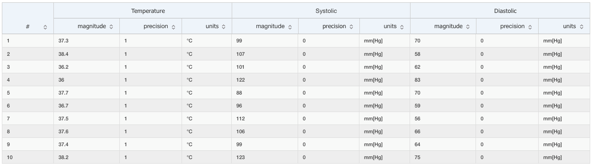

# Walkthrough for the openEHRapi package


# Introduction

[EhrScape](https://www.ehrscape.com) is an open health data platform providing a rich service framework that allows you to store, query and retrieve electronic health records based on the [openEHR](http://www.openehr.org/) specification. The data is available as [JSON](https://en.wikipedia.org/wiki/JSON) via a [REST](https://en.wikipedia.org/wiki/Representational_state_transfer) web service architecture. 

The overall approach is generic – we want to obtain healthcare data by calling a REST API, and then format the returned result set in R to ready the data for more sophisticated analysis.

RESTful applications use HTTP requests to read data (e.g., make queries) and post data (create and/or update). At its most basic, calling a REST API to obtain data involves making a HTTP GET request to a server. If the call succeeds, you’ll have a document that contains the requested data. To store data using REST API, a HTTP POST request needs to be made to the server along with the newly created data.

This tutorial describes the `openEHRapi` package, showcasing the use of R for handling data from an openEHR using REST API:

* [GET /query](https://www.ehrscape.com/api-explorer.html?api=openehr&service=/query&operation=/query&method=get&inline=true): returns the results of the specified AQL query,
* [POST /composition](https://www.ehrscape.com/api-explorer.html?api=openehr&service=/composition&operation=/composition&method=post&inline=true): creates and commits a contribution consisting of multiple composition creations, updates or deletes.

Please check the [EhrScape API Explorer](https://www.ehrscape.com/api-explorer.html) for a complete list of REST API.

The basis of this package are functions from the:

- **httr** package: functions for making HTTP requests
- **jsonlite** package: functions for parsing JSON formated data into data frames (R-suitable form)

An important part is parsing the obtained JSON data into R-usable form. The result set in JSON format can be complex in structure with several nested levels which requires flattening of the structure to the data frame.  

The package `openEHRapi` includes functions: 

* `get_query`: for a given [AQL](http://www.openehr.org/releases/QUERY/latest/docs/AQL/AQL.html) query returns the result set in a data frame. 
* `post_composition`: stores new data records (compositions) in openEHR server.

All the examples below can be checked on EhrScape API Explorer. 
Part of the `get_query` function that ensures proper editing the baseURL and error handling of the GET request is credited to [openehR](https://github.com/DIPSAS/openehR) package. [Details](https://github.com/search?q=paste0%28+++++++++++%22Could+not+execute+query.+HTTP+%22%2C&type=code). 

# Data query

Data is queried from EhrScape using the `get_query` function:


```r
query_data <- get_query(baseURL, credentials = c(user_name, password), aql_query, full_path = FALSE)
```

Input parameters: 

  - `baseURL`: base url address of the REST service, 
  - `credentials`: authentication pair of username and password
  - `aql_query`: AQL query, 
  - `wide`: a logical value indicating the format of returned data. If `TRUE`, the data is returned in wide format, otherwise in long format.
  - `full_path`: logical value indicating the degree of flattening. If `FALSE`, each value (even repetitions on the same path) in the JSON is assigned a unique identifier. If `TRUE`, values are sorted in the outpt data frame according to JSON path and unique sequence within the same path (if there are several repetitions on the same JSON path).
  
The function connects to the server with provided credentials and AQL query. The response in JSON format is parsed to a data frame and returned as the result of the function. 

Example: Query body temperature, systolic and diastolic measurements for all patients


```r
aql_query <- 
  "select
    t/data[at0002|History|]/events[at0003|Any event|]/data[at0001]/items[at0004|Temperature|]/value as Temperature,
    bp/data[at0001|history|]/events[at0006|any event|]/data[at0003]/items[at0004|Systolic|]/value as Systolic,
    bp/data[at0001|history|]/events[at0006|any event|]/data[at0003]/items[at0005|Diastolic|]/value as Diastolic
from EHR e
contains COMPOSITION c
contains (
    OBSERVATION t[openEHR-EHR-OBSERVATION.body_temperature.v1] and
    OBSERVATION bp[openEHR-EHR-OBSERVATION.blood_pressure.v1])
offset 0 limit 100"
baseURL <- "https://rest.ehrscape.com/rest/openehr/v1/"
user_name <- "guidemo"
password <- "gui?!demo123"
```

Result of the above query is: 



## Make HTTP request

The function begins by preparing the AQL query for construction of the HTTP request. First, the `rm_white` function of the **qdapRegex** package removes from the input `aql_query` all multiple white spaces, white spaces before commas, semicolons, colons or endmarks, white spaces before or after brackets, leading and trailing white spaces. Next, line break and carriage return symbols are replaced with white space by using the `gsub` function. The edited AQL query string is then URL encoded (`query_enc`) and used to construct the HTTP request `URL_address` 


```r
aql_query <- qdapRegex::rm_white(aql_query)
aql_query <- gsub("\r?\n|\r", " ", aql_query)
query_enc <- utils::URLencode(aql_query)
URL_address = paste0(baseURL, "query/aql?q=", query_enc)
#>  chr "https://rest.ehrscape.com/rest/openehr/v1/query/aql?q=select%20t/data[a"..
```

## GET response

The request `URL_address` is executed using the `GET` function of the **httr** package. The server response is stored as `resp`. Since openEHR server requires authentication, user credentials have to be included to the `GET` function call. Additionally, the `content_type_json` function is used to set the expected content type returned from the server to JSON. 


```r
resp <- httr::GET(URL_address, httr::authenticate(user_name, password), httr::content_type_json())
#> List of 10
#> $ url : chr
#>    "https://rest.ehrscape.com/rest/openehr/v1/query/aql?q=select%20t/data[at0"..
#>    __truncated__
#> $ status_code: int 200
#> $ headers :List of 5
#> ..$ date : chr "Thu, 10 Sep 2020 10:34:52 GMT"
#> ..$ server : chr "Apache/2.4.18 (Ubuntu)"
#> ..$ vary : chr
#>    "Origin,Access-Control-Request-Method,Access-Control-Request-Headers"
#> ..$ content-type : chr "application/json;charset=utf-8"
#> ..$ transfer-encoding: chr "chunked"
#> ..- attr(*, "class")= chr [1:2] "insensitive" "list"
#> $ all_headers:List of 1
#> ..$ :List of 3
#> .. ..$ status : int 200
#> .. ..$ version: chr "HTTP/1.1"
#> .. ..$ headers:List of 5
#> .. .. ..$ date : chr "Thu, 10 Sep 2020 10:34:52 GMT"
#> .. .. ..$ server : chr "Apache/2.4.18 (Ubuntu)"
#> .. .. ..$ vary : chr
#>    "Origin,Access-Control-Request-Method,Access-Control-Request-Headers"
#> .. .. ..$ content-type : chr "application/json;charset=utf-8"
#> .. .. ..$ transfer-encoding: chr "chunked"
#> .. .. ..- attr(*, "class")= chr [1:2] "insensitive" "list"
#> $ cookies :'data.frame': 0 obs. of 7 variables:
#> ..$ domain : logi(0)
#> ..$ flag : logi(0)
#> ..$ path : logi(0)
#> ..$ secure : logi(0)
#> ..$ expiration: 'POSIXct' num(0)
#> ..$ name : logi(0)
#> ..$ value : logi(0)
#> $ content : raw [1:15038] 7b 22 6d 65 ...
#> $ date : POSIXct[1:1], format: "2020-09-10 10:34:52"
#> $ times : Named num [1:6] 0 0.0103 0.0504 0.1391 0.1878 ...
#> ..- attr(*, "names")= chr [1:6] "redirect" "namelookup" "connect" "pretransfer"
#>    ...
#> $ request :List of 7
#> ..$ method : chr "GET"
#> ..$ url : chr
#>    "https://rest.ehrscape.com/rest/openehr/v1/query/aql?q=select%20t/data[at0"..
#>    __truncated__
#> ..$ headers : Named chr [1:2] "application/json, text/xml, application/xml,
#>    */*" "application/json"
#> .. ..- attr(*, "names")= chr [1:2] "Accept" "Content-Type"
#> ..$ fields : NULL
#> ..$ options :List of 4
#> .. ..$ useragent: chr "libcurl/7.64.1 r-curl/4.3 httr/1.4.2"
#> .. ..$ httpauth : num 1
#> .. ..$ userpwd : chr "guidemo:gui?!demo123"
#> .. ..$ httpget : logi TRUE
#> ..$ auth_token: NULL
#> ..$ output : list()
#> .. ..- attr(*, "class")= chr [1:2] "write_memory" "write_function"
#> ..- attr(*, "class")= chr "request"
#> $ handle :Class 'curl_handle' <externalptr>
#> - attr(*, "class")= chr "response"
```

## Parse response

Response `resp` includes data such as the HTTP request, status, headers, cookies, and also the answer to the request in JSON format. This is stored in the content field, which is extracted with the `content` function to a nested list `json_results`. 


```r
json_results <- httr::content(resp)
#> List of 4
#> $ meta :List of 4
#> ..$ _href : chr
#>    "https://rest.ehrscape.com/rest/openehr/v1/query/aql?q=select%20t/data[at0"..
#>    __truncated__
#> ..$ _type : chr "RESULTSET"
#> ..$ _created : chr "2020-09-10T10:34:52.863Z"
#> ..$ _executed_aql: chr "select t/data[at0002|History|]/events[at0003|Any
#>    event|]/data[at0001]/items[at0004|Temperature|]/value as Tempe"|
#>    __truncated__
#> $ q : chr "select t/data[at0002|History|]/events[at0003|Any
#>    event|]/data[at0001]/items[at0004|Temperature|]/value as Tempe"|
#>    __truncated__
#> $ columns:List of 3
#> ..$ :List of 2
#> .. ..$ name: chr "Temperature"
#> .. ..$ path: chr
#>    "/data[at0002]/events[at0003]/data[at0001]/items[at0004]/value"
#> ..$ :List of 2
#> .. ..$ name: chr "Systolic"
#> .. ..$ path: chr
#>    "/data[at0001]/events[at0006]/data[at0003]/items[at0004]/value"
#> ..$ :List of 2
#> .. ..$ name: chr "Diastolic"
#> .. ..$ path: chr
#>    "/data[at0001]/events[at0006]/data[at0003]/items[at0005]/value"
#> $ rows :List of 60
#> ..$ :List of 3
#> .. ..$ :List of 4
#> .. .. ..$ _type : chr "DV_QUANTITY"
#> .. .. ..$ magnitude: num 37.3
#> .. .. ..$ units : chr "°C"
#> .. .. ..$ precision: int 1
#> .. ..$ :List of 4
#> .. .. ..$ _type : chr "DV_QUANTITY"
#> .. .. ..$ magnitude: num 99
#> .. .. ..$ units : chr "mm[Hg]"
#> .. .. ..$ precision: int 0
#> .. ..$ :List of 4
#> .. .. ..$ _type : chr "DV_QUANTITY"
#> .. .. ..$ magnitude: num 70
#> .. .. ..$ units : chr "mm[Hg]"
#> .. .. ..$ precision: int 0
#> ..$ :List of 3
#> .. ..$ :List of 4
#> .. .. ..$ _type : chr "DV_QUANTITY"
#> .. .. ..$ magnitude: num 38.4
#> .. .. ..$ units : chr "°C"
#> .. .. ..$ precision: int 1
#> .. ..$ :List of 4
#> .. .. ..$ _type : chr "DV_QUANTITY"
#> .. .. ..$ magnitude: num 107
#> .. .. ..$ units : chr "mm[Hg]"
#> .. .. ..$ precision: int 0
#> .. ..$ :List of 4
#> .. .. ..$ _type : chr "DV_QUANTITY"
#> .. .. ..$ magnitude: num 58
#> .. .. ..$ units : chr "mm[Hg]"
#> .. .. ..$ precision: int 0
#> ..$ :List of 3
#> .. ..$ :List of 4
#> .. .. ..$ _type : chr "DV_QUANTITY"
#> .. .. ..$ magnitude: num 36.2
#> .. .. ..$ units : chr "°C"
#> .. .. ..$ precision: int 1
#> .. ..$ :List of 4
#> .. .. ..$ _type : chr "DV_QUANTITY"
#> .. .. ..$ magnitude: num 101
#> .. .. ..$ units : chr "mm[Hg]"
#> .. .. ..$ precision: int 0
#> .. ..$ :List of 4
#> .. .. ..$ _type : chr "DV_QUANTITY"
#> .. .. ..$ magnitude: num 62
#> .. .. ..$ units : chr "mm[Hg]"
#> .. .. ..$ precision: int 0
#> ..$ :List of 3
#> .. ..$ :List of 4
#> .. .. ..$ _type : chr "DV_QUANTITY"
#> .. .. ..$ magnitude: num 36
#> .. .. ..$ units : chr "°C"
#> .. .. ..$ precision: int 1
#> .. ..$ :List of 4
#> .. .. ..$ _type : chr "DV_QUANTITY"
#> .. .. ..$ magnitude: num 122
#> .. .. ..$ units : chr "mm[Hg]"
#> .. .. ..$ precision: int 0
#> .. ..$ :List of 4
#> .. .. ..$ _type : chr "DV_QUANTITY"
#> .. .. ..$ magnitude: num 83
#> .. .. ..$ units : chr "mm[Hg]"
#> .. .. ..$ precision: int 0
#> .. [list output truncated]
```

Sublists contain the used AQL query and URL address as well as the result, which is extracted to the `json_rows` named vector. Number of parameters per variable is stored in `pars_per_var` and names of queried variables and their paths are extracted to the data frame `namesPaths`. 


```r
json_rows <- unlist(json_results$rows)
#> Named chr [1:720] "DV_QUANTITY" "37.3" "°C" "1" ...
#> - attr(*, "names")= chr [1:720] "_type" "magnitude" "units" "precision" ...
nvars <- length(json_results$columns)
pars_per_var <- unlist(lapply(json_results$rows[[1]], length))
namesPaths <- as.data.frame(matrix(unlist(json_results$columns),
                                nrow = nvars, byrow = TRUE,
                                dimnames = list(NULL, names(json_results$columns[[1]])))
                         )
```

## Convert to data frame

The `json_rows` named vector is converted to two-column data frame `json_nav` where the names of the vector are in one column and the values are in the other


```r
json_nav <- as.data.frame(json_rows, stringsAsFactors = FALSE)
json_nav$path <- paste(rep(rep(namesPaths$name, pars_per_var), times = length(json_results$rows)),
                           attr(json_rows, "names"), sep = ".")
#> 'data.frame':	720 obs. of  2 variables:
#> $ json_rows: chr "DV_QUANTITY" "37.3" "°C" "1" ...
#> $ path : chr "Temperature._type" "Temperature.magnitude" "Temperature.units"
#>    "Temperature.precision" ...
```

The names of the unlisted JSON `json_rows` represent paths of the values in the nested JSON. And in the next step the unique paths of the JSON content are determined (`pars`) and used to determine the number of different records `rec_num` and their index limits (`limits`) in the `json_nav` data_frame. 


```r
unique_path <- unique(json_nav$path)
json_nav$path <- ordered(json_nav$path, levels = unique_path)
#>  chr [1:12] "Temperature._type" "Temperature.magnitude" "Temperature.units" ...
runs <- rle(json_nav$path == unique_path[1])
limits <- cumsum(runs$lengths)
#>  int [1:120] 1 12 13 24 25 36 37 48 49 60 ...
rec_num <- sum(runs$values)
#>  int 60
```

The number of different records `rec_num` and their start and end limits `limits` are then used to add a new column `ind` to the `json_nav` data frame to assign each line to the corresponding record number


```r
json_nav$ind <- rep(NA, dim(json_nav)[1])
for(i in 1:rec_num) {
  json_nav$ind[limits[2*i - 1] : limits[2*i]] <- i
}
#> 'data.frame':	720 obs. of  3 variables:
#> $ json_rows: chr "DV_QUANTITY" "37.3" "°C" "1" ...
#> $ path : Ord.factor w/ 12 levels "Temperature._type"<..: 1 2 3 4 5 6 7 8 9 10
#>    ...
#> $ ind : int 1 1 1 1 1 1 1 1 1 1 ...
```

Below temperature data for the first three patients from the `json_nav` is visualized (the first column indicates which rows are displayed).

<table>
 <thead>
  <tr>
   <th style="text-align:left;">   </th>
   <th style="text-align:left;"> json_rows </th>
   <th style="text-align:left;"> path </th>
   <th style="text-align:right;"> ind </th>
  </tr>
 </thead>
<tbody>
  <tr>
   <td style="text-align:left;"> 1 </td>
   <td style="text-align:left;"> DV_QUANTITY </td>
   <td style="text-align:left;"> Temperature._type </td>
   <td style="text-align:right;"> 1 </td>
  </tr>
  <tr>
   <td style="text-align:left;"> 2 </td>
   <td style="text-align:left;"> 37.3 </td>
   <td style="text-align:left;"> Temperature.magnitude </td>
   <td style="text-align:right;"> 1 </td>
  </tr>
  <tr>
   <td style="text-align:left;"> 3 </td>
   <td style="text-align:left;"> °C </td>
   <td style="text-align:left;"> Temperature.units </td>
   <td style="text-align:right;"> 1 </td>
  </tr>
  <tr>
   <td style="text-align:left;"> 4 </td>
   <td style="text-align:left;"> 1 </td>
   <td style="text-align:left;"> Temperature.precision </td>
   <td style="text-align:right;"> 1 </td>
  </tr>
  <tr>
   <td style="text-align:left;"> 13 </td>
   <td style="text-align:left;"> DV_QUANTITY </td>
   <td style="text-align:left;"> Temperature._type </td>
   <td style="text-align:right;"> 2 </td>
  </tr>
  <tr>
   <td style="text-align:left;"> 14 </td>
   <td style="text-align:left;"> 38.4 </td>
   <td style="text-align:left;"> Temperature.magnitude </td>
   <td style="text-align:right;"> 2 </td>
  </tr>
  <tr>
   <td style="text-align:left;"> 15 </td>
   <td style="text-align:left;"> °C </td>
   <td style="text-align:left;"> Temperature.units </td>
   <td style="text-align:right;"> 2 </td>
  </tr>
  <tr>
   <td style="text-align:left;"> 16 </td>
   <td style="text-align:left;"> 1 </td>
   <td style="text-align:left;"> Temperature.precision </td>
   <td style="text-align:right;"> 2 </td>
  </tr>
  <tr>
   <td style="text-align:left;"> 25 </td>
   <td style="text-align:left;"> DV_QUANTITY </td>
   <td style="text-align:left;"> Temperature._type </td>
   <td style="text-align:right;"> 3 </td>
  </tr>
  <tr>
   <td style="text-align:left;"> 26 </td>
   <td style="text-align:left;"> 36.2 </td>
   <td style="text-align:left;"> Temperature.magnitude </td>
   <td style="text-align:right;"> 3 </td>
  </tr>
  <tr>
   <td style="text-align:left;"> 27 </td>
   <td style="text-align:left;"> °C </td>
   <td style="text-align:left;"> Temperature.units </td>
   <td style="text-align:right;"> 3 </td>
  </tr>
  <tr>
   <td style="text-align:left;"> 28 </td>
   <td style="text-align:left;"> 1 </td>
   <td style="text-align:left;"> Temperature.precision </td>
   <td style="text-align:right;"> 3 </td>
  </tr>
</tbody>
</table>


In the final step, the output data frame `out` is prepared according to the values of the `wide` and `full_path` logical parameters.

### JSON paths without numbering

If `full_path` is set to `FALSE`, the column names of the `out` data frame are equal to the values of `pars` vector. Additionally, the `ind` and `seq` columns are included. This way each column represents elements on the same path. The `ind` column is used to annotate each row with the corresponding record number. The `seq` column is used to annotate each row with the number of repetitions in the same JSON path (to distinguish between several different elements in the same JSON path). If each JSON path contains a single element, all values in the `seq` are equal to 1.

The `seq` column is created using the `with` function, which evaluates the `json_nav` data frame to the expression defined by the `ave` function. The `ave` function groups the values in `json_rows` according to unique combinations of variables `ind` and `path`. The `out` data frame is cast (by using function `dcast`) from the molten data frame `json_nav` by sorting the values in `json_rows` according to the match between `ind` and `seq` on one side and `path` on the other. 

Additionally, the queried variable names are included to the `out` data frame and the `ind` column is adjusted to correctly distinct between different records. 


```r
json_nav$seq <- with(json_nav, stats::ave(json_rows, ind, path, FUN = seq_along))
json_nav$seq <- as.numeric(json_nav$seq)
out <- reshape2::dcast(ind + seq ~ path, data = json_nav, value.var = "json_rows")
#> 'data.frame':	60 obs. of  14 variables:
#>  $ ind                  : int  1 2 3 4 5 6 7 8 9 10 ...
#>  $ seq                  : num  1 1 1 1 1 1 1 1 1 1 ...
#>  $ Temperature._type    : chr  "DV_QUANTITY" "DV_QUANTITY" "DV_QUANTITY" "DV_QUANTITY" ...
#>  $ Temperature.magnitude: chr  "37.3" "38.4" "36.2" "36" ...
#>  $ Temperature.units    : chr  "°C" "°C" "°C" "°C" ...
#>  $ Temperature.precision: chr  "1" "1" "1" "1" ...
#>  $ Systolic._type       : chr  "DV_QUANTITY" "DV_QUANTITY" "DV_QUANTITY" "DV_QUANTITY" ...
#>  $ Systolic.magnitude   : chr  "99" "107" "101" "122" ...
#>  $ Systolic.units       : chr  "mm[Hg]" "mm[Hg]" "mm[Hg]" "mm[Hg]" ...
#>  $ Systolic.precision   : chr  "0" "0" "0" "0" ...
#>  $ Diastolic._type      : chr  "DV_QUANTITY" "DV_QUANTITY" "DV_QUANTITY" "DV_QUANTITY" ...
#>  $ Diastolic.magnitude  : chr  "70" "58" "62" "83" ...
#>  $ Diastolic.units      : chr  "mm[Hg]" "mm[Hg]" "mm[Hg]" "mm[Hg]" ...
#>  $ Diastolic.precision  : chr  "0" "0" "0" "0" ...
```

The first six rows of output data frame `out` presented as table

<div style="border: 1px solid #ddd; padding: 5px; overflow-x: scroll; width:700px; "><table>
 <thead>
  <tr>
   <th style="text-align:right;"> ind </th>
   <th style="text-align:right;"> seq </th>
   <th style="text-align:left;"> Temperature._type </th>
   <th style="text-align:left;"> Temperature.magnitude </th>
   <th style="text-align:left;"> Temperature.units </th>
   <th style="text-align:left;"> Temperature.precision </th>
   <th style="text-align:left;"> Systolic._type </th>
   <th style="text-align:left;"> Systolic.magnitude </th>
   <th style="text-align:left;"> Systolic.units </th>
   <th style="text-align:left;"> Systolic.precision </th>
   <th style="text-align:left;"> Diastolic._type </th>
   <th style="text-align:left;"> Diastolic.magnitude </th>
   <th style="text-align:left;"> Diastolic.units </th>
   <th style="text-align:left;"> Diastolic.precision </th>
  </tr>
 </thead>
<tbody>
  <tr>
   <td style="text-align:right;"> 1 </td>
   <td style="text-align:right;"> 1 </td>
   <td style="text-align:left;"> DV_QUANTITY </td>
   <td style="text-align:left;"> 37.3 </td>
   <td style="text-align:left;"> °C </td>
   <td style="text-align:left;"> 1 </td>
   <td style="text-align:left;"> DV_QUANTITY </td>
   <td style="text-align:left;"> 99 </td>
   <td style="text-align:left;"> mm[Hg] </td>
   <td style="text-align:left;"> 0 </td>
   <td style="text-align:left;"> DV_QUANTITY </td>
   <td style="text-align:left;"> 70 </td>
   <td style="text-align:left;"> mm[Hg] </td>
   <td style="text-align:left;"> 0 </td>
  </tr>
  <tr>
   <td style="text-align:right;"> 2 </td>
   <td style="text-align:right;"> 1 </td>
   <td style="text-align:left;"> DV_QUANTITY </td>
   <td style="text-align:left;"> 38.4 </td>
   <td style="text-align:left;"> °C </td>
   <td style="text-align:left;"> 1 </td>
   <td style="text-align:left;"> DV_QUANTITY </td>
   <td style="text-align:left;"> 107 </td>
   <td style="text-align:left;"> mm[Hg] </td>
   <td style="text-align:left;"> 0 </td>
   <td style="text-align:left;"> DV_QUANTITY </td>
   <td style="text-align:left;"> 58 </td>
   <td style="text-align:left;"> mm[Hg] </td>
   <td style="text-align:left;"> 0 </td>
  </tr>
  <tr>
   <td style="text-align:right;"> 3 </td>
   <td style="text-align:right;"> 1 </td>
   <td style="text-align:left;"> DV_QUANTITY </td>
   <td style="text-align:left;"> 36.2 </td>
   <td style="text-align:left;"> °C </td>
   <td style="text-align:left;"> 1 </td>
   <td style="text-align:left;"> DV_QUANTITY </td>
   <td style="text-align:left;"> 101 </td>
   <td style="text-align:left;"> mm[Hg] </td>
   <td style="text-align:left;"> 0 </td>
   <td style="text-align:left;"> DV_QUANTITY </td>
   <td style="text-align:left;"> 62 </td>
   <td style="text-align:left;"> mm[Hg] </td>
   <td style="text-align:left;"> 0 </td>
  </tr>
  <tr>
   <td style="text-align:right;"> 4 </td>
   <td style="text-align:right;"> 1 </td>
   <td style="text-align:left;"> DV_QUANTITY </td>
   <td style="text-align:left;"> 36 </td>
   <td style="text-align:left;"> °C </td>
   <td style="text-align:left;"> 1 </td>
   <td style="text-align:left;"> DV_QUANTITY </td>
   <td style="text-align:left;"> 122 </td>
   <td style="text-align:left;"> mm[Hg] </td>
   <td style="text-align:left;"> 0 </td>
   <td style="text-align:left;"> DV_QUANTITY </td>
   <td style="text-align:left;"> 83 </td>
   <td style="text-align:left;"> mm[Hg] </td>
   <td style="text-align:left;"> 0 </td>
  </tr>
  <tr>
   <td style="text-align:right;"> 5 </td>
   <td style="text-align:right;"> 1 </td>
   <td style="text-align:left;"> DV_QUANTITY </td>
   <td style="text-align:left;"> 37.7 </td>
   <td style="text-align:left;"> °C </td>
   <td style="text-align:left;"> 1 </td>
   <td style="text-align:left;"> DV_QUANTITY </td>
   <td style="text-align:left;"> 88 </td>
   <td style="text-align:left;"> mm[Hg] </td>
   <td style="text-align:left;"> 0 </td>
   <td style="text-align:left;"> DV_QUANTITY </td>
   <td style="text-align:left;"> 70 </td>
   <td style="text-align:left;"> mm[Hg] </td>
   <td style="text-align:left;"> 0 </td>
  </tr>
  <tr>
   <td style="text-align:right;"> 6 </td>
   <td style="text-align:right;"> 1 </td>
   <td style="text-align:left;"> DV_QUANTITY </td>
   <td style="text-align:left;"> 36.7 </td>
   <td style="text-align:left;"> °C </td>
   <td style="text-align:left;"> 1 </td>
   <td style="text-align:left;"> DV_QUANTITY </td>
   <td style="text-align:left;"> 96 </td>
   <td style="text-align:left;"> mm[Hg] </td>
   <td style="text-align:left;"> 0 </td>
   <td style="text-align:left;"> DV_QUANTITY </td>
   <td style="text-align:left;"> 59 </td>
   <td style="text-align:left;"> mm[Hg] </td>
   <td style="text-align:left;"> 0 </td>
  </tr>
</tbody>
</table></div>

### JSON paths with numbering 

If `full_path` is set to `TRUE`, the number of columns of the output data frame is equal to the number of unique paths of the JSON content increased for the number of paths that repeat due to repetitions on the same JSON level (plus one for the `ind` column). The names of the columns are equal to the values of `pars` with appendend integer value of the repetition, which is used to distinguish between several different elements with the same JSON path. 

For this a new temporary data frame `tmp` is created, which includes the columns of the `json_nav` along with the column `newind` created as unique combinations of the columns `ind` and `path`. This is achieved by using the `ddply` function, which splits the input data frame (`json_nav`) according to given variables (`ind` and `path`), applies the selected function (`transform` - transform to data frame) on the splits along with the additional column `newind` and combines the results into a data frame. The `out` data frame is cast (by using function `dcast`) from the molten data frame `tmp` by sorting the values in `json_rows` according to the match between `ind` on one side and `newind` on the other.


```r
tmp <- plyr::ddply(json_nav, plyr::.(ind, path), 
                   transform, 
                   newind = paste(path, seq_along(path), sep = "."))
tmp$newind <- ordered(tmp$newind, levels = unique(tmp$newind))
out2 <- reshape2::dcast(tmp, ind ~ newind, value.var = "json_rows")
#> 'data.frame':	60 obs. of  13 variables:
#>  $ ind                    : int  1 2 3 4 5 6 7 8 9 10 ...
#>  $ Temperature._type.1    : chr  "DV_QUANTITY" "DV_QUANTITY" "DV_QUANTITY" "DV_QUANTITY" ...
#>  $ Temperature.magnitude.1: chr  "37.3" "38.4" "36.2" "36" ...
#>  $ Temperature.units.1    : chr  "°C" "°C" "°C" "°C" ...
#>  $ Temperature.precision.1: chr  "1" "1" "1" "1" ...
#>  $ Systolic._type.1       : chr  "DV_QUANTITY" "DV_QUANTITY" "DV_QUANTITY" "DV_QUANTITY" ...
#>  $ Systolic.magnitude.1   : chr  "99" "107" "101" "122" ...
#>  $ Systolic.units.1       : chr  "mm[Hg]" "mm[Hg]" "mm[Hg]" "mm[Hg]" ...
#>  $ Systolic.precision.1   : chr  "0" "0" "0" "0" ...
#>  $ Diastolic._type.1      : chr  "DV_QUANTITY" "DV_QUANTITY" "DV_QUANTITY" "DV_QUANTITY" ...
#>  $ Diastolic.magnitude.1  : chr  "70" "58" "62" "83" ...
#>  $ Diastolic.units.1      : chr  "mm[Hg]" "mm[Hg]" "mm[Hg]" "mm[Hg]" ...
#>  $ Diastolic.precision.1  : chr  "0" "0" "0" "0" ...
```

The first six rows of output data frame `out2` presented as table

<div style="border: 1px solid #ddd; padding: 5px; overflow-x: scroll; width:700px; "><table>
 <thead>
  <tr>
   <th style="text-align:right;"> ind </th>
   <th style="text-align:left;"> Temperature._type.1 </th>
   <th style="text-align:left;"> Temperature.magnitude.1 </th>
   <th style="text-align:left;"> Temperature.units.1 </th>
   <th style="text-align:left;"> Temperature.precision.1 </th>
   <th style="text-align:left;"> Systolic._type.1 </th>
   <th style="text-align:left;"> Systolic.magnitude.1 </th>
   <th style="text-align:left;"> Systolic.units.1 </th>
   <th style="text-align:left;"> Systolic.precision.1 </th>
   <th style="text-align:left;"> Diastolic._type.1 </th>
   <th style="text-align:left;"> Diastolic.magnitude.1 </th>
   <th style="text-align:left;"> Diastolic.units.1 </th>
   <th style="text-align:left;"> Diastolic.precision.1 </th>
  </tr>
 </thead>
<tbody>
  <tr>
   <td style="text-align:right;"> 1 </td>
   <td style="text-align:left;"> DV_QUANTITY </td>
   <td style="text-align:left;"> 37.3 </td>
   <td style="text-align:left;"> °C </td>
   <td style="text-align:left;"> 1 </td>
   <td style="text-align:left;"> DV_QUANTITY </td>
   <td style="text-align:left;"> 99 </td>
   <td style="text-align:left;"> mm[Hg] </td>
   <td style="text-align:left;"> 0 </td>
   <td style="text-align:left;"> DV_QUANTITY </td>
   <td style="text-align:left;"> 70 </td>
   <td style="text-align:left;"> mm[Hg] </td>
   <td style="text-align:left;"> 0 </td>
  </tr>
  <tr>
   <td style="text-align:right;"> 2 </td>
   <td style="text-align:left;"> DV_QUANTITY </td>
   <td style="text-align:left;"> 38.4 </td>
   <td style="text-align:left;"> °C </td>
   <td style="text-align:left;"> 1 </td>
   <td style="text-align:left;"> DV_QUANTITY </td>
   <td style="text-align:left;"> 107 </td>
   <td style="text-align:left;"> mm[Hg] </td>
   <td style="text-align:left;"> 0 </td>
   <td style="text-align:left;"> DV_QUANTITY </td>
   <td style="text-align:left;"> 58 </td>
   <td style="text-align:left;"> mm[Hg] </td>
   <td style="text-align:left;"> 0 </td>
  </tr>
  <tr>
   <td style="text-align:right;"> 3 </td>
   <td style="text-align:left;"> DV_QUANTITY </td>
   <td style="text-align:left;"> 36.2 </td>
   <td style="text-align:left;"> °C </td>
   <td style="text-align:left;"> 1 </td>
   <td style="text-align:left;"> DV_QUANTITY </td>
   <td style="text-align:left;"> 101 </td>
   <td style="text-align:left;"> mm[Hg] </td>
   <td style="text-align:left;"> 0 </td>
   <td style="text-align:left;"> DV_QUANTITY </td>
   <td style="text-align:left;"> 62 </td>
   <td style="text-align:left;"> mm[Hg] </td>
   <td style="text-align:left;"> 0 </td>
  </tr>
  <tr>
   <td style="text-align:right;"> 4 </td>
   <td style="text-align:left;"> DV_QUANTITY </td>
   <td style="text-align:left;"> 36 </td>
   <td style="text-align:left;"> °C </td>
   <td style="text-align:left;"> 1 </td>
   <td style="text-align:left;"> DV_QUANTITY </td>
   <td style="text-align:left;"> 122 </td>
   <td style="text-align:left;"> mm[Hg] </td>
   <td style="text-align:left;"> 0 </td>
   <td style="text-align:left;"> DV_QUANTITY </td>
   <td style="text-align:left;"> 83 </td>
   <td style="text-align:left;"> mm[Hg] </td>
   <td style="text-align:left;"> 0 </td>
  </tr>
  <tr>
   <td style="text-align:right;"> 5 </td>
   <td style="text-align:left;"> DV_QUANTITY </td>
   <td style="text-align:left;"> 37.7 </td>
   <td style="text-align:left;"> °C </td>
   <td style="text-align:left;"> 1 </td>
   <td style="text-align:left;"> DV_QUANTITY </td>
   <td style="text-align:left;"> 88 </td>
   <td style="text-align:left;"> mm[Hg] </td>
   <td style="text-align:left;"> 0 </td>
   <td style="text-align:left;"> DV_QUANTITY </td>
   <td style="text-align:left;"> 70 </td>
   <td style="text-align:left;"> mm[Hg] </td>
   <td style="text-align:left;"> 0 </td>
  </tr>
  <tr>
   <td style="text-align:right;"> 6 </td>
   <td style="text-align:left;"> DV_QUANTITY </td>
   <td style="text-align:left;"> 36.7 </td>
   <td style="text-align:left;"> °C </td>
   <td style="text-align:left;"> 1 </td>
   <td style="text-align:left;"> DV_QUANTITY </td>
   <td style="text-align:left;"> 96 </td>
   <td style="text-align:left;"> mm[Hg] </td>
   <td style="text-align:left;"> 0 </td>
   <td style="text-align:left;"> DV_QUANTITY </td>
   <td style="text-align:left;"> 59 </td>
   <td style="text-align:left;"> mm[Hg] </td>
   <td style="text-align:left;"> 0 </td>
  </tr>
</tbody>
</table></div>

In this case the `out2` notation was used just to distinguish between results for different values of the `full_path` argument. 


# Save data

Function `post_composition` enables saving data records (composition) to openEHR server. Compositions are created by using web templates (please check the template endpoint of Electronic Health Record APIs on [EhrScape API Explorer](https://www.ehrscape.com/api-explorer.html)). Web template can be regarded as an input schema, which declares all possible settings of the input data structures for building an openEHR composition. To build a composition sample use `GET /template/{templateId}/example`, which returns an example of data values for a web template. This is used as a prototype composition and further filled with actual data. 

The composition has to be prepared and provided to the function in JSON format. Additionally, the composition has to be complemented by an identifier of an actual EHR record. The composition is saved to the server using the REST method **POST**. The function is called as: 


```r
post_data <- post_composition(baseURL, credentials = c(user_name, password), ehrId, composition)
```

Input parameters: 

  - `baseURL`: base url address of the REST service, 
  - `credentials`: authentication pair of username and password
  - `ehrId`: identifier of an existing EHR record
  - `composition`: the openEhr composition in JSON format to be saved to openEHR server. It can be given as character string or as a structured list. 

The function connects to the server with provided credentials. The response in JSON format is parsed to a list and returned as the result of the function. 

Example: Save a patient's body temperature measurement to his EHR using a structured web template composition


```r
composition <- 
'{
  "_type": "COMPOSITION",
  "name": {
    "_type": "DV_TEXT",
    "value": "Vital Signs"
  },
  "archetype_details": {
    "_type": "ARCHETYPED",
    "archetype_id": {
      "_type": "ARCHETYPE_ID",
      "value": "openEHR-EHR-COMPOSITION.encounter.v1"
    },
    "template_id": {
      "_type": "TEMPLATE_ID",
      "value": "Vital Signs"
    },
    "rm_version": "1.0.4"
  },
  "archetype_node_id": "openEHR-EHR-COMPOSITION.encounter.v1",
  "language": {
    "_type": "CODE_PHRASE",
    "terminology_id": {
      "_type": "TERMINOLOGY_ID",
      "value": "ISO_639-1"
    },
    "code_string": "en"
  },
  "territory": {
    "_type": "CODE_PHRASE",
    "terminology_id": {
      "_type": "TERMINOLOGY_ID",
      "value": "ISO_3166-1"
    },
    "code_string": "US"
  },
  "category": {
    "_type": "DV_CODED_TEXT",
    "value": "event",
    "defining_code": {
      "_type": "CODE_PHRASE",
      "terminology_id": {
        "_type": "TERMINOLOGY_ID",
        "value": "openehr"
      },
      "code_string": "433"
    }
  },
  "composer": {
    "_type": "PARTY_IDENTIFIED",
    "name": "Silvia Blake"
  },
  "context": {
    "_type": "EVENT_CONTEXT",
    "start_time": {
      "_type": "DV_DATE_TIME",
      "value": "2019-12-03T14:55:35.001+02:00"
    },
    "setting": {
      "_type": "DV_CODED_TEXT",
      "value": "other care",
      "defining_code": {
        "_type": "CODE_PHRASE",
        "terminology_id": {
          "_type": "TERMINOLOGY_ID",
          "value": "openehr"
        },
        "code_string": "238"
      }
    },
    "health_care_facility": {
      "_type": "PARTY_IDENTIFIED",
      "external_ref": {
        "_type": "PARTY_REF",
        "id": {
          "_type": "GENERIC_ID",
          "value": "9091",
          "scheme": "HOSPITAL-NS"
        },
        "namespace": "HOSPITAL-NS",
        "type": "PARTY"
      },
      "name": "Hospital"
    }
  },
  "content": [
    {
      "_type": "OBSERVATION",
      "name": {
        "_type": "DV_TEXT",
        "value": "Body temperature"
      },
      "archetype_details": {
        "_type": "ARCHETYPED",
        "archetype_id": {
          "_type": "ARCHETYPE_ID",
          "value": "openEHR-EHR-OBSERVATION.body_temperature.v1"
        },
        "rm_version": "1.0.4"
      },
      "archetype_node_id": "openEHR-EHR-OBSERVATION.body_temperature.v1",
      "language": {
        "_type": "CODE_PHRASE",
        "terminology_id": {
          "_type": "TERMINOLOGY_ID",
          "value": "ISO_639-1"
        },
        "code_string": "en"
      },
      "encoding": {
        "_type": "CODE_PHRASE",
        "terminology_id": {
          "_type": "TERMINOLOGY_ID",
          "value": "IANA_character-sets"
        },
        "code_string": "UTF-8"
      },
      "subject": {
        "_type": "PARTY_SELF"
      },
      "data": {
        "_type": "HISTORY",
        "name": {
          "_type": "DV_TEXT",
          "value": "History"
        },
        "archetype_node_id": "at0002",
        "origin": {
          "_type": "DV_DATE_TIME",
          "value": "2019-12-03T14:55:35.001+02:00"
        },
        "events": [
          {
            "_type": "POINT_EVENT",
            "name": {
              "_type": "DV_TEXT",
              "value": "Any event"
            },
            "archetype_node_id": "at0003",
            "time": {
              "_type": "DV_DATE_TIME",
              "value": "2019-12-03T14:55:35.001+02:00"
            },
            "data": {
              "_type": "ITEM_TREE",
              "name": {
                "_type": "DV_TEXT",
                "value": "Tree"
              },
              "archetype_node_id": "at0001",
              "items": [
                {
                  "_type": "ELEMENT",
                  "name": {
                    "_type": "DV_TEXT",
                    "value": "Temperature"
                  },
                  "archetype_node_id": "at0004",
                  "value": {
                    "_type": "DV_QUANTITY",
                    "magnitude": 37.94,
                    "units": "°C",
                    "precision": 1
                  }
                }
              ]
            }
          }
        ]
      }
    }
  ]
}'
baseURL <- "https://rest.ehrscape.com/rest/openehr/v1/"
user_name <- "****"
password <- "****"
ehrId <- "3944045a-656b-44e8-ba0f-136cfd44c045"
```

## Make HTTP request

The function begins by constructing the HTTP request from the `baseURL` and `ehrId` arguments. For this, the `modify_url` function of the **httr** package is used 


```r
URL_address <- httr::modify_url(paste0(baseURL, "ehr/", ehrId, "/composition"))
#>  chr "https://rest.ehrscape.com/rest/openehr/v1/ehr/3944045a-656b-44e8-ba0f-1"..
```

## Prepare composition

Construction of HTTP request is followed by preparing the `composition`, which can either be given as character string or a structured list or data frame. In case it is given as a character string, all inapropriate white space, line break and carriage return symbols are cleaned using the same procedure as with the function `get_query` and the cleaned character string is converted to a structured list using the `fromJSON` function of the **jsonlite** package


```r
if(typeof(composition) == "character"){
  composition <- qdapRegex::rm_white(composition)
  composition <- gsub("\r?\n|\r", " ", composition)
  df <- jsonlite::fromJSON(composition)
} else {
  df <- composition
}
df
#> $`_type`
#> [1] "COMPOSITION"
#> 
#> $name
#> $name$`_type`
#> [1] "DV_TEXT"
#> 
#> $name$value
#> [1] "Vital Signs"
#> 
#> 
#> $archetype_details
#> $archetype_details$`_type`
#> [1] "ARCHETYPED"
#> 
#> $archetype_details$archetype_id
#> $archetype_details$archetype_id$`_type`
#> [1] "ARCHETYPE_ID"
#> 
#> $archetype_details$archetype_id$value
#> [1] "openEHR-EHR-COMPOSITION.encounter.v1"
#> 
#> 
#> $archetype_details$template_id
#> $archetype_details$template_id$`_type`
#> [1] "TEMPLATE_ID"
#> 
#> $archetype_details$template_id$value
#> [1] "Vital Signs"
#> 
#> 
#> $archetype_details$rm_version
#> [1] "1.0.4"
#> 
#> 
#> $archetype_node_id
#> [1] "openEHR-EHR-COMPOSITION.encounter.v1"
#> 
#> $language
#> $language$`_type`
#> [1] "CODE_PHRASE"
#> 
#> $language$terminology_id
#> $language$terminology_id$`_type`
#> [1] "TERMINOLOGY_ID"
#> 
#> $language$terminology_id$value
#> [1] "ISO_639-1"
#> 
#> 
#> $language$code_string
#> [1] "en"
#> 
#> 
#> $territory
#> $territory$`_type`
#> [1] "CODE_PHRASE"
#> 
#> $territory$terminology_id
#> $territory$terminology_id$`_type`
#> [1] "TERMINOLOGY_ID"
#> 
#> $territory$terminology_id$value
#> [1] "ISO_3166-1"
#> 
#> 
#> $territory$code_string
#> [1] "US"
#> 
#> 
#> $category
#> $category$`_type`
#> [1] "DV_CODED_TEXT"
#> 
#> $category$value
#> [1] "event"
#> 
#> $category$defining_code
#> $category$defining_code$`_type`
#> [1] "CODE_PHRASE"
#> 
#> $category$defining_code$terminology_id
#> $category$defining_code$terminology_id$`_type`
#> [1] "TERMINOLOGY_ID"
#> 
#> $category$defining_code$terminology_id$value
#> [1] "openehr"
#> 
#> 
#> $category$defining_code$code_string
#> [1] "433"
#> 
#> 
#> 
#> $composer
#> $composer$`_type`
#> [1] "PARTY_IDENTIFIED"
#> 
#> $composer$name
#> [1] "Silvia Blake"
#> 
#> 
#> $context
#> $context$`_type`
#> [1] "EVENT_CONTEXT"
#> 
#> $context$start_time
#> $context$start_time$`_type`
#> [1] "DV_DATE_TIME"
#> 
#> $context$start_time$value
#> [1] "2019-12-03T14:55:35.001+02:00"
#> 
#> 
#> $context$setting
#> $context$setting$`_type`
#> [1] "DV_CODED_TEXT"
#> 
#> $context$setting$value
#> [1] "other care"
#> 
#> $context$setting$defining_code
#> $context$setting$defining_code$`_type`
#> [1] "CODE_PHRASE"
#> 
#> $context$setting$defining_code$terminology_id
#> $context$setting$defining_code$terminology_id$`_type`
#> [1] "TERMINOLOGY_ID"
#> 
#> $context$setting$defining_code$terminology_id$value
#> [1] "openehr"
#> 
#> 
#> $context$setting$defining_code$code_string
#> [1] "238"
#> 
#> 
#> 
#> $context$health_care_facility
#> $context$health_care_facility$`_type`
#> [1] "PARTY_IDENTIFIED"
#> 
#> $context$health_care_facility$external_ref
#> $context$health_care_facility$external_ref$`_type`
#> [1] "PARTY_REF"
#> 
#> $context$health_care_facility$external_ref$id
#> $context$health_care_facility$external_ref$id$`_type`
#> [1] "GENERIC_ID"
#> 
#> $context$health_care_facility$external_ref$id$value
#> [1] "9091"
#> 
#> $context$health_care_facility$external_ref$id$scheme
#> [1] "HOSPITAL-NS"
#> 
#> 
#> $context$health_care_facility$external_ref$namespace
#> [1] "HOSPITAL-NS"
#> 
#> $context$health_care_facility$external_ref$type
#> [1] "PARTY"
#> 
#> 
#> $context$health_care_facility$name
#> [1] "Hospital"
#> 
#> 
#> 
#> $content
#>         _type name._type       name.value archetype_details._type
#> 1 OBSERVATION    DV_TEXT Body temperature              ARCHETYPED
#>   archetype_details.archetype_id._type
#> 1                         ARCHETYPE_ID
#>          archetype_details.archetype_id.value archetype_details.rm_version
#> 1 openEHR-EHR-OBSERVATION.body_temperature.v1                        1.0.4
#>                             archetype_node_id language._type
#> 1 openEHR-EHR-OBSERVATION.body_temperature.v1    CODE_PHRASE
#>   language.terminology_id._type language.terminology_id.value
#> 1                TERMINOLOGY_ID                     ISO_639-1
#>   language.code_string encoding._type encoding.terminology_id._type
#> 1                   en    CODE_PHRASE                TERMINOLOGY_ID
#>   encoding.terminology_id.value encoding.code_string      _type data._type
#> 1           IANA_character-sets                UTF-8 PARTY_SELF    HISTORY
#>   data.name._type data.name.value data.archetype_node_id data.origin._type
#> 1         DV_TEXT         History                 at0002      DV_DATE_TIME
#>               data.origin.value
#> 1 2019-12-03T14:55:35.001+02:00
#>                                                                                                                                                                                data.events
#> 1 POINT_EVENT, DV_TEXT, Any event, at0003, DV_DATE_TIME, 2019-12-03T14:55:35.001+02:00, ITEM_TREE, DV_TEXT, Tree, at0001, ELEMENT, DV_TEXT, Temperature, at0004, DV_QUANTITY, 37.94, °C, 1
```

## POST data 

Once the HTTP request `URL_address` and composition data `df` are prepared, they can be used to save the composition to the server. This is done by using the `POST` function of the **httr** package. The required arguments include the HTTP request (`URL_address`), configuration settings (authentication with `user_name` and `password`), body (`df` containing the composition) and encoding used (the `encode` argument)


```r
resp <- httr::POST(URL_address, httr::authenticate(user_name, password), body = df, encode = "json")
#> List of 10
#> $ url : chr
#>    "https://rest.ehrscape.com/rest/openehr/v1/ehr/3944045a-656b-44e8-ba0f-136"..
#> $ status_code: int 201
#> $ headers :List of 8
#> ..$ date : chr "Wed, 09 Sep 2020 14:26:33 GMT"
#> ..$ server : chr "Apache/2.4.18 (Ubuntu)"
#> ..$ vary : chr
#>    "Origin,Access-Control-Request-Method,Access-Control-Request-Headers"
#> ..$ last-modified : chr "Wed, 09 Sep 2020 14:26:33 GMT"
#> ..$ etag : chr
#>    "\"5acce0a8-b503-4cca-8b21-7f7508dc5c0b::medtronic.ehrscape.com::1\""
#> ..$ location : chr
#>    "https://rest.ehrscape.com/rest/openehr/v1/ehr/3944045a-656b-44e8-ba0f-136"..
#>    __truncated__
#> ..$ openehr-uri : chr
#>    "ehr:/3944045a-656b-44e8-ba0f-136cfd44c045/compositions/5acce0a8-b503-4cca"..
#> ..$ content-length: chr "0"
#> ..- attr(*, "class")= chr [1:2] "insensitive" "list"
#> $ all_headers:List of 1
#> ..$ :List of 3
#> .. ..$ status : int 201
#> .. ..$ version: chr "HTTP/1.1"
#> .. ..$ headers:List of 8
#> .. .. ..$ date : chr "Wed, 09 Sep 2020 14:26:33 GMT"
#> .. .. ..$ server : chr "Apache/2.4.18 (Ubuntu)"
#> .. .. ..$ vary : chr
#>    "Origin,Access-Control-Request-Method,Access-Control-Request-Headers"
#> .. .. ..$ last-modified : chr "Wed, 09 Sep 2020 14:26:33 GMT"
#> .. .. ..$ etag : chr
#>    "\"5acce0a8-b503-4cca-8b21-7f7508dc5c0b::medtronic.ehrscape.com::1\""
#> .. .. ..$ location : chr
#>    "https://rest.ehrscape.com/rest/openehr/v1/ehr/3944045a-656b-44e8-ba0f-136"..
#>    __truncated__
#> .. .. ..$ openehr-uri : chr
#>    "ehr:/3944045a-656b-44e8-ba0f-136cfd44c045/compositions/5acce0a8-b503-4cca"..
#> .. .. ..$ content-length: chr "0"
#> .. .. ..- attr(*, "class")= chr [1:2] "insensitive" "list"
#> $ cookies :'data.frame': 0 obs. of 7 variables:
#> ..$ domain : logi(0)
#> ..$ flag : logi(0)
#> ..$ path : logi(0)
#> ..$ secure : logi(0)
#> ..$ expiration: 'POSIXct' num(0)
#> ..$ name : logi(0)
#> ..$ value : logi(0)
#> $ content : raw(0)
#> $ date : POSIXct[1:1], format: "2020-09-09 14:26:33"
#> $ times : Named num [1:6] 0 0.00764 0.03002 0.07676 0 ...
#> ..- attr(*, "names")= chr [1:6] "redirect" "namelookup" "connect" "pretransfer"
#>    ...
#> $ request :List of 7
#> ..$ method : chr "POST"
#> ..$ url : chr
#>    "https://rest.ehrscape.com/rest/openehr/v1/ehr/3944045a-656b-44e8-ba0f-136"..
#> ..$ headers : Named chr [1:2] "application/json, text/xml, application/xml,
#>    */*" "application/json"
#> .. ..- attr(*, "names")= chr [1:2] "Accept" "Content-Type"
#> ..$ fields : NULL
#> ..$ options :List of 6
#> .. ..$ useragent : chr "libcurl/7.64.1 r-curl/4.3 httr/1.4.2"
#> .. ..$ post : logi TRUE
#> .. ..$ postfieldsize: int 2562
#> .. ..$ postfields : raw [1:2562] 7b 22 5f 74 ...
#> .. ..$ httpauth : num 1
#> .. ..$ userpwd : chr "****:****"
#> ..$ auth_token: NULL
#> ..$ output : list()
#> .. ..- attr(*, "class")= chr [1:2] "write_memory" "write_function"
#> ..- attr(*, "class")= chr "request"
#> $ handle :Class 'curl_handle' <externalptr>
#> - attr(*, "class")= chr "response"
```

## Parse response 

The server response contains the details of the call along with the HTTP status. In case of successfully executed request, the response body contains a link to the newly created composition. This link is parsed from the content field of the response


```r
resp_content <- httr::content(resp, as = "parsed")
#> $answer
#> Response [https://rest.ehrscape.com/rest/openehr/v1/ehr/3944045a-656b-44e8-ba0f-136cfd44c045/composition]
#>   Date: 2020-09-09 14:26
#>   Status: 201
#>   Content-Type: <unknown>
#> <EMPTY BODY>
#> 
#> $answer_content
#> NULL
#> 
#> $location
#> [1] "https://rest.ehrscape.com/rest/openehr/v1/ehr/3944045a-656b-44e8-ba0f-136cfd44c045/composition/5acce0a8-b503-4cca-8b21-7f7508dc5c0b::medtronic.ehrscape.com::1"
```

The function returns a list of the full response `resp` and the parsed content field containing the link to the created composition `resp_content`.
